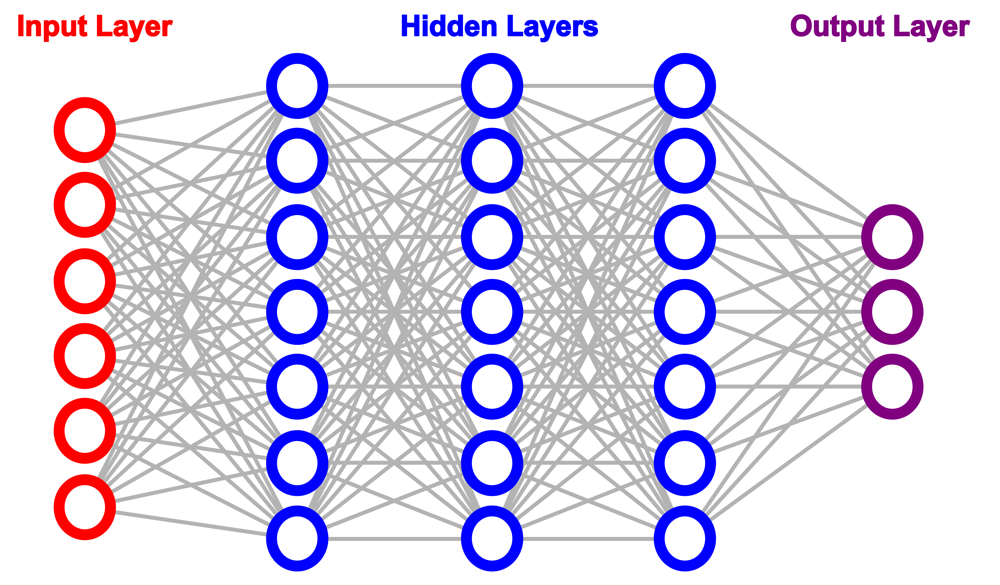

```{r setup, include=FALSE}
knitr::opts_chunk$set(echo = TRUE)
```

# Multiple approaches to predict flake mass  

  * Guillermo Bustos-Pérez $^{(1,2,3,4)}$  
  * Javier Baena Preysler $^{(1)}$   

$^{1}$ Departamento de Prehistoria y Arqueología, Universidad Autónoma de Madrid, Madrid, Spain  
$^{2}$ Institut Català de Paleoecologia Humana i Evolució Social (IPHES), Zona Educacional 4, Campus Sescelades URV (Edifici W3), 43007 Tarragona, Spain  
$^{3}$ Àrea de Prehistoria, Universitat Rovira i Virgili (URV), Avinguda de Catalunya 35, 43002 Tarragona, Spain  
$^{4}$ Corresponding author at: [guillermo.bustos@estudiante.uam.es](mailto:guillermo.bustos@estudiante.uam.es)    [guillermo.willbustos\@gmail.com](mailto:guillermo.willbustos@gmail.com)   

## Abstract   

Predicting original flake mass is a major goal of lithic analysis. Predicting original flake mass allows for researchers to make estimations of remaining mass, lost mass, and other features. All these measures relate to the organization of lithic technology by past societies. The present work tests three different models to predict log of flake mass: multiple linear regression, random forest regression, and artificial neural networks (ANN). Estimations of flake mass were performed using the remaining features of flakes from an experimental assemblage. This assemblage was obtained by the expansion of a previous dataset through the inclusion of bigger flakes, allowing the analysis to account for the effects of sample size and value distribution. Correlation results show a large/strong relation between predictions and real outcome ($r^2$ = 0.78 in the best case). Comparison of the models affords insights into variable importance for predicting flake mass. Results show that (for the present dataset) multiple linear regression still stands as the best method for predicting log of flake weight. Additionally, transformation of predicted values from the multiple linear regression and true values to the linear scale reinforces the linear correlation above the 0.8 threshold.

**Key words:** lithic technology; experimental archaeology; flake weight; machine learning; deep learning

## 1. Introduction  

"Curated" is a key concept for the analysis of lithic technological organization [@andrefsky_analysis_2009; @binford_organization_1979; @nelson_study_1991; @spry_technological_2016]. Initially, "curated" was defined as encompassing a series of behavioral patterns related to provisioning strategies [@binford_organization_1979; @renfrew_interassemblage_1973]. Further authors included tool transport, utilization in a wide range of tasks, anticipated production, hafting, and recycling (after the original tool had been discarded) among the adaptive behavioral strategies that defined curation. [@shott_exegesis_1996; -@shott_tool-class_1989] proposed an alternative interpretation of the term “curation” as the “ratio of realized to potential utility.” This shift in the definition of “curation” has deep implications for lithic analysis and the study of lithic technological organization, since it transforms “curation” into a continuous variable [@shott_exegesis_1996]. A conception of “curation” as a continuous variable usually implies usually implies the degree of reduction or maintenance undergone by a tool [@shott_exegesis_1996; @shott_tool-class_1989; @shott_role_2007]. Additionally, the understanding of curation as a continuum also extends to the reduction approach [@dibble_interpretation_1987; @dibble_interpretation_1987; @rolland_new_1990] which considers processes of resharpening as a major factor driving the presence and frequency of tool types. Ethnographic studies also emphasize the role of retouch in resharpening dulled edges, in changes in morphology, or in variations in artifact use as morphology changes throughout reduction [@casamiquela_temas_1978; @gould_living_1968; @nuevo_delaunay_glass_2017; @shott_measuring_2007; @white_ethno-archaeology_1967].    

Usually, two approaches are employed to estimate the reduction and curation undergone by a retouched artifact. The first approach focuses on estimations made through measurements of reductions directly made on retouch. This has led to the proposal of several indexes that use different measurements, such as height of retouch, length of retouched edge, or projection of original angle [@bustos-perez_exploring_2019; @eren_defining_2005; @hiscock_experimental_2005; @kuhn_geometric_1990; @morales_measuring_2015]. Although proposed indexes derived from this broad approach usually return high correlation values, they are conditioned by flake morphology, direction of retouch, or tool type (laterally retouched scrapers, endscrapers, bifacial products, etc.). @dibble_middle_1995 noted the "flat flake problem" when applying @kuhn_geometric_1990 general index of unifacial reduction (GIUR). The “flat flake problem” states that a flake with a trapezoidal cross section (where the dorsal face is mainly flat) will promptly reach maximum values of GIUR although reduction continues. The effects of the “flat flake problem” do not seem to be particularly severe on the GIUR  [@hiscock_experimental_2005],but they exemplify the possible limitations that these indexes may possess as a result of flake morphology. @shott_reduction_2005 extensive review of methods outlines the strengths and limitations derived from geometry, flake morphology, and assemblage suitability faced by each of the indexes.  

The second approach aims to estimate original flake mass based on remaining features. This approach has the advantage of not being conditioned by tool type, direction of retouch, or flake morphology. Estimating original mass and comparing it with remaining mass can provide highly useful measures, such as percentage of mass remaining, amount of mass lost, and other features. All these measures are in keeping with the curation concept as a continuous and with the reduction approach. Initial controlled experiments showed highly promising results in the ability to predict flake mass from remaining features [@dibble_effect_1995]. However, subsequent experiments based on the replication of knapping methods failed to obtain such high levels of correlation [@davis_quantifying_1998; @shott_flake_2000]. Additionally, on some occasions, estimated original mass was lower than mass of flake after retouch [@davis_quantifying_1998]. This posed an important drawback since, as @dibble_comment_1998 states and @shott_flake_2000 reiterate: controlled experiments are useful only if results and variable relationships are extendible to the archaeological record. Further research has explored the estimation of flake mass through the combination of several variables [@dogandzic_edge_2015; @shott_use_2017] and the determination of the best variables with which to perform estimations [@bustos-perez_predicting_2021].    

@hiscock_generalization_2010 state the logical and analytical characteristics desirable for an index: inferential power; directionality; comprehensiveness; sensitivity; versatility; blank diversity; and scale independence. Following these characteristics, it can be stated that the first approach mentioned above is strong in inferential power, directionality, comprehensiveness, and sensitivity. On the other hand, present systems to estimate flake mass are strong in inferential power, comprehensiveness, sensitivity, versatility, blank diversity, and scale independence.     

Most analysis focuses on the use of linear regression (usually using platform surface area as a proxy of flake mass) or the combination of several variables in multiple linear regression. The generalization afforded by statistical programming software [@r_core_team_r_2019; @rstudio_team_rstudio_2019] allows for the implementation of regression models beyond simple linear regression. The present study uses and evaluates three common machine learning regression models (artificial neural networks, multiple linear regression, and random forest) for the estimation of flake mass. Additionally, each model provides insights into variable importance.    

### 1.2 Loading the data   

The following code provides the list of packages employed in the analysis, checks if they are missing and installs the missing ones.  

```{r}
list.of.packages <- c("tidyverse", "lattice", "caret", "neuralnet", "ranger", "NeuralNetTools")

new.packages <- list.of.packages[!(list.of.packages %in% 
                                     installed.packages()[,"Package"])]

if(length(new.packages)) install.packages(new.packages)
```

After this we can load the packages to perform model training and analysis. Additionally in this markdown we are going to use package knitr to show a nice output of tables. The present study makes extensive use of tidyverse (Wickham et al., 2019) and caret (Kuhn, 2008) for the treatment of data and training of models.  

```{r message=FALSE, warning=FALSE}
list.of.packages <- c("tidyverse", "lattice", "caret", "neuralnet", "ranger", "knitr")

lapply(list.of.packages, library, character.only = TRUE)
```

The following code load the dataset from a .csv file and allows to see a preview of the data.  

```{r Load the data}
# Load the data
Reg_Data <- read.csv("Data/Flake Mass v02 Eng.csv")
```

```{r Show the data}
head(Reg_Data[1:10,])
```

## 2. Methods  

### 2.1 Experimental assemblage  

The sample for analysis was composed of 500 experimentally knapped flakes using hard hammers. The flakes are categorized according to 30 knapping sequences wherein a wide variety of knapping methods were employed—hierarchical (Levallois and hierarchical discoid), bifacial (discoid), and unipolar—to generate the experimental sample, ensuring a wide range of morphologies [@dibble_levallois:_1995; @boeda_caracteristiques_1995; boeda_debitage_1993; @casanova_i_marti_strategies_2009; @terradas_discoid_2003]. This constitutes an expansion of a previous dataset employed for similar purposes [@bustos-perez_predicting_2021], which increases the range of dimensions and mass of the assemblage. Although termination type influences flake mass, its influence on predicting original flake mass is considered residual or nonsignificant [@clarkson_estimating_2011; @shott_flake_2000]. The experimental assemblage was dominated by flakes with feather terminations (89.8%), although other types of terminations were present. All selected flakes were complete.   

```{r table of terminations}
kable(data.frame(table(Reg_Data$Termination_type)))
```

A key requirement of experimentations designed to estimate flake mass is that they are independent of external factors. To satisfy this requirement, the flakes were knapped with a wide variety of hammerstones. The raw material of hammerstones varied widely (quartz, quartzite, sandstone, and limestone), which allowed for a diverse range of morphologies and potential active percussion areas.    

Comparison of the experimental dataset with the one from the previous study [@bustos-perez_predicting_2021] shows an increase in the size and average mass of experimentally knapped flakes. While in the previous study 50% of the flakes had mass values between 4.15 g and 14.02 g [@bustos-perez_predicting_2021], in the present study 50% of the flakes weighed between 5.87 g and 26.96 g. This indicates that the expansion of the dataset was achieved by the inclusion of heavier and bigger flakes. Additionally, exploratory visual analysis of flake mass shows a highly skewed distribution, with flakes weighing between 10 g and 20 g the most frequent.    

```{r Summary statistics}
#  Summary statistics of the experimental assemblage
Summary_Assem <- data.frame(
  rbind(data.frame(data.matrix(summary(Reg_Data$Length))) %>% t(),
        data.frame(data.matrix(summary(Reg_Data$Width))) %>% t(),
        data.frame(data.matrix(summary(Reg_Data$MeanThick))) %>% t(),
        data.frame(data.matrix(summary(Reg_Data$Surface.Plat))) %>% t(),
        data.frame(data.matrix(summary(Reg_Data$Weight))) %>% t()))
Measure <- c("Length", "Width", "Mean Thickness", "Platform Surface",
             "Weight")
Summary_Assem <- cbind(Measure, Summary_Assem)
rownames(Summary_Assem) <- 1:nrow(Summary_Assem)
```

```{r kable of summary statistics}
kable(Summary_Assem)
```

```{r Baggolini scatter plot}
Reg_Data %>% 
  ggplot(aes(Width, Length)) +
  geom_segment(x = 40, y = 0, xend = 0, yend = 40, color = "gray48") +
  geom_segment(x = 60, y = 0, xend = 0, yend = 60, color = "gray48") +
  geom_segment(x = 80, y = 0, xend = 0, yend = 80, color = "gray48") +
  
  geom_segment(x = 0, y = 0, xend = 105, yend = 105, color = "gray48") +
  
  geom_segment(x = 0, y = 0, xend = (105/6), yend = 105, color = "gray48") +
  geom_segment(x = 0, y = 0, xend = (105/3), yend = 105, color = "gray48") +
  geom_segment(x = 0, y = 0, xend = (105/2), yend = 105, color = "gray48") +
  geom_segment(x = 0, y = 0, xend = (105/1.5), yend = 105, color = "gray48") +
  geom_segment(x = 0, y = 0, xend = (105/0.75), yend = 105, color = "gray48") +
  geom_segment(x = 0, y = 0, xend = (105/0.5), yend = 105, color = "gray48") +
  geom_segment(x = 0, y = 0, xend = 105, yend = (105/2), color = "gray48") +
  
  annotate("text", x = 0, y = 104, adj = 0, 
           label = "Very thin blade", size = 2.5) +
  annotate("text", x = 20, y = 104, adj = 0, 
           label = "Thin blade", size = 2.5) +
  annotate("text", x = 40, y = 104, adj = 0, 
           label = "Blade", size = 2.5) +
  annotate("text", x = 53, y = 104, adj = 0, 
           label = "Elongated flake", size = 2.5) +
  annotate("text", x = 85, y = 104, adj = 0, 
           label = "Flake", size = 2.5) +
  annotate("text", x = 103, y = 92.5, adj = 0, 
           label = "Wide\nflake", size = 2.5) +
  annotate("text", x = 103, y = 65, adj = 0, 
           label = "Very\nwide\nflake", size = 2.5) +
  annotate("text", x = 103, y = 25, adj = 0, 
           label = "Wider\nflake", size = 2.5) +
  
  annotate("text", x = 20, y = 1, adj = 0, 
           label = "Micro", size = 2.5) +
  annotate("text", x = 47, y = 1, adj = 0, 
           label = "Small", size = 2.5) +
  annotate("text", x = 65, y = 1, adj = 0, 
           label = "Normal", size = 2.5) +
  annotate("text", x = 85, y = 1, adj = 0, 
           label = "Big", size = 2.5) +
  
  geom_point(aes(color = Termination_type), size = 2, alpha = 0.75) +
  scale_x_continuous(breaks = seq(0, 105, 5), lim = c(0, 105)) +
  scale_y_continuous(breaks = seq(0, 105, 5), lim = c(0, 105)) +
  ylab("Length (mm)") +
  xlab("Width (mm)") +
  theme_light() +
  ggsci::scale_color_aaas() +
  labs(color = "Termination type") +
  guides(color = guide_legend(nrow = 1, title.position = "top")) +
  theme(axis.title = element_text(size = 9, color = "black", face = "bold"),
        axis.text = element_text(size = 7.5, color = "black"),
        legend.position = "bottom") +
  coord_fixed() 
```

```{r Histogramm of flake weight, fig.height=2.5}
# Histogram of flake weight
Reg_Data %>% ggplot(aes(Weight)) +
  geom_histogram(binwidth = 10,
                 color = "black", fill = "gray", 
                 boundary = 0) +
  theme_light() +
  ylab("Frequency") +
  xlab("Weight (g)") +
  scale_x_continuous(breaks = seq(0, 200, 20)) +
  theme(
    axis.text = element_text(color = "black", size = 9),
    axis.title = element_text(color = "black", size = 10))
```

 

### 2.2 Variable selection    

Previous work [@bustos-perez_predicting_2021] employed best subset selection [@furnival_regressions_2000; @hocking_selection_1967] to obtain the best model with the best explanatory variables. The present work maintains the previously selected variables and uses an expanded version of the dataset. Variables employed to predict flake mass are: average thickness, log10 of maximum thickness, number of scars, amount of cortex, external platform angle (EPA), log10 of platform size and log10 of platform depth.   

  * **Average thickness:** mean flake thickness measured at 0.25, 0.50 and 0.75 of flake length [@eren_why_2012].  
  * **Log10 of maximum thickness:** log10 transformation of the highest of the three values of average thickness.      
  * **Number of scars:** number of scars bigger than 5 mm [@scerri_can_2016].  
  * **Amount of cortex:** measured on an ordinal scale. A slightly modified version of the triple cortex typology [@barker_lithics_2005], with categories being: cortical (1), more than 50% covered by cortex (2), less than 50% covered by cortex (3), residual presence of cortex (4), and no cortex (5).  
  * **External Platform Angle (EPA):** relation in degrees between the platform and the dorsal surface of the flake. Measured with a manual goniometer.   
  * **Log10 of platform size:**log10 transformation of platform size measured following @muller_new_2016.   
  * **Log10 of platform depth:** log10 transformation of platform depth. Platform depth belongs to the corresponding measure present at @muller_new_2016.   

Flake mass (in grams) was recorded using a Sytech SY-BS502 scale with 0.01 precision. All dimensional measures were performed using digital calipers to 0.1 mm. Two different opinions exist on how EPA should be measured [@davis_quantifying_1998; @dibble_effect_1995], and the difficulty of obtaining accurate measurements when the platform or surface is curved is acknowledged. Two methods for recording flake platform exist. The first method [@barker_lithics_2005] uses the product of platform width and depth. The second method [@muller_new_2016] first ascribes the general platform morphology to a geometric figure (rectangle, triangle, rhombus, trapezoid, or ellipse); the templated area of the geometric figures in combination with the corresponding measurements is then employed to calculate platform area. The second system has been shown to better approximate platform size when compared with measurements from scanning techniques and to not overestimate platform size [@muller_new_2016]. Additionally, previous studies have shown a clear preference for the second method as a variable for predicting flake weight  [@bustos-perez_predicting_2021]. Thus, only measures of platform surface derived using the second method [@muller_new_2016] were employed.   

Previous works have shown that it is easier to predict log10 of flake weight using log10 of platform size [@braun_landscape-scale_2008; @bustos-perez_predicting_2021; @clarkson_estimating_2011; @shott_flake_2000]. Log transformations of variables are common, since they avoid negative results (necessary in the case of predicting flake weight), reduce skewed distributions, and can approximate parametric distributions (which favors the inferential power of models). In the present study, all logarithmic transformations refer to the common logarithm (base 10), and the target variable was the logarithmic transformation of flake weight.    

  

   

Collinearity between predictors has previously been reported for platform surface and platform depth, and mean thickness and log10 of maximum thickness  [@bustos-perez_predicting_2021]. For the present dataset, there is an important collinearity between log10 of maximum thickness and mean thickness ($r^2$ = 0.879) and an expected moderate/strong collinearity between platform depth and platform surface ($r^2$ = 0.614). Awareness of these collinearities is important, since collinearity affects variable importance (making it hard to separate the individual effect of a variable on the response), reduces the accuracy of the estimates in a multiple linear regression, and can result in counterintuitive estimates [@james_introduction_2013].    

```{r Collinearity}
# Collinearity between measures of thickness
R2(Reg_Data$MeanThick, Reg_Data$Log_Max_Thick)

# Collinearity between measures of platform
R2(Reg_Data$Platfom_Depth, Reg_Data$Surface.Plat)
```

### 2.3 Regression methods    

Three methods were employed to estimate log10 of flake mass: multiple linear regression, artificial neural networks (ANN), and random forest regression. The multiple linear regression extends the simple linear regression in such a way that it can directly accommodate multiple predictors [@james_introduction_2013].     

$$ Y = \beta_0 +  \beta_1X_1 + \beta_2X_2 +···\beta_pX_p + \epsilon $$

Artificial neural networks (ANN) are constituted by layers that are made on nodes. Each ANN has an input layer made of input nodes (unprocessed features from the dataset) and an output layer made of output nodes. The output layer represents the target variable and can have one (in the case of regression when the target is to predict numerical outputs) or several nodes (in the case of classification problems). Nodes between layers are connected with parameter values that are estimated when the ANN is fitted to the data. An ANN where nodes from the input layer are directly connected to the output layer (no hidden layers) is directly comparable to a multiple linear regression. To model more complex relationships, ANNs use hidden layers (each composed of a series of nodes) between the input and output layers that process signals from the input data and their interactions [@lantz_machine_2019]. The structure of the ANN according to the number of hidden layers and number of nodes in each layer is referred to as its topology. The present work uses the R package *neuralnet* v.1.44.2 [@gunther_neuralnet_2010] to train the ANN with backpropagation [@rumelhart_learning_1986]. For the present work, the ANN topology is limited to having only one or two hidden layers. The number of nodes of hidden layer 1 ranges between 1 and 4, while the number of nodes of hidden layer 2 ranges from 0 (no second hidden layer) to 4. All possible combinations were tested.  

{height="400"}

Random forest regressions select random samples of the data and build trees for prediction. As a result, each tree is built from different data, and the average is used as prediction. This adds diversity, reduces overfit, and provides higher-resolution predictions [@lantz_machine_2019]. Additional to the random selection of data, random forest can be further randomized by providing the number of trees to train, the number of possible variables to split at each node, and the minimal node size. These are hyperparameters, whose values need to be provided to the model before training. A Cartesian grid search (to test for all possible combinations) is performed on the abovementioned hyperparameters, with the number of trees to grow for each model ranging from 500 to 700 by 25; the number of possible variables to split at each node ranging from 1 to 5; and minimal node size ranging from 1 to 5. The R package *ranger* v.0.13.1 [@wright_ranger_2017] was employed to train random forests.    

### 2.4 Machine learning evaluation   

With the exception of multiple linear regression, machine learning models and ANN are prone to overfit and need to be tested on data not previously seen by the models [@hastie_elements_2001; @james_introduction_2013]. The present work employed a k-fold cross validation to estimate out-of-sample model performance. In k-fold cross validation, the dataset is randomly shuffled and divided into k folds. The first fold is employed as a test set, and the model is trained in the remaining folds. After this, the second fold is employed as a test set and the rest as a new training set. This process continues until all folds have served as a test set. Since the folds are shaped by the initial random shuffle, it is advisable to repeat this cycle a series of times. The present work employs a 10-fold cross validation (each fold having a sample of 50 elements) repeated 50 times.    

Machine learning regression models are evaluated using proportion of variance explained ($r^2$ and *adjusted* $r^2$), visualization of regression plots, visualization of residuals (difference between actual and predicted value) plots, density plots of residuals, and descriptive statistics of residuals. Proportion of variance indicates how much of the observed variation is explained by the model [@james_introduction_2013]. The addition of predictors results in an increasing $r^2$ irrespective of predictor contribution to the model and making it impossible to compare models with a different number of predictors. *Adjusted* $r^2$ is analogous to the $r^2$ but adjusted to the number of explanatory variables, thus making model comparison possible. *Adjusted* $r^2$ is required for the multiple linear regression model in order to make comparisons while $r^2$ is required for the rest of the models.  

*Adjusted* $r^2$ indicates how strongly predictions are related to the true value, but it does not indicate how far predictions fall from the true value [@lantz_machine_2019]. Mean average error (MAE) and root mean squared error (RMSE) provide values of how far predictions fall from the true value [@lantz_machine_2019; @james_introduction_2013]. MAE measures the average magnitude of errors, regardless of signal. RMSE also provides a measure of distance between predicted and actual values, although it punishes large errors. A perfect model will have MAE and RMSE values of 0. In general, better models will have lower values of MAE and RMSE.   

A regression plot provides a scatter plot of predicted and true values along its regression line. In a good model, the regression line will pass through the center of all points, which will be evenly distributed above and below. The residuals plot provides a scatter plot of true values and residuals (difference between true value and predicted value), allowing for observation of whether there is systematic bias in the model. The residual plot of a good model will have the points evenly distributed on the zero value.    

Collinearity of the abovementioned pairs of predictors is addressed by two means: first, by calculating variance inflation factor; and second, by comparing performance metrics values and residual distribution of the best models without collinear variables. Variance inflation factor provides a measure of correlation between predictors and their effects on the model. In the present study, variance inflation factor is calculated using the R package car v.3.1.0 [@fox_r_2018]. Thresholds for evaluating variance inflation factor values vary, although commonly, values between 1 and 10 are considered inconsequential, values between 10 and 30 are cause for concern, and values above 30 are considered seriously harmful [@marquardt_generalized_1970; @obrien_caution_2007]. ). At present, the package car only allows for the calculation of variance inflation factor for multiple linear regression. Although the different nature of the models can result in different effects of collinearity, results from calculating the variance inflation factor in the multiple linear regression can be extrapolated to the random forest and the ANN. While retrieving pairs of collinear variables allows for the determination of variable importance, it is important to keep in mind that collinearity between predictors does not affect predictions and the inferential power of a model [@alin_multicollinearity_2010; @paul_multicollinearity_2006].   

The complete workflow was developed using the R language (v.4.0.2) in the RStudio IDE v.1.4.1103 [@r_core_team_r_2019; @rstudio_team_rstudio_2019]. Package *tidyverse* v.1.3.1 [@wickham_welcome_2019] was employed for data manipulation and representation. Packages *leaps* v.3.1  [@lumley_based_on_fortran_code_by_alan_miller_leaps_2020] and *lattice* v.0.20.45 [@sarkar_lattice_2008] were employed additionally to the previously mentioned packages for model training. The package *caret* v.6.0.92 [@kuhn_building_2008] was employed to set the validation methods and obtain the evaluation metrics of each model.    

### 2.5 Training the models     

The following code sets the train control to perform the 50x10 k fold cross validation.      

```{r}
# Set Train control
train.control <- trainControl(method = "repeatedcv", 
                              number = 10, repeats = 50,
                              savePredictions = TRUE)
```

The following code trains the multiple linear regression.  

```{r training multiple linear regression, eval = FALSE}
# Train the model
frmla <- Log_Weight ~ MeanThick + Cortex + No_Scars + EPA + Log_Max_Thick + Log_Plat + Log_Plat_De

set.seed(123)
lm.model <- train(frmla, 
               data = Reg_Data, 
               method = "lm",
               trControl = train.control)
```

The following code performs hyperparameter grid search for Random Forest. Cartesian grid search is performed on the following hyperparameters: number of trees to grow for each model (ranging from 500 to 700 by 25); number of variables to possibly split at each node (ranging from 1 to 5); and minimal node size (ranging from 1 to 5).  

Please note that while **mtry** (random number of variables to consider in each split) and **min.node.size** can be integrated into a cartesian grid search, the number of trees to grow cannot. Thus, it is necessary to include the training of the models in a loop were the number of trees changes in a sequence. At the end of each loop the best combination of mtry and min.node.size for the given number of trees is extracted (along with the results).  

```{r Hyperparameter grid search of Random Forest, message=FALSE, warning=FALSE, eval=FALSE}
#### Hyperparameter tuning for random forest ####
# range of hyperparameters
mtry <- seq(1, 5, 1)
min.node.size <- seq(1, 5, 1)
splitrule = "variance"

# Grid of possible combinations
hyper_grid <- expand.grid(
  mtry = mtry,
  min.node.size = min.node.size ,
  splitrule = "variance")

# Loop over different number of trees
best_tune <- data.frame(
  mtry = numeric(0),
  min_node.size = numeric(0),
  Num_Trees = numeric(0),
  r_squared = numeric(0))

my_seq <- seq(500, 700, 25)

set.seed(123)
for (x in my_seq){
  
  RF_weight <- train(frmla, 
                       Reg_Data,
                       method = "ranger",
                       trControl = train.control,
                       num.trees = x,
                       tuneGrid = hyper_grid 
  )
  
  Bst_R <- data.frame(
    mtry = RF_weight$bestTune[[1]],
    min_node.size = RF_weight$bestTune[[3]],
    Num_Trees = x,
    r_squared = RF_weight$finalModel[[10]])
  
  best_tune <- rbind(best_tune, Bst_R)
  
  Bst_R <- c()
  
}
```

```{r include=FALSE}
load("Hyperparameter grid search results/Results grid search RF.RData")
```

The following code returns the best combination of hyperparameters.  

```{r best tune for random Forest}
best_tune_2 <- best_tune[which.max(best_tune$r_squared),]
best_tune_2
```

```{r hyperparameters.rf}
kable(best_tune)
```

Finally, the Random forest with optimal combination of hyperparameters can be trained.  

```{r Training of Random Forest with optimal hyperparameters, eval = FALSE}
#### Final random forest model ####
newr_grid <- expand.grid(mtry = best_tune_2$mtry,
                          min.node.size = best_tune_2$min_node.size,
                          splitrule = "variance"
)

RF_weight <- train(frmla, 
                   Reg_Data,
                   method = "ranger",
                   trControl = train.control,
                   tuneGrid = newr_grid, 
                   num.trees = best_tune$Num_Trees,
                   importance = "impurity_corrected")
```

The following code trains the ANN performing cartesian grid search for the optimal topology.  

```{r Hyperparameter grid search of ANN topology, eval=FALSE}
#### Look for best ANN architecture ####
 set.seed(123)
 train.control <- trainControl(method = "repeatedcv", 
                               number = 10, repeats = 50,
                               verboseIter = TRUE)

  tune.grid.neuralnet <- expand.grid(
   .layer1 = c(1:4),
   .layer2 = c(0:4),
   .layer3 = 0
 )

 nnet_model <- train(
   Log_Weight ~ MeanThick + Log_Max_Thick + EPA + Log_Plat + Log_Plat_De + Cortex + No_Scars,
   Reg_Data,
   method = 'neuralnet',
   trControl = train.control,
   tuneGrid = tune.grid.neuralnet,
   preProcess = c("center", "scale"),
   learningrate = 0.01,  
   threshold = 0.01,
   stepmax = (10^100),
   linear.output = TRUE
 )
```

```{r include=FALSE}
load("Hyperparameter grid search results/Results grid search NNET model.RData")
```

## 3. Results   

```{r include=FALSE}
load("Models/Multiple Linear regression model.RData")
load("Models/Random Forest model.RData")
load("Models/NNET model.RData")
```

### 3.1 Hyperparameter grid search   

results of the hyperparameter Cartesian grid search for the random forest regression. In all cases, the hyperparameter of the number of variables to possibly split at each node was selected to have a value of 2. Linear correlation reaches its maximum at a minimum node size of 4 and 625 trees grown for the model ($r^2$ = 0.73). The second-best hyperparameter combination (minimum node size of 5 and 500 trees grown for the model) presents a marginally lower value of linear correlation (0.00005 lower).     

```{r graph of random forest hyperparamters, fig.height=3}
#### Hyperparameters of Random forest ####
data.frame(best_tune) %>% 
  ggplot(aes(factor(Num_Trees), min_node.size, fill = r_squared)) + 
  geom_tile(alpha = 0.75) +
  xlab("Number of trees") +
  ylab("Min node size") +
  scale_y_continuous(breaks = seq(4, 5, 1), lim = c(3.5, 5.5)) +
  geom_text(aes(label = round(r_squared, 4)), size = 3) +
  ggsci::scale_fill_gsea(reverse = TRUE) +
  theme_classic() +
  theme(legend.position = "none",
        axis.text = element_text(color = "black", size = 8))

```

The Cartesian grid search of the ANN topology ) indicates that increasing the number of nodes in the first hidden layer decreases linear correlation with the outcome and that increasing the number of layers and nodes results in lower values of $r^2$. Thus, the simplest ANN architecture (one hidden layer with one node) provides the highest correlation coefficient ($r^2$ = 0.78). The second-best topology (two hidden layers with one node at each layer) provides a marginally lower value (0.0005 lower).   

```{r Plot of ANN performance for diferent topologies}
data.frame(nnet_model$results) %>% 
  ggplot(aes(layer1, layer2, fill = Rsquared)) + 
  geom_tile(alpha = 0.75) +
  geom_text(aes(label = round(Rsquared, 4)), size = 3) +
  ggsci::scale_fill_gsea(reverse = TRUE) +
  xlab("Number of nodes in layer 1") +
  ylab("Number of nodes in layer 2") +
  theme_classic() +
  coord_fixed() +
  theme(legend.position = "none",
        axis.text = element_text(color = "black", size = 8))
```

### 3.2 Model evaluation   

The following table presents the precision metrics for each model. ANN and multiple linear regression perform similarly, with similar values of r2 (0.78), RMSE (0.21), and MAE (0.17), although ANN performs slightly better. On the other hand, random forest regression performs slightly worse, with a lower value of r2 (0.72) and higher values of RMSE (0.24) and MAE (0.19).   

```{r Table of performance metrics of each model}
Temp <- data.frame(rbind(
  round(MLR_model$results[2:4],2),
  round(nnet_model_f$results[4:6],2),
  round(RF_model$results[4:6],2)))

Temp <- cbind(data.frame(model = c("MLR", "ANN", "RF")), Temp)

kable(Temp)
```

Visualization of regression plots for each model provides additional information on the performance of each model. The poor performance of Random Forest (lowest value of $r^2$) is reflected in a limited range of prediction, to between a minimum value of 0.55 and a maximum value of 1.76 for log10 of flake mass. As a result, data are not evenly distributed along the regression line. For the lowest values of prediction, most points fall below the regression line, while most data points fall above it for the highest values. ANN and multiple linear regression plots present similar patterns of distribution, with data evenly distributed along the regression line. Flakes with a log10 value of flake mass above 2 are more evenly distributed in the multiple linear regression than in the ANN.    

```{r Regression plots of all models, fig.width=12}
#### Linear model ####
MLR_results <- as.data.frame(MLR_model$pred) %>% 
  group_by(rowIndex) %>% 
  summarise(Pred = mean(pred),
            Obs = mean(obs)) %>% 
  mutate(Residual = Obs - Pred)

#### ANN model ####
nnet_results <- as.data.frame(nnet_model_f$pred) %>% 
  group_by(rowIndex) %>% 
  summarise(Pred = mean(pred),
            Obs = mean(obs)) %>% 
  mutate(Residual = Obs - Pred)

#### RF Model ####
RF_results <- as.data.frame(RF_model$pred) %>% 
  group_by(rowIndex) %>% 
  summarise(Pred = mean(pred),
            Obs = mean(obs)) %>% 
  mutate(Residual = Obs - Pred)

#### Put models together #####
Temp <- rbind(MLR_results, nnet_results, RF_results)
Temp$Model <- "Multiple linear regression"
Temp$Model[501:1000] <- "ANN"
Temp$Model[1001:1500] <- "Random Forest"

#### Correlation plot ####
Temp %>% 
  ggplot(aes(Pred, Obs)) +
  geom_point(alpha = 0.5, size = 1.5) +
  geom_line(aes(y = Pred), size = 1, col = "blue") +
  
  scale_x_continuous(breaks = seq(0, 2.55, 0.25), lim = c(-0.1, 2.35)) +
  scale_y_continuous(breaks = seq(0, 2.55, 0.25), lim = c(-0.1, 2.35)) +
  
  xlab("Predicted") +
  ylab("Observed") +

  facet_wrap(~ Model, ncol = 3) + 
  coord_fixed() +
  theme_light() +
  theme(strip.text = element_text(color = "black", face = "bold", size = 9),
        strip.background = element_rect(fill = "white", colour = "black", size = 1),
        axis.text = element_text(size = 7.5, color = "black"))

```

Visual analysis of the scatter plot for observed and residual values allows the observation of model performance for different ranges of log10 of flake mass values. Residuals of the random forest present a systematic bias at the uppermost and lowest values of observed weight. In the case of flakes with a log10 value of 0.50, there is a systematic overestimation of size. In the case of flakes with a log10 value of 1.75, there is a systematic underestimation of values. ANN and multiple linear regression present very similar plots for observed values and residuals. In both cases, residual values indicate a systematic overestimation of a log10 flake mass when the actual value is below 0.25.     

Between values of 0.25 and 2, both models present a very similar performance, with residual values falling evenly on either side of the 0 value. ANN seems to present a slightly systematic underestimation of flakes with a log10 of flake mass above a value of 2. Multiple linear regression does seem to perform better for flakes with a log10 flake mass value above 2, with residual values falling evenly on either side of or very close to the cero value line.    

```{r Plots of observed values and residuals, fig.width=12}
## Plots of observed values and residuals
Temp %>% 
  ggplot(aes(Obs, Residual)) +
  geom_point(alpha = 0.5, size = 1.5) +
  
  xlab("Observed") +
  ylab("Residual") +
  
  scale_x_continuous(breaks = seq(0, 2.55, 0.25), lim = c(min(Temp$Obs), max(Temp$Obs))) +
  scale_y_continuous(breaks = seq(-0.75, 0.75, 0.25), lim = c(-0.85, 0.85)) +
  geom_hline(yintercept = 0, linetype = "dashed") +
  
  facet_wrap(~ Model, ncol = 3) + 
  coord_fixed() +
  theme_light() +
  theme(strip.text = element_text(color = "black", face = "bold", size = 9),
        strip.background = element_rect(fill = "white", colour = "black", size = 1),
        axis.text = element_text(size = 7.5, color = "black"))
```

Correlation between observed values and residuals allows for the evaluation of whether residuals increase along with increasing values of log10 of weight. ANN and multiple linear regression models present the same value of $r^2$ for correlation of observed values and residuals ($r^2$ = 0.22; p < 0.01) while Random Forest presents a higher value of correlation ($r^2$ = 0.5; p < 0.01).

```{r Descriptive statistics of residuals}
# Residuals and multiple linear regression
summary(lm(Residual ~ Obs, MLR_results))

# Residuals and ANN
summary(lm(Residual ~ Obs, nnet_results))

# Residuals and RF model
summary(lm(Residual ~ Obs, RF_results))
```

Descriptive statistics of residuals and density plots allow to evaluate dispersion range of residuals. All models present average and median residual values close to 0, with density curves peaking near this value which is indicative of good model performance. Fifty percent of residual values from the ANN model fall between the values of -0.137 and 0.143 making for a distance of 0.276. Fifty percent of residual values from the multiple linear regression model fall between the values of  -0.137 and 0.134 making for a distance of 0.271. This indicates that the multiple linear regression model concentrates 50% of residual values in a slightly shorter range. This range is 0.005 shorter than the one from the ANN model. The random forest presents the highest dispersion range for 50% of residual values.   

```{r Density plot of residuals, fig.width=9, fig.height=3}
# Density plot of residuals
Temp %>% ggplot(aes(Residual, color = Model)) +
  geom_density(size = 1) +
  ggsci::scale_color_aaas() +
  scale_x_continuous(breaks = seq(-1, 1, 0.25), lim = c(-1,1)) +
  geom_vline(xintercept = 0, linetype = "dashed") +
  geom_hline(yintercept = 0) +
  ylab("Density") +
  theme_light() +
  theme(legend.position = "bottom",
        legend.title = element_text(face = "bold"),
        axis.text = element_text(color = "black", size = 9),
        axis.title = element_text(color = "black", size = 10))
```

Ninety percent of residual values from the ANN model fall between the values of -0.379 and 0.33 making for a distance of 0.709. Ninety percent of residual values from the multiple linear regression model fall between the values of -0.371 and 0.333 making for a distance of 0.704. Ninety percent of residual values from the random forest model fall between the values of -0.412 and 0.355 making for a distance of 0.767. Again, multiple linear regression concentrates 90% of residuals in the shortest range. ANN presents a slightly wider range (a difference of 0.005), and random forest presents the widest range of the three models.     

```{r descriptive statistics of residuals}
kable(
  Temp %>% group_by(Model) %>% 
  summarise(
    Min = min(Residual),
    `5 Percentil` = quantile(Residual, 0.05),
    `1Quantile` = quantile(Residual, 0.25),
    Mean = mean(Residual),
    Median = quantile(Residual, 0.5),
    `3Quantile` = quantile(Residual, 0.75),
    `95 Percentil` = quantile(Residual, 0.95),
    Max = max(Residual)
  ))
```

```{r data of residuals according to termination}
# Order of flakes is kept the same for all models
Terminations <- Reg_Data %>% select(Termination_type)
Terminations <- rbind(Terminations, Terminations, Terminations)
Terminations <- cbind(Temp, Terminations)

# Mutate to new categories: feather termination and other types of terminations
Terminations <- Terminations %>% mutate(
  New_Term =
  case_when(
    Termination_type == "Feather" ~ "Feather",
    Termination_type != "Feather" ~ "Other"))
```

```{r residuals according to termination, fig.width=8, fig.height=3}
Terminations %>% 
  ggplot(aes(New_Term, Residual, fill = New_Term)) +
  facet_wrap(~ Model, ncol = 3) +
  geom_violin(alpha = 0.6) +
  geom_boxplot(alpha = 0.8, outlier.size = 0) +
  geom_jitter(width = 0.15, alpha = 1, size = 0.9, shape = 23, aes(fill = New_Term)) +
  ggsci::scale_fill_aaas() +
  xlab(NULL) +
  theme_light() +
  theme(
    legend.position = "none",
    strip.text = element_text(color = "black", face = "bold", size = 9),
    strip.background = element_rect(fill = "white", colour = "black", size = 1),
    axis.text = element_text(color = "black", size = 8.5),
    axis.title = element_text(color = "black", size = 9))

```

Exploratory data analysis of residuals according to termination type through box and violin plots shows possible differences in the distribution for the three models. Comparison of residuals means according to termination type and for each model through t-test shows significant differences for the ANN model (t = -2.5; p = 0.02), the multiple linear regression (t = -2.52; p = 0.01), but not for the random forest regression (t = -1.82, p = 0.07). In all models, the residuals mean of flakes with feather terminations fall near the 0 value (-0.007 in the case of ANN; -0.008 in the case of multiple linear regression and -0.002 in the case of Random Forest). Flakes with terminations other than feather tend to have a slightly higher mean of residuals values (0.07 in the case of ANN; 0.07 in the case of multiple linear regression; 0.06 in the case of random Forest).   

```{r t-test residuals and terminations}
# t-test residuals and terminations for ANN
t.test(Residual ~ New_Term, data = Terminations[Terminations$Model == "ANN",])

# t-test residuals and terminations for Multiple linear regression
t.test(Residual ~ New_Term, data = Terminations[Terminations$Model == "Multiple linear regression",])

# t-test residuals and terminations for Random Forest
t.test(Residual ~ New_Term, data = Terminations[Terminations$Model == "Random Forest",])
```

### 3.3 Linear transformation of predictions   

The following table presents the performance metrics of each model after transforming true and predicted values back to the linear scale. ANN and multiple linear regression reinforce their correlation, while random forest decreases its $r^2$ value. Multiple linear regression provides the highest $r^2$ value ($r^2$ = 0.813) followed by ANN ($r^2$ = 0.801), indicating that multiple linear regression generalizes better to the linear scale. All models present lower RMSE values than the standard deviation value of weight of the experimental assemblage (24.83 g), which is indicative of good general performance.     

```{r}
# Transform into linear scale
Temp <- Temp %>% 
  mutate(Observed = 10^Obs,
         Predicted = 10^Pred,
         Line_Res = Observed - Predicted)
```

```{r performance metrics in the linear scale}
ANN <- Temp %>% filter(Model == "ANN")
MLR <- Temp %>% filter(Model == "Multiple linear regression")
RF <- Temp %>% filter(Model == "Random Forest")

# Performance metrics
kable(data.frame(
  "Metric" = 
    c("r2", "RMSE", "MAE"),
  
  "ANN" = 
    c(round(R2(ANN$Observed, ANN$Predicted),3),
  round(RMSE(ANN$Observed, ANN$Predicted),3),
  round(MAE(ANN$Observed, ANN$Predicted), 3)),
  
  "Mult. Linear Reg." = 
    c(round(R2(MLR$Observed, MLR$Predicted),3),
    round(RMSE(MLR$Observed, MLR$Predicted),3),
    round(MAE(MLR$Observed, MLR$Predicted), 3)),
  
  "Random Forest" = 
    c(round(R2(RF$Observed, RF$Predicted),3),
    round(RMSE(RF$Observed, RF$Predicted),3),
    round(MAE(RF$Observed, RF$Predicted), 3))
))
```

```{r, fig.width=12}
## Regression plot on linear scale
Temp %>% ggplot(aes(Predicted, Observed)) +
  geom_point(alpha = 0.5, size = 1.5) +
  geom_line(aes(y = Predicted), size = 1, col = "blue") +
  
  scale_x_continuous(breaks = seq(0, 205, 20), lim = c(0, 205)) +
  scale_y_continuous(breaks = seq(0, 205, 20), lim = c(0, 205)) +
  
  facet_wrap(~ Model) +
  coord_fixed() +
  theme_light() +
  theme(strip.text = element_text(color = "black", face = "bold", size = 9),
        strip.background = element_rect(fill = "white", colour = "black", size = 1),
        axis.text = element_text(size = 7.5, color = "black"))
```

Visualization of regression plots also supports the better generalization of multiple linear regression to the linear scale. Random forest limits its maximum prediction to 57.2 g, resulting in a poor generalization to the linear scale. Due to this, residuals from the Random Forest indicate significant underestimations of flake weight, with an average underestimation of 4.6 g. Fifty percent of the residuals of the random forest range between overestimations of 2.64 g and underestimations of 7.06 g. Ninety percent of the residuals from the random forest range between overestimations of 10.35 g and underestimations of 29.74 g. Visual representation of residuals of the random forest by density plot shows that despite peaking on the 0 value, it presents a long tail of positive residuals as a result of underestimations of predictions.    

ANN generalizes better to the linear scale, with a higher range of predictions that reach a maximum value of 123 g. A density plot of residuals from the ANN presents a concentrated peak on the 0 value with a mean value of 1.82 g. Despite this, ANN residuals still present a slightly long tail of positive values for residuals as a result of some underestimations. Fifty percent of residuals from ANN range between overestimations of 2.52 g and underestimations of 5.55 g. Ninety percent of the residuals from ANN range between overestimations of 13.18 g and underestimations of 18.79 g.    

As previously mentioned, multiple linear regression generalizes better to the linear scale, with a maximum predicted value of 170 g. Residuals present an average 1.4 g value, with the density plot peaking near the 0 value and tails to the positive and negative values of similar length. Fifty percent of residuals from multiple linear regression range between overestimations of 2.42 g and underestimations of 5.73 g. Ninety percent of residuals from multiple linear regression range between overestimations of 13.18 g and underestimations of 18.79 g. Thus, multiple linear regression presents the shortest range in a 90% concentration of residuals.   

```{r}
# Density plot of residuals on the linear scale
Temp %>% ggplot(aes(Line_Res, color = Model)) +
  geom_density(size = 0.75) +
  ggsci::scale_color_aaas() +
  geom_vline(xintercept = 0, linetype = "dashed") +
  geom_hline(yintercept = 0) +
  ylab("Density") +
  xlab("Residuals (g)") +
  theme_light() +
  theme(legend.position = "bottom",
        legend.title = element_text(face = "bold",size = 9),
        axis.text = element_text(color = "black", size = 9),
        axis.title = element_text(color = "black", size = 10),
        legend.text = element_text(size = 9))

```

```{r}
# Descriptive statistics of residuals
kable(
  Temp %>% group_by(Model) %>% 
    summarise(
      Min = min(Line_Res),
      `5 Percentil` = quantile(Line_Res, 0.05),
      `1Quantile` = quantile(Line_Res, 0.25),
      Mean = mean(Line_Res),
      Median = quantile(Line_Res, 0.5),
      `3Quantile` = quantile(Line_Res, 0.75),
      `95 Percentil` = quantile(Line_Res, 0.95),
      Max = max(Line_Res)
  ))
```

### 3.4 Collinearity and variable importance    

The following table presents the variance inflation factor of each of the predictors in the multiple linear regression model. Although mean thickness and log10 of maximum thickness present the highest values (8.43 and 8.88 respectively), neither of the predictors presents a value above 10, indicating that collinearity is irrelevant.    

```{r}
# Variance inflation factor of Multiple Linear Regression
car::vif(MLR_model$finalModel)
```

Previous to test non-collinear combination of variables it is necessary to set the formulas with the different possible combinations. The following code provides four additional formulas for training the models without pairs of collinear variables.

```{r}
# Models formula without collinear variables
frmla1 <- as.formula("Log_Weight ~ Log_Max_Thick + EPA + Log_Plat + Cortex + No_Scars")
frmla2 <- as.formula("Log_Weight ~ Log_Max_Thick + EPA + Log_Plat_De + Cortex + No_Scars")
frmla3 <- as.formula("Log_Weight ~ MeanThick + EPA + Log_Plat + Cortex + No_Scars")
frmla4 <- as.formula("Log_Weight ~ MeanThick + EPA + Log_Plat_De + Cortex + No_Scars")
```

```{r include=FALSE}
# Set grid for ANN
tune.grid.neuralnet <- expand.grid(
  .layer1 = c(1),
  .layer2 = 0,
  .layer3 = 0)

# RF grid
newr_grid <- expand.grid(mtry = 2,
                         min.node.size = 4,
                         splitrule = "variance")
```

Following the preparation of the formulas each variation of the model can be trained. Note that this implies training four variation for each model (a total of 12 additional models). Hyperparamter tuning is kept the same as for models trained including all variables.

```{r, eval=FALSE}
# Train MLR models
set.seed(123)
lm.model1 <- train(frmla1, 
                   data = Reg_Data, 
                   method = "lm",
                   trControl = train.control)

set.seed(123)
lm.model2 <- train(frmla2, 
                   data = Reg_Data, 
                   method = "lm",
                   trControl = train.control)

set.seed(123)
lm.model3 <- train(frmla3, 
                   data = Reg_Data, 
                   method = "lm",
                   trControl = train.control)

set.seed(123)
lm.model4 <- train(frmla4,
                   data = Reg_Data, 
                   method = "lm",
                   trControl = train.control)

# Train ANN  
set.seed(123)
nnet_model1 <- train(
  frmla1,
  Reg_Data,
  method = 'neuralnet',
  trControl = train.control,
  tuneGrid = tune.grid.neuralnet,
  preProcess = c("center", "scale"),
  learningrate = 0.01,  
  threshold = 0.01,
  stepmax = (10^100),
  linear.output = TRUE
)

set.seed(123)
nnet_model2 <- train(
  frmla2,
  Reg_Data,
  method = 'neuralnet',
  trControl = train.control,
  tuneGrid = tune.grid.neuralnet,
  preProcess = c("center", "scale"),
  learningrate = 0.01,  
  threshold = 0.01,
  stepmax = (10^100),
  linear.output = TRUE
)

set.seed(123)
nnet_model3 <- train(
  frmla3,
  Reg_Data,
  method = 'neuralnet',
  trControl = train.control,
  tuneGrid = tune.grid.neuralnet,
  preProcess = c("center", "scale"),
  learningrate = 0.01,  
  threshold = 0.01,
  stepmax = (10^100),
  linear.output = TRUE
)

set.seed(123)
nnet_model4 <- train(
  frmla4,
  Reg_Data,
  method = 'neuralnet',
  trControl = train.control,
  tuneGrid = tune.grid.neuralnet,
  preProcess = c("center", "scale"),
  learningrate = 0.01,  
  threshold = 0.01,
  stepmax = (10^100),
  linear.output = TRUE
)


# Train Random Forest
set.seed(123)
RF.model1 <- train(frmla1, 
                   Reg_Data,
                   method = "ranger",
                   trControl = train.control,
                   tuneGrid = newr_grid, 
                   num.trees = 625,
                   importance = "impurity_corrected")

set.seed(123)
RF.model2 <- train(frmla2, 
                   Reg_Data,
                   method = "ranger",
                   trControl = train.control,
                   tuneGrid = newr_grid, 
                   num.trees = 625,
                   importance = "impurity_corrected")

set.seed(123)
RF.model3 <- train(frmla3, 
                   Reg_Data,
                   method = "ranger",
                   trControl = train.control,
                   tuneGrid = newr_grid, 
                   num.trees = 625,
                   importance = "impurity_corrected")

set.seed(123)
RF.model4 <- train(frmla4, 
                   Reg_Data,
                   method = "ranger",
                   trControl = train.control,
                   tuneGrid = newr_grid, 
                   num.trees = 625,
                   importance = "impurity_corrected")

```

```{r, include=FALSE}
load("Models/Models non collinear variables.RData")
```

The following table presents model performance metrics of the three tested methods when collinear variables are retrieved. For multiple linear regression and ANN, performance metrics were the best when mean thickness and log10 of platform depth were retrieved, and these models presented the lowest performance values when average thickness and log10 of platform depth were kept as predictive variables. In the case of random forest regression, performance values were lowest when mean thickness and log10 of platform surface were excluded as predictive variables. However, these values are similar to the ones obtained when log10 of maximum thickness and log10 of platform surface were excluded when training the random forest regression.   

```{r}
data.frame(
  Model = c("MLR", "MLR", "MLR", "MLR",
            "ANN", "ANN", "ANN", "ANN",
            "Random Forest", "Random Forest", "Random Forest", "Random Forest"),
  
  `Variables excluded` = c(
    "Mean Thickness & Log of Plat. Depth", 
    "Mean Thickness & Log of Plat. Surf.",
    "Log of Max. Thick & Log of Plat. Depth", 
    "Log of Max. Thick & Log of Plat. Surf.",
    
    "Mean Thickness & Log of Plat. Depth", 
    "Mean Thickness & Log of Plat. Surf.",
    "Log of Max. Thick & Log of Plat. Depth", 
    "Log of Max. Thick & Log of Plat. Surf.",

    "Mean Thickness & Log of Plat. Depth", 
    "Mean Thickness & Log of Plat. Surf.",
    "Log of Max. Thick & Log of Plat. Depth", 
    "Log of Max. Thick & Log of Plat. Surf."),
  
  Rsquared = rbind(
    round(lm.model1$results$Rsquared,3),
    round(lm.model2$results$Rsquared,3),
    round(lm.model3$results$Rsquared,3),
    round(lm.model4$results$Rsquared,3),
    
    round(nnet_model$results$Rsquared,3),
    round(nnet_model2$results$Rsquared,3),
    round(nnet_model3$results$Rsquared,3),
    round(nnet_model4$results$Rsquared,3),
    
    round(RF.model1$results$Rsquared,3),
    round(RF.model2$results$Rsquared,3),
    round(RF.model3$results$Rsquared,3),
    round(RF.model4$results$Rsquared,3)),

  RMSE = rbind(
    round(lm.model1$results$RMSE,3),
    round(lm.model2$results$RMSE,3),
    round(lm.model3$results$RMSE,3),
    round(lm.model4$results$RMSE,3),
    
    round(nnet_model$results$RMSE,3),
    round(nnet_model2$results$RMSE,3),
    round(nnet_model3$results$RMSE,3),
    round(nnet_model4$results$RMSE,3),
    
    round(RF.model1$results$RMSE,3),
    round(RF.model2$results$RMSE,3),
    round(RF.model3$results$RMSE,3),
    round(RF.model4$results$RMSE,3)),
  
  MAE = rbind(
    round(lm.model1$results$MAE,3),
    round(lm.model2$results$MAE,3),
    round(lm.model3$results$MAE,3),
    round(lm.model4$results$MAE,3),
    
    round(nnet_model$results$MAE,3),
    round(nnet_model2$results$MAE,3),
    round(nnet_model3$results$MAE,3),
    round(nnet_model4$results$MAE,3),
    
    round(RF.model1$results$MAE,3),
    round(RF.model2$results$MAE,3),
    round(RF.model3$results$MAE,3),
    round(RF.model4$results$MAE,3)))
```

All models with the best combinations of noncollinear variables presented slightly lower performance metrics ($r^2$, RMSE, MAE) slightly lower, bbut similar to the ones from models including collinear variables. When the predicted values from models with collinear variables are compared to the predicted values of models with no collinear variables, no significant differences are present fperformance metrics when predictions and observations from the best models without collinear variables are transformed into the linear scale. Again, the exclusion of collinear variables results in slightly increased values of RMSE and MAE, and a lower $r^2$ value. Additionally, when collinear variables are excluded, RMSE and MAE indicate that ANN generalizes better to the linear scale. Both results of performance metrics (in the logarithmic and linear scales) indicate that the predictive power of models is slightly diminished when collinear variables are excluded from model training, but this diminution is not significant.   

```{r}
# Get predictions from models with no collinear variables
# and transform into linear scale for further use

# Multiple Linear regression and join with previous predictions
lm.pred <- as.data.frame(lm.model1$pred) %>% 
group_by(rowIndex) %>% 
  summarise(
    obs = mean(obs),
    pred = mean(pred)) %>% 
  mutate(
  Weigh = 10^obs,
  Pred.Weight = 10^pred)

lm.pred <- cbind(
  lm.pred, 
(MLR_model$pred %>% group_by(rowIndex) %>% 
  summarise(coll.pred = mean(pred),
            coll.obs = mean(obs)) %>% 
  mutate(Coll.pred.Weight = 10^coll.pred) %>% 
   select(-rowIndex))) 

# ANN and join with previous predictions
nnet.pred <- as.data.frame(nnet_model$pred) %>% 
  group_by(rowIndex) %>% 
  summarise(
    obs = mean(obs),
    pred = mean(pred)) %>% 
  mutate(
    Weigh = 10^obs,
    Pred.Weight = 10^pred)

nnet.pred <- cbind(
  nnet.pred, 
  (nnet_model_f$pred %>% group_by(rowIndex) %>% 
     summarise(coll.pred = mean(pred),
               coll.obs = mean(obs)) %>% 
     mutate(Coll.pred.Weight = 10^coll.pred) %>% 
     select(-rowIndex))) 


# RF and join with previous predictions
RF.pred <- as.data.frame(RF.model3$pred) %>% 
  group_by(rowIndex) %>% 
  summarise(
    obs = mean(obs),
    pred = mean(pred)) %>% 
  mutate(
    Weigh = 10^obs,
    Pred.Weight = 10^pred)
RF.pred <- cbind(
  RF.pred, 
  (RF_model$pred %>% group_by(rowIndex) %>% 
     summarise(coll.pred = mean(pred),
               coll.obs = mean(obs)) %>% 
     mutate(Coll.pred.Weight = 10^coll.pred) %>% 
     select(-rowIndex))) 

```

```{r}
# t-test to check if there is differences between predictions
t.test(lm.pred$pred, lm.pred$coll.pred)
t.test(nnet.pred$pred, nnet.pred$coll.pred)
t.test(RF.pred$pred, RF.pred$coll.pred)
```

```{r}
# Performance metrics of best models without collinear variables in the linear scale
tibble(
  Model = c("MLR", "ANN", "RF"),
  Rsquared = rbind(
    round(R2(lm.pred$Weigh, lm.pred$Pred.Weight),3),
    round(R2(nnet.pred$Weigh, nnet.pred$Pred.Weight),3),
    round(R2(RF.pred$Weigh, RF.pred$Pred.Weight),3)),
  RMSE = rbind(
    round(RMSE(lm.pred$Weigh, lm.pred$Pred.Weight),3),
    round(RMSE(nnet.pred$Weigh, nnet.pred$Pred.Weight),3),
    round(RMSE(RF.pred$Weigh, RF.pred$Pred.Weight),3)),
  MAE = rbind(
    round(MAE(lm.pred$Weigh, lm.pred$Pred.Weight),3),
    round(MAE(nnet.pred$Weigh, nnet.pred$Pred.Weight),3),
    round(MAE(RF.pred$Weigh, RF.pred$Pred.Weight),3)))
```

Retrieving collinear variables allows for the evaluation of variable importance for each model. All models consider measures of thickness (mean thickness in the case of random forest, and log10 of maximum thickness in the case of multiple linear regression and ANN) to be of maximum importance. Both ANN and multiple linear regression consider the importance of the rest of the variables to sit in the same order: relative amount of cortex is considered the second most important variable, followed by number of scars and log of platform size. The order of importance of variables does change in the random forest regression, with log of platform size being the second most important variable, followed by relative amount of cortex and number of scars. EPA is considered the variable of least importance by all models. ANN does attribute some importance to the prediction of log10 of flake weight. A 0 value of importance for EPA is obtained in the random forest and multiple linear regression models. However, coefficient estimates of the multiple linear regression do consider EPA a significant predictor (p = 0.015).     

```{r}
# Make Data frame of importance of MLR
mr_imp <- varImp(lm.model1, scale = TRUE)
mr_imp <- as.data.frame(mr_imp$importance)
mr_imp$Variable = rownames(mr_imp)
mr_imp$Model = "Multiple Linear Regression"

temp <- NeuralNetTools::garson(nnet_model)
ANN_imp <- data.frame(temp$data) %>% mutate(
  Overall = (rel_imp*100)/max(temp$data[,1])) %>% 
  select(-c(rel_imp)) %>% 
  rename(Variable = x_names) %>% 
  mutate(Model = "ANN") %>% 
  select(Overall, Variable, Model)

# Make Data frame of RF importance
RF_imp <- varImp(RF.model3, scale = TRUE)
RF_imp <- as.data.frame(RF_imp$importance)
RF_imp$Variable = rownames(RF_imp)
RF_imp$Model = "Random Forest"

#### Variable importance according to model 
Var_Imp <- rbind(mr_imp, ANN_imp, RF_imp)
rm(mr_imp, ANN_imp, RF_imp)

Var_Imp$Variable <- factor(Var_Imp$Variable,
                           levels = c("Log_Max_Thick",
                                      "Log_Plat", 
                                      "EPA", "Cortex", "No_Scars",
                                      "MeanThick"),
                           labels = c("Log of Max. Thick.\n(Mean Thick. for RF)",
                                      "Log of Plat.",
                                      "EPA", "Cortex",
                                      "No. Scars",
                                      "Log of Max. Thick.\n(Mean Thick. for RF)"))
```

```{r, fig.width=8, fig.he5}
# Variable importance of each model
Var_Imp %>% ggplot(aes(Variable, Overall, fill = Overall)) +
  geom_col() +
  geom_text(data = Var_Imp[Var_Imp$Overall > 0,],
            aes(label = round(Overall, 2)), vjust= "top", size = 2.5) +
  ggsci::scale_fill_gsea(reverse = TRUE) +
  theme_classic() +
  facet_wrap(~ Model, ncol = 1) +
  ylab("Relative importance") +
  xlab(NULL) +
  theme(legend.position = "none",
        axis.text = element_text(color = "black", size = 7),
        strip.text = element_text(color = "black", face = "bold", size = 8),
        strip.background = element_rect(fill = "white", colour = "black", size=1),
        axis.title.y = element_text(color = "black", size = 8))
```

## 4. Discussion   

The present study has expanded a previous dataset [@bustos-perez_predicting_2021] with bigger and heavier flakes and applied three common machine and deep learning regression algorithms (multiple linear regression, ANN, and random forest) to determine log10 of flake mass based on previously selected variables [@bustos-perez_predicting_2021]. Additionally, predicted results and true values have been transformed back to the linear scale to explore further relations. ANN and multiple linear regression present similar $r^2$ values (0.78 in both cases), performance metrics, and residual distributions in the logarithmic scale. Comparatively, random forest performed poorly with a lower $r^2$ (0.72), worse performance metrics, and clearly biased distributions of residuals. Transformation of predicted and true values back to the linear scale slightly reinforced an increase in ANN’s and multiple linear regression’s $r^2$ values (0.8 and 0.81 respectively), while generating a decrease in the random forest $r^2$ (0.66). Results from residuals analysis and distribution, performance metrics, and regression plots indicate that multiple linear regression is the model that best generalizes to the linear scale when collinear variables are included.   

Results obtained by removing collinear variables allowed for the evaluation of predictor impact on model performance and reliability of predictions. Results from variance inflation factor analysis and comparison of residuals distribution indicate that no statistical difference exists between predictions that include collinear variables and predictions that exclude them. This indicates that predictions from models including collinear variables are as reliable as the ones that do not include collinear variables. However, when collinear variables are excluded from model training, ANN generalizes slightly better to the linear scale than multiple linear regression.   

Removing collinear variables also allowed for a better evaluation of variable importance for each model. In all cases, measures of thickness (average thickness in the case of random forest and log10 of maximum thickness in the case of ANN and multiple linear regression) are considered of maximum importance for predicting log10 of flake weight. After measures of thickness, the order of importance of the variables is the same for ANN and multiple linear regression, although their relative values differ. These variables and their order are: relative amount of cortex, number of scars, and log10 of platform size. However, for these variables, importance values are much lower in the case of multiple linear regression, suggesting that ANN is diversifying the importance of predictors, while multiple linear regression relies more on log10 of maximum thickness. Random forest (the model with the worst performance metrics) considered mean thickness as the key feature for determining log10 of flake mass, followed by log10 of platform surface. Amount of cortex and number of scars were considered as variables of minor importance, and EPA was given no importance at all by random forest. ANN is the only model to assign a value of relative importance to EPA (although being the least important variable for that model), while multiple linear regression accords it a 0 value of importance, although it is considered statistically significant in the model coefficients. These results indicate that although EPA might be a significant predictor, its importance for predicting log10 of flake mass is minimal when compared with other predictors.   

Results from the present study show significant differences in residual distribution according to flake termination when determining flake weight. This suggests that flake termination plays a significant role when predicting original weight. Although not included as a predictor in the present study, further research might benefit from coding termination type (as “feather” or “other”) to determine original flake weight.   

Several works have addressed the estimation of flake mass from remaining variables. The first element of comparison is with the previous version of this dataset [@bustos-perez_predicting_2021]. The expansion of the dataset through the inclusion of bigger flakes has resulted in an increased linear correlation for multiple linear regression and ANN. A possible interpretation for the increased value of $r^2$ is that as flake mass increases, the importance of variables shifts, and more variance is captured by the model. Thus, it can be inferred that smaller flakes with relatively low values of mass have a higher variability among the selected variables, resulting in a lower $r^2$. Additionally, the inclusion of bigger flakes and the addressing of collinearity has also resulted in changes in variable importance. The previous version of the dataset [@bustos-perez_predicting_2021] considered cortex amount and number of scars as the third and fourth most significant variables of the model (behind log10 values of maximum thickness and platform size). In the present study, all three models emphasize even more the importance of thickness measures (especially log10 of maximum thickness). Cortex amount and number of scars are respectively considered the second and third most important variables (although with values of importance considerably lower than measures of thickness), while log10 of platform size is considered the fourth most important variable (second in the case of random forest regression). EPA is the variable most heavily affected by the increasing size of flakes, since it goes from being a significant variable [@bustos-perez_predicting_2021] to being considered almost irrelevant by most of the models. Possible sources for the lack of resolution when measuring EPA can be attributed to the use of manual goniometers. Previous studies have shown high variability when obtaining angle measurements from manual goniometers [@dibble_comparative_1980; @morales_measuring_2015], 
and this lack of resolution can also be applied to EPA measurements. Previous studies have acknowledged the difficulty of measuring EPA with manual goniometers or have produced different interpretations of the flake exterior surface [@davis_quantifying_1998; @dibble_effect_1995; @shott_flake_2000]. This could be a possible explanation for the low importance attributed to EPA by the models of the present study. Four variables (average thickness, log10 of maximum thickness, number of scars, and relative amount of cortex) employed in the present study can be altered by extensive processes of retouch. Therefore, caution and an overall estimation of the integrity of the predictors are highly advisable before applying the model. 

Most previous works employ a single linear regression to estimate flake mass in the log10 scale or the linear scale. @shott_flake_2000 estimate log10 value of flake mass based on log10 values of platform area measured with digital calipers obtaining an $r^2$ of 0.67. @braun_landscape-scale_2008 obtain a similar linear correlation value of log10 of flake mass ($r^2$ = 0.66) for their sample of flakes, employing digital calipers to measure platform area and using log10 of platform area. This value increases drastically when they measure platform area of the same flakes with digital photographs ($r^2$ = 0.865). However, this highly promising result was nuanced by @clarkson_estimating_2011 estimations of flake mass using 3D measures of platform surface. @clarkson_estimating_2011 report an $r^2$ of 0.49 for their total experimental sample and indicate that diverse flake assemblages reduce the capability of estimating flake mass based on platform area. @maloney_experimental_2020 estimates flake mass (g) based on 3D measures of platform surface and obtains an $r^2$ value of 0.411 for the complete sample. @orellana_figueroa_proof_2021 use virtual knapping and neural networks to predict flake shape (width and length) along with flake volume, reporting an $r^2$ = 0.771 and a RMSE = 0.763. @dogandzic_edge_2015 approach the estimation of flake mass using a multiple linear regression that uses platform width and depth, EPA, and blank thickness, obtaining an $r^2$ value of 0.75 for the cubic root of weight. Although this is a high degree of correlation, they express concerns about the model accuracy  [@dogandzic_edge_2015]. @shott_use_2017 follow in the steps of @dogandzic_edge_2015 and use a multiple linear regression with platform surface (as the product of platform width and depth), flake thickness, and EPA as variables, resulting in an $r^2$ value of 0.73. @archer_geometric_2018 and @morales_measuring_2015 ) employ 3D scanning techniques to estimate original flake mass (using geometric morphometrics or geometrical relationships) obtaining respective $r^2$ values of 0.879 and 0.891. However, these resources are not as widespread among archaeologists and are hard to apply to numerous collections, making desirable the estimation of flake mass by the use of non–laser scanning techniques.   

In the present study, the transformation back to the linear scale of log10 values of observed and predicted mass resulted in changes in the coefficients of determination for the three models. ANN and multiple linear regression reinforced their correlation values above the 0.8 threshold, while random forest suffered a decrease. It should not be surprising that ANN and multiple linear regression behave similarly, since an ANN with one node in only one hidden layer is considered to be a distant cousin of multiple linear regression [@lantz_machine_2019]. Ideally, predictions of flake weight would be done in the linear scale, since they are easier to interpret. Changes in the correlation coefficient when shifting from the logarithmic to the linear scale can be considered a result of the distribution of residuals, original data, and the nature of the logarithmic scale. Here, a possible explanation resides in the skewed distribution of flake mass of the present dataset, which is directly associated with predictions of the model. The higher the value of log10 of flake mass, the more imperative it becomes that care is taken to ensure accuracy of prediction. This can be illustrated with the following example: a flake with a log10 value of mass of 1 (10 g) and a log10 predicted value of 1.1 (12.59 g) will result in a residual of 2.59 g in the linear scale. A flake with a log10 value of mass of 2 (100 g) and a predicted log10 value of 2.1 (125.89 g) will result in a residual of 25.89 g. Thus, although in the logarithmic scale the residuals have the same value, in the linear scale they result in a difference 10 times bigger. Despite this drawback, the multiple linear regression model generalizes relatively well to the linear scale but requires further evaluation.   

Reproducibility is a key issue for archaeology (and all sciences), and the existence of independent researches reaching similar results on correlations and variable importance is key for the validation of a method [@marwick_computational_2017]. The present study differs slightly in variable importance from previous studies that use multiple linear regression and measures from flakes [@dogandzic_edge_2015; @shott_use_2017]. Measures of flake thickness (either mean flake thickness or log10 of maximum thickness) have been previously acknowledged as important variables for estimating original flake mass [@dogandzic_edge_2015; @shott_use_2017]. The present study reinforces this relationship, since the evaluation of variable importance when collinearity is excluded results in log10 of maximum thickness being considered the key variable for estimating original flake mass. Log10 values of platform surface have also been acknowledged as an important predictor of flake mass [@braun_landscape-scale_2008; @bustos-perez_predicting_2021; @clarkson_estimating_2011; @davis_quantifying_1998; @shott_flake_2000]. However, in the present study, although log10 of platform size remains as an important variable, its relative importance is dwarfed due to the heavy importance of log10 of maximum thickness. Log10 of platform surface does gain considerable importance in the random forest, the only model that uses mean thickness. This is possibly indicating that the importance of log10 of platform size was perhaps overemphasized in studies where mean thickness was employed as a predictor instead of log10 of maximum thickness [@braun_landscape-scale_2008; @bustos-perez_predicting_2021; @clarkson_estimating_2011; @davis_quantifying_1998; @shott_flake_2000].   

@hiscock_generalization_2010 advocate for the use of indexes presenting logical and analytical qualities. These are: inferential power (advocating for those indexes with an $r^2$ above 0.8); directionality (increasing values as reduction proceeds); comprehensiveness (capability of operating at all levels of reduction); sensitivity; versatility (applicable to different types and positions of retouch); blank diversity; and scale independence.   

Estimation of original flake mass would serve as an ideal index to satisfy these logical and analytical criteria, since it would allow for the comparison of remaining mass with original mass (being able to estimate derived measures such as amount of mass lost, percentage of mass remaining, etc.) and it could be applied to different types of blanks. In the present study, the estimation of original flake mass using multiple linear regression in the linear scale provided an $r^2$ above the 0.8 threshold although as previously mentioned caution is required. Theoretically, this would fulfill the seven logical and analytical requirements put forward by @hiscock_generalization_2010. However, @davis_quantifying_1998 showed how estimations of flake mass might result in lower values than those of the flake after undergoing retouch. This drawback violates the logical and analytical principle of directionality of indexes and requires further evaluation before applying the present model. One of the reasons for this drawback might reside in @hiscock_generalization_2010 advocation for the use of $r^2$. Use of $r^2$ might not be such a good indicator of model performance in predicting original flake mass, for two reasons. First, and as previously mentioned, $r^2$ does not indicate how far (on average) predictions fall from the true value (which is provided by MAE and RMSE). Evaluating models according to how far predictions fall from the true value can help avoid the contradiction pointed out by @davis_quantifying_1998 in which the estimated flake mass is lower than the mass of the same retouched flake. Second, it has been well demonstrated that different distributions of data might result in similar or identical values of $r^2$ [@anscombe_graphs_1973; @chatterjee_generating_2007], outlining the need for graphical evaluation of regression plots and distribution of residuals.

Research on the previous version of this dataset [@bustos-perez_predicting_2021] also provided slightly higher, but very similar, values of RMSE (0.217 vs. 0.209) and MAE (0.178 vs. 0.166). This comparison, along with performance metrics and plots from previous similar research [@bustos-perez_predicting_2021; @dibble_effect_1995; @dogandzic_edge_2015; @maloney_experimental_2020; @shott_flake_2000; @shott_use_2017] seems to delineate a limit in the ability to predict original flake mass based on remaining flake attributes, even with the inclusion of new algorithms. This limitation might be the result of variables that do not survive the archaeological record, or be due to the need to include new variables for analysis. The unexplained portion of variance might be related to variables that barely survive or are hard to determine in the archaeological record (such as hammerstone speed, morphology, and density).  

Several variables have the potential to increase the inferential power of models in estimating original flake mass and can be explored in further research. @bradbury_examining_1999 used scar density per flake surface (which can act as a replacement of simple scar count), showing promising results. @mcpherron_introducing_2020 introduced the platform surface interior angle (PSIA), which is also showing promising results in estimating original flake mass. Additional variables such as height of retouch [@bustos-perez_exploring_2019; @kuhn_geometric_1990] in combination with remaining flake mass might also have the potential to increase the inferential power of models. The system for recording cortex amount might be a source of disincentive for applying the present study models. Systems for recording amount of cortex might vary among lithics analysts, with the added complication of being an ordinal variable used in regression analysis. Thus, further research might benefit from excluding this variable and then evaluating model performance.

Other indexes, such as GIUR [@hiscock_experimental_2005; @kuhn_geometric_1990] the estimated reduction percentage [ERP; @eren_defining_2005], 3DERP [@morales_measuring_2015] or the combination of retouched edge length and average retouched height known as the AvtL [@bustos-perez_exploring_2019], guarantee directionality and sensitivity and are reported to have higher inferential power in most cases.   

## 5. Conclusions

The present research deals with the estimation of flake mass using the remaining features of a flake. Estimating original flake mass is key for the estimation of curation and for making inferences on the organization of the lithic technology of past societies. The experimental sample employed to estimate flake mass was obtained after expanding a previously existing dataset [@bustos-perez_predicting_2021]by the inclusion of bigger flakes. The inclusion of bigger flakes resulted in a higher correlation value ($r^2$), although measures of distance between predictions and true values (RMSE and MAE) did not vary substantially from the previous version of the dataset. Addressing collinearity ensured the quality of predictions and variable importance. Predictions from models that include collinear variables do not statistically differ and are as reliable as predictions from models without collinear variables. Log10 of maximum thickness stands out as the most important variable for predicting flake mass. Multiple linear regression and the simplest ANN have been shown to be the best models for estimating log10 of flake mass in the present dataset.   

## Acknowledgments

The authors wish to thank the co-editor and the three anonymous reviewers for their comments and suggestions. This article is the result of the research projects “Como, Quien Y Donde?: Variabilidad De Comportamientos En La Captación Y Transformación De Los Recursos Liticos Dentro De Grupos Neandertales 2” (HAR2016-76760-C3-2-P) financed by Agencia Estatal de Investigación (AEI), Fondo Europeo de Desarrollo Regional (FEDER); and “En Los Limites De La Diversidad: Comportamiento Neandertal En El Centro Y Sur De La Penisula Iberica” (ID2019-103987GB-C33) financed by the Programa Estatal de Generación de Conocimiento y Fortalecimiento Científico y Tecnológico del Sistema de I+D+i y de I+D+i Orientada a los Retos de la Sociedad, del Plan Estatal de Investigación Científica y Técnica y de Innovación (2017–2020). Development of the experimentation and analysis of the materials were undertaken at the Laboratory of Experimental Archaeology (Universidad Autónoma de Madrid). This work has been carried out with the financial support of the Generalitat de Catalunya, AGAUR agency (2017SGR1040 Research Group), the Universitat Rovira i Virgili (2021PFR-URV-126), and the Spanish Ministry of Science and Innovation (MICINN/FEDER project PID2021-122355NB-C32).The Institut Català de Paleoecologia Humana i Evolució Social (IPHES-CERCA) has received financial support from the Spanish Ministry of Science and Innovation through the “María de Maeztu” program for Units of Excellence (CEX2019-000945-M).   

## 6. References
