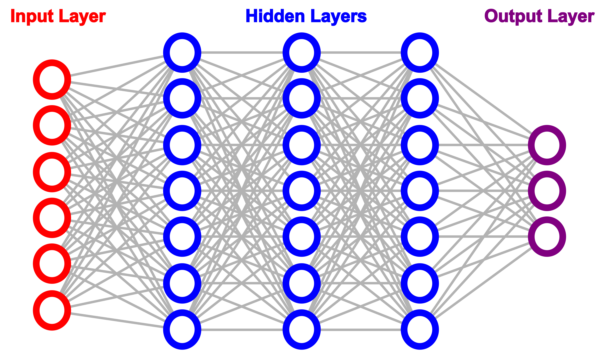
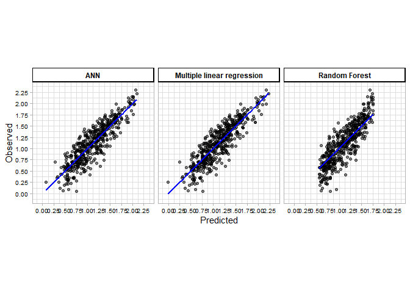
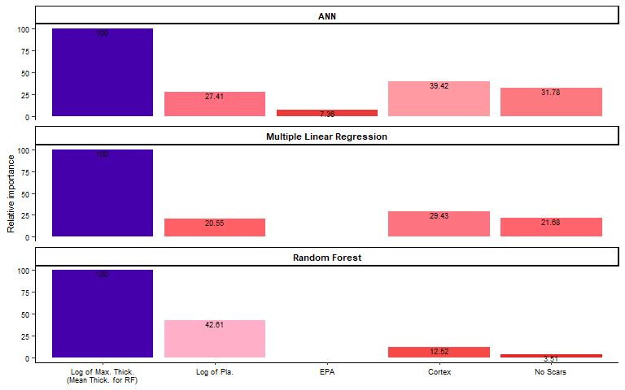

# Multiple approaches to predict flake mass

-   Guillermo Bustos-Pérez <sup>(1,2)</sup>  
-   Javier Baena Preysler <sup>(1)</sup>

<sup>1</sup> Departamento de Prehistoria y Arqueología, Universidad
Autónoma de Madrid, Madrid, Spain  
<sup>2</sup> Corresponding author at:
<guillermo.bustos@estudiante.uam.es> \| <guillermo.willbustos@gmail.com>

## Abstract

Predicting original flake mass is a major goal of lithic analysis.
Predicting original flake mass allows to make estimations of remaining
mass, lost mass, etc. All these measures relate to the organization of
lithic technology by past societies. The present work tests three
different models to predict log of flake mass: Multiple Linear
Regression, Random Forest regression and Artificial Neuronal Network
(ANN). Estimations of flake mass are performed using remaining features
of flakes from an experimental assemblage. This assemblage has been
obtained by the expansion of a previous dataset by the inclusion of
bigger flakes, allowing to account for the effects of sample size and
value distribution. Correlation results show a large/strong relation
between predictions and real outcome (r2 = 0.78 in the best case).
Comparison of models allows to gain insights into variable importance
for predicting flake mass. Results also show that (for the present
dataset) multiple linear regression still stands as the best method for
predicting log of flake weight. Additionally, transformation of
predicted values from the multiple linear regression and true values to
the linear scale reinforces the linear correlation above the 0.8
threshold.

**Key words:** lithic technology; experimental archaeology; flake
weight; Machine Learning; Deep Learning

## 1. Introduction

“Curated” is a key concept for the analysis of lithic technological
organization ([Andrefsky, 2009](#ref-andrefsky_analysis_2009); [Binford,
1979](#ref-binford_organization_1979); [Nelson,
1991](#ref-nelson_study_1991); [Spry and Stern,
2016](#ref-spry_technological_2016)). Initially “curated” was defined to
encompass a series of behavioral patterns related to provisioning
strategies ([Binford, 1979](#ref-binford_organization_1979),
[1973](#ref-renfrew_interassemblage_1973)). Further authors included
tool transport, utilization in a wide range of tasks, anticipated
production, hafting and recycling (after original tool had been
discarded) into the behavioral adaptive strategies that defined a
curation. [Shott](#ref-shott_exegesis_1996)
([1996](#ref-shott_exegesis_1996), [1989](#ref-shott_tool-class_1989))
proposed an alternative interpretation of the term “curation” as the
“ratio of realized to potential utility.” This shift in the definition
of the “curation” has deep implications for lithic analysis and the
study of lithic technological organization since it transforms
“curation” into a continuous variable ([Shott,
1996](#ref-shott_exegesis_1996)). This shift of “curation” into a
continuous variable usually implies the degree of reduction or
maintenance undergone by a tool ([Shott, 2007](#ref-shott_role_2007),
[1996](#ref-shott_exegesis_1996), [1989](#ref-shott_tool-class_1989)).
Additionally, the understanding of curation as a continuum also relates
to the reduction approach ([Dibble,
1987](#ref-dibble_interpretation_1987),
[1987](#ref-dibble_interpretation_1987); [Rolland and Dibble,
1990](#ref-rolland_new_1990)) which considers processes of resharpening
as a major factor driving the presence and frequency of tool types.
Ethnographic studies also emphasize the role of retouch on resharpening
dulled edges, changes in morphology, or variations in artifact use as
morphology changes throughout reduction ([Casamiquela,
1978](#ref-casamiquela_temas_1978); [Gould,
1968](#ref-gould_living_1968); [Nuevo Delaunay et al.,
2017](#ref-nuevo_delaunay_glass_2017); [Shott and Weedman,
2007](#ref-shott_measuring_2007); [White,
1967](#ref-white_ethno-archaeology_1967)).  
Usually two approaches are employed to estimate the reduction and
curation undergone by a retouched artifact. The first branch of approach
focuses on estimations made through measurements directly made on
retouch. This has led to the proposal of several indexes which use
different measurements such as height of retouch, length of retouched
edge, or projection of original angle ([Bustos-Pérez and Baena,
2019](#ref-bustos-perez_exploring_2019); [Eren et al.,
2005](#ref-eren_defining_2005); [Hiscock and Clarkson,
2005](#ref-hiscock_experimental_2005); [Kuhn,
1990](#ref-kuhn_geometric_1990); [Morales et al.,
2015](#ref-morales_measuring_2015)). Although proposed indexes from this
broad approach usually present high correlation values, they are
conditioned by flake morphology, direction of retouch or tool type
(laterally retouched scrapers, endscrapers, bifacial products, etc.).
[Dibble](#ref-dibble_middle_1995) ([1995](#ref-dibble_middle_1995))
noted the “flat flake problem” when applying
[Kuhn](#ref-kuhn_geometric_1990) ([1990](#ref-kuhn_geometric_1990))
general index of unifacial reduction (GIUR). The “flat flake problem”
states that a flake with trapezoidal cross section (where the dorsal
face is mainly flat) will promptly reach maximum values of GIUR although
reduction continues. The effects of the “flat flake problem” don’t seem
to be so severe on the GIUR ([Hiscock and Clarkson,
2005](#ref-hiscock_experimental_2005)) but they exemplify the possible
limitations that these indexes may undergone as a result of flake
morphology. [Shott](#ref-shott_reduction_2005)
([2005](#ref-shott_reduction_2005)) extensive review of methods outlines
the strengths and limitations derived from geometry, flake morphology
and assemblage suitability faced by each of the indexes.  
The second branch of approach aims to estimate original flake mass based
on remaining features. This branch of approach has the advantage of not
being conditioned by tool type, direction of retouch, or flake
morphology. Estimating original mass and comparing it with remaining
mass can provide highly useful measures such as percentage of mass
remaining, amount of mass lost, etc. All these measures relate to the
curation concept as a continuous and the reduction approach. Initial
controlled experiments showed highly promising results on the ability to
predict flake mass from remaining features ([Dibble and Pelcin,
1995](#ref-dibble_effect_1995)). However following experiments based on
the replication of knapping methods failed to obtain such high levels of
correlation ([Davis and Shea, 1998](#ref-davis_quantifying_1998); [Shott
et al., 2000](#ref-shott_flake_2000)) Additionally in some occasions
estimated original mass was lower than mass of flake after retouch
([Davis and Shea, 1998](#ref-davis_quantifying_1998)). This posed an
important drawback since as [Dibble](#ref-dibble_comment_1998)
([1998](#ref-dibble_comment_1998)) states and [Shott et
al.](#ref-shott_flake_2000) ([2000](#ref-shott_flake_2000)) reiterates:
controlled experiments are useful only if results and variable
relationships are extendible to the archaeological record. Further
research has explored the estimation of flake mass using the combination
of several variables ([Dogandžić et al.,
2015](#ref-dogandzic_edge_2015); [Shott and Seeman,
2017](#ref-shott_use_2017)) and the determination of best variables to
perform estimations ([Bustos-Pérez and Baena,
2021](#ref-bustos-perez_predicting_2021)). [Hiscock and
Tabrett](#ref-hiscock_generalization_2010)
([2010](#ref-hiscock_generalization_2010)) state the logical and
analytical characteristics desirable for an index: inferential power;
directionality; comprehensiveness; sensitivity; versatility, blank
diversity and scale independence. Following these characteristics it can
be stated that the first branch of approach is strong in inferential
power, directionality, comprehensiveness and sensitivity. On the other
hand present estimations of flake mass are strong in inferential power,
comprehensiveness, sensitivity, versatility, blank diversity and scale
independence.

Most analysis focus on the use linear regression (usually through
platform surface as a proxy of flake mass) or the combination of several
variables in multiple linear regression. The generalization of
statistical programming software ([R. C. Team,
2019](#ref-r_core_team_r_2019); [Rs. Team,
2019](#ref-rstudio_team_rstudio_2019)) allows for the implementation of
regression models beyond the simple linear regression. The present study
uses and evaluates three common Machine Learning regression models
(Artificial Neural Networks; Multiple Linear Regression and Random
Forest) for the estimation of flake mass. Additionally each model
provides insights into variable importance.

### 1.2 Loading the data

The following code provides the list of packages employed in the
analysis, checks if they are missing and installs the missing ones.

``` r
list.of.packages <- c("tidyverse", "lattice", "caret", "neuralnet", "ranger", "NeuralNetTools")

new.packages <- list.of.packages[!(list.of.packages %in% 
                                     installed.packages()[,"Package"])]

if(length(new.packages)) install.packages(new.packages)
```

After this we can load the packages to perform model training and
analysis. Additionally in this markdown we are going to use package
knitr to show a nice output of tables. The present study makes extensive
use of tidyverse (Wickham et al., 2019) and caret (Kuhn, 2008) for the
treatment of data and training of models.

``` r
list.of.packages <- c("tidyverse", "lattice", "caret", "neuralnet", "ranger", "knitr")

lapply(list.of.packages, library, character.only = TRUE)
```

    ## [[1]]
    ##  [1] "forcats"   "stringr"   "dplyr"     "purrr"     "readr"     "tidyr"    
    ##  [7] "tibble"    "ggplot2"   "tidyverse" "stats"     "graphics"  "grDevices"
    ## [13] "utils"     "datasets"  "methods"   "base"     
    ## 
    ## [[2]]
    ##  [1] "lattice"   "forcats"   "stringr"   "dplyr"     "purrr"     "readr"    
    ##  [7] "tidyr"     "tibble"    "ggplot2"   "tidyverse" "stats"     "graphics" 
    ## [13] "grDevices" "utils"     "datasets"  "methods"   "base"     
    ## 
    ## [[3]]
    ##  [1] "caret"     "lattice"   "forcats"   "stringr"   "dplyr"     "purrr"    
    ##  [7] "readr"     "tidyr"     "tibble"    "ggplot2"   "tidyverse" "stats"    
    ## [13] "graphics"  "grDevices" "utils"     "datasets"  "methods"   "base"     
    ## 
    ## [[4]]
    ##  [1] "neuralnet" "caret"     "lattice"   "forcats"   "stringr"   "dplyr"    
    ##  [7] "purrr"     "readr"     "tidyr"     "tibble"    "ggplot2"   "tidyverse"
    ## [13] "stats"     "graphics"  "grDevices" "utils"     "datasets"  "methods"  
    ## [19] "base"     
    ## 
    ## [[5]]
    ##  [1] "ranger"    "neuralnet" "caret"     "lattice"   "forcats"   "stringr"  
    ##  [7] "dplyr"     "purrr"     "readr"     "tidyr"     "tibble"    "ggplot2"  
    ## [13] "tidyverse" "stats"     "graphics"  "grDevices" "utils"     "datasets" 
    ## [19] "methods"   "base"     
    ## 
    ## [[6]]
    ##  [1] "knitr"     "ranger"    "neuralnet" "caret"     "lattice"   "forcats"  
    ##  [7] "stringr"   "dplyr"     "purrr"     "readr"     "tidyr"     "tibble"   
    ## [13] "ggplot2"   "tidyverse" "stats"     "graphics"  "grDevices" "utils"    
    ## [19] "datasets"  "methods"   "base"

The following code load the dataset from a .csv file and allows to see a
preview of the data.

``` r
# Load the data
Reg_Data <- read.csv("Data/Flake Mass v02 Eng.csv")
```

``` r
kable(Reg_Data[1:10,])
```

| Length | Width | MeanThick | Max_Thick | Weight | Surface.Plat | Platfom_Depth | Cortex | No_Scars | Termination_type | EPA | Log_Weight | Log_Max_Thick | Log_Plat | Log_Plat_De |
|-------:|------:|----------:|----------:|-------:|-------------:|--------------:|-------:|---------:|:-----------------|----:|-----------:|--------------:|---------:|------------:|
|   51.3 |  29.8 | 10.066667 |      13.1 |  17.83 |       83.585 |           7.3 |      5 |        4 | Feather          |  51 |  1.2511513 |     1.1172713 | 1.922128 |   0.8633229 |
|   49.1 |  30.0 |  8.566667 |       9.7 |  13.33 |       90.480 |           7.8 |      5 |        3 | Feather          |  70 |  1.1248301 |     0.9867717 | 1.956553 |   0.8920946 |
|   30.8 |  43.8 | 11.566667 |      16.8 |  20.33 |       40.500 |           3.6 |      3 |        2 | Feather          |  35 |  1.3081374 |     1.2253093 | 1.607455 |   0.5563025 |
|   30.2 |  19.6 |  5.500000 |       6.7 |   3.98 |       59.670 |           5.1 |      5 |        3 | Feather          |  66 |  0.5998831 |     0.8260748 | 1.775756 |   0.7075702 |
|   57.1 |  37.8 | 11.166667 |      13.3 |  22.18 |      109.800 |          12.0 |      4 |        3 | Feather          |  68 |  1.3459615 |     1.1238516 | 2.040602 |   1.0791812 |
|   37.5 |  34.2 |  5.466667 |       6.7 |   7.97 |       51.340 |           6.8 |      5 |        1 | Hinge            |  65 |  0.9014583 |     0.8260748 | 1.710456 |   0.8325089 |
|   65.6 |  41.9 | 10.400000 |      14.6 |  24.16 |       93.840 |          10.2 |      5 |        2 | Feather          |  67 |  1.3830969 |     1.1643529 | 1.972388 |   1.0086002 |
|   86.8 |  70.8 | 16.066667 |      19.2 |  96.20 |      210.625 |          12.5 |      5 |        3 | Step             |  66 |  1.9831751 |     1.2833012 | 2.323510 |   1.0969100 |
|   39.2 |  54.7 | 16.700000 |      27.3 |  31.70 |       17.460 |           3.6 |      5 |        2 | Feather          |  30 |  1.5010593 |     1.4361626 | 1.242044 |   0.5563025 |
|   49.2 |  60.6 | 11.233333 |      14.0 |  40.16 |      158.080 |          12.8 |      5 |        2 | Hinge            |  68 |  1.6037937 |     1.1461280 | 2.198877 |   1.1072100 |

## 2. Methods

### 2.1 Experimental assemblage

Sample for analysis is composed of 500 experimentally knapped flakes
using hard hammer. Flakes belong to 30 knapping sequences where a wide
variety of knapping methods were employed —hierarchical (Levallois and
Hierarchical Discoid), bifacial (Discoid), and unipolar— to generate the
experimental sample, ensuring a wide range of morphologies
\[[Boëda](#ref-dibble_levallois:_1995)
([1995a](#ref-dibble_levallois:_1995));
[Boëda](#ref-boeda_caracteristiques_1995)
([1995b](#ref-boeda_caracteristiques_1995)); boeda_debitage_1993;
[Casanova i Martí et al.](#ref-casanova_i_marti_strategies_2009)
([2009](#ref-casanova_i_marti_strategies_2009));
[Terradas](#ref-terradas_discoid_2003)
([2003](#ref-terradas_discoid_2003))\]. This is an expansion of a
previous dataset employed for similar purposes ([Bustos-Pérez and Baena,
2021](#ref-bustos-perez_predicting_2021)) which allows to expand the
range of dimensions and mass of the assemblage. Although termination
type influences flake mass, its influence on predicting original flake
mass is considered residual or non-significant ([Clarkson and Hiscock,
2011](#ref-clarkson_estimating_2011); [Shott et al.,
2000](#ref-shott_flake_2000)). The experimental assemblage is dominated
by flakes with feather terminations (89.8%) although other type of
terminations are present. All selected flakes were complete.

``` r
kable(data.frame(table(Reg_Data$Termination_type)))
```

| Var1     | Freq |
|:---------|-----:|
| Feather  |  449 |
| Hinge    |   42 |
| Inflexed |    2 |
| Plunging |    2 |
| Step     |    5 |

A key aspect of experimentations directed to estimate flake mass is that
they are independent of external factors. Due to this the flakes were
knapped with a wide variety of hammerstones. Raw material of
hammerstones varied widely (quartz, quartzite, sandstone and limestone)
which allowed for a diverse range of morphologies and potential active
percussion areas.  
Comparison of the experimental dataset with the one from the previous
study ([Bustos-Pérez and Baena,
2021](#ref-bustos-perez_predicting_2021)) shows an increase on the size
and average mass of experimentally knapped flakes. While in the previous
study 50% of the flakes had mass values between 4.15g and 14.02g
([Bustos-Pérez and Baena, 2021](#ref-bustos-perez_predicting_2021)), in
the present study 50% of the flakes weight between 5.87g and 26.96g.
This indicates that the expansion of the dataset has been done by the
inclusion of heavier and bigger flakes. Additionally, exploratory visual
analysis of flake mass shows a highly skewed distribution with flakes
weighting between 10 g and 20 g the most frequent.

``` r
#  Summary statistics of the experimental assemblage
Summary_Assem <- data.frame(
  rbind(data.frame(data.matrix(summary(Reg_Data$Length))) %>% t(),
        data.frame(data.matrix(summary(Reg_Data$Width))) %>% t(),
        data.frame(data.matrix(summary(Reg_Data$MeanThick))) %>% t(),
        data.frame(data.matrix(summary(Reg_Data$Surface.Plat))) %>% t(),
        data.frame(data.matrix(summary(Reg_Data$Weight))) %>% t()))
Measure <- c("Length", "Width", "Mean Thickness", "Platform Surface",
             "Weight")
Summary_Assem <- cbind(Measure, Summary_Assem)
rownames(Summary_Assem) <- 1:nrow(Summary_Assem)
```

``` r
kable(Summary_Assem)
```

| Measure          |      Min. |  X1st.Qu. |    Median |      Mean |  X3rd.Qu. |   Max. |
|:-----------------|----------:|----------:|----------:|----------:|----------:|-------:|
| Length           | 16.500000 | 36.300000 | 45.900000 | 48.253200 |  59.60000 | 100.90 |
| Width            | 14.900000 | 31.175000 | 39.000000 | 40.559200 |  46.82500 |  85.50 |
| Mean Thickness   |  1.800000 |  6.058333 |  8.516667 |  9.249567 |  11.28333 |  26.50 |
| Platform Surface |  2.591814 | 31.350000 | 62.933736 | 93.254685 | 116.11875 | 620.00 |
| Weight           |  1.140000 |  5.870000 | 12.965000 | 21.390400 |  26.95750 | 200.73 |

``` r
Reg_Data %>% 
  ggplot(aes(Width, Length)) +
  geom_segment(x = 40, y = 0, xend = 0, yend = 40, color = "gray48") +
  geom_segment(x = 60, y = 0, xend = 0, yend = 60, color = "gray48") +
  geom_segment(x = 80, y = 0, xend = 0, yend = 80, color = "gray48") +
  
  geom_segment(x = 0, y = 0, xend = 105, yend = 105, color = "gray48") +
  
  geom_segment(x = 0, y = 0, xend = (105/6), yend = 105, color = "gray48") +
  geom_segment(x = 0, y = 0, xend = (105/3), yend = 105, color = "gray48") +
  geom_segment(x = 0, y = 0, xend = (105/2), yend = 105, color = "gray48") +
  geom_segment(x = 0, y = 0, xend = (105/1.5), yend = 105, color = "gray48") +
  geom_segment(x = 0, y = 0, xend = (105/0.75), yend = 105, color = "gray48") +
  geom_segment(x = 0, y = 0, xend = (105/0.5), yend = 105, color = "gray48") +
  geom_segment(x = 0, y = 0, xend = 105, yend = (105/2), color = "gray48") +
  
  annotate("text", x = 0, y = 104, adj = 0, 
           label = "Very thin blade", size = 2.5) +
  annotate("text", x = 20, y = 104, adj = 0, 
           label = "Thin blade", size = 2.5) +
  annotate("text", x = 40, y = 104, adj = 0, 
           label = "Blade", size = 2.5) +
  annotate("text", x = 53, y = 104, adj = 0, 
           label = "Elongated flake", size = 2.5) +
  annotate("text", x = 85, y = 104, adj = 0, 
           label = "Flake", size = 2.5) +
  annotate("text", x = 103, y = 92.5, adj = 0, 
           label = "Wide\nflake", size = 2.5) +
  annotate("text", x = 103, y = 65, adj = 0, 
           label = "Very\nwide\nflake", size = 2.5) +
  annotate("text", x = 103, y = 25, adj = 0, 
           label = "Wider\nflake", size = 2.5) +
  
  annotate("text", x = 20, y = 1, adj = 0, 
           label = "Micro", size = 2.5) +
  annotate("text", x = 47, y = 1, adj = 0, 
           label = "Small", size = 2.5) +
  annotate("text", x = 65, y = 1, adj = 0, 
           label = "Normal", size = 2.5) +
  annotate("text", x = 85, y = 1, adj = 0, 
           label = "Big", size = 2.5) +
  
  geom_point(aes(color = Termination_type), size = 2, alpha = 0.75) +
  scale_x_continuous(breaks = seq(0, 105, 5), lim = c(0, 105)) +
  scale_y_continuous(breaks = seq(0, 105, 5), lim = c(0, 105)) +
  ylab("Length (mm)") +
  xlab("Width (mm)") +
  theme_light() +
  ggsci::scale_color_aaas() +
  labs(color = "Termination type") +
  guides(color = guide_legend(nrow = 1, title.position = "top")) +
  theme(axis.title = element_text(size = 9, color = "black", face = "bold"),
        axis.text = element_text(size = 7.5, color = "black"),
        legend.position = "bottom") +
  coord_fixed() 
```


``` r
# Histogram of flake weight
Reg_Data %>% ggplot(aes(Weight)) +
  geom_histogram(binwidth = 10,
                 color = "black", fill = "gray") +
  theme_light() +
  ylab("Count") +
  xlab("Weight (g)") +
  scale_x_continuous(breaks = seq(0, 200, 20)) +
  theme(
    axis.text = element_text(color = "black", size = 9),
    axis.title = element_text(color = "black", size = 10))
```


 

### 2.2 Variable selection

Previous work ([Bustos-Pérez and Baena,
2021](#ref-bustos-perez_predicting_2021)) employed best subset selection
([Furnival and Wilson, 2000](#ref-furnival_regressions_2000); [Hocking
and Leslie, 1967](#ref-hocking_selection_1967)) to obtain the best model
with the best explanatory variables. The present work maintains the
previously selected variables and uses an expanded version of the
dataset. Variables employed to predict flake mass are: average
thickness, log10 of maximum thickness, number of scars, amount of
cortex, EPA, log10 of platform size and log10 of platform depth.

-   **Average thickness:** mean flake thickness measured at 0.25, 0.50
    and 0.75 of flake length ([Eren and Lycett,
    2012](#ref-eren_why_2012)).  
-   **Log10 of maximum thickness:** log10 transformation of the highest
    of the three values of average thickness.  
-   **Number of scars:** number of scars bigger than 5 mm ([Scerri et
    al., 2016](#ref-scerri_can_2016)).  
-   **Amount of cortex:** measured in an ordinal scale. A slightly
    modified version of the triple cortex typology ([Andrefsky,
    2005](#ref-barker_lithics_2005)), with categories being: cortical
    (1), more than 50% covered by cortex (2), less than 50% covered by
    cortex (3), residual presence of cortex (4), and no cortex (5).  
-   **External Platform Angle (EPA):** relation in degrees between the
    platform and the dorsal surface of the flake. Measured with a manual
    goniometer.  
-   **Log10 of platform size:**log10 transformation of platform size
    measured following [Muller and Clarkson](#ref-muller_new_2016)
    ([2016](#ref-muller_new_2016)).  
-   **Log10 of platform depth:** log10 transformation of platform depth.
    Platform depth belongs to the corresponding measure present at
    [Muller and Clarkson](#ref-muller_new_2016)
    ([2016](#ref-muller_new_2016)).

Flake mass (in grams) was recorded using a Sytech SY-BS502 scale with
0.01 precision. All dimensional measures are performed using digital
calipers to 0.1 mm. Two different opinions exist on how EPA should be
measured ([Davis and Shea, 1998](#ref-davis_quantifying_1998); [Dibble
and Pelcin, 1995](#ref-dibble_effect_1995)), and the difficulty of
obtaining accurate measurements when the platform or surface is curved
is acknowledged. Previous studies have shown that it is easier to
predict log10 of flake weight using log10 of flake platform. Two methods
for recording flake platform exists. The first method ([Andrefsky,
2005](#ref-barker_lithics_2005)) uses the product of platform width and
depth. The second method ([Muller and Clarkson,
2016](#ref-muller_new_2016)) ascribes the general platform morphology to
a geometric figure (rectangle, triangle, rhombus, trapezoid, or
ellipse). The area of the geometric figures in combination with the
corresponding measurements is employed to calculate platform area. The
second system has been shown to better approximate platform size when
compared with measurements from scanning techniques and to not
overestimate platform size ([Muller and Clarkson,
2016](#ref-muller_new_2016)). Additionally, previous studies have shown
a clear preference for the second method as a variable for predicting
flake weight ([Bustos-Pérez and Baena,
2021](#ref-bustos-perez_predicting_2021)). Thus only measures of
platform surface belonging to the second method ([Muller and Clarkson,
2016](#ref-muller_new_2016)) are employed.

Previous works shown that it is easier to predict log10 of flake weight
using log10 of platform size ([Braun et al.,
2008](#ref-braun_landscape-scale_2008); [Bustos-Pérez and Baena,
2021](#ref-bustos-perez_predicting_2021); [Clarkson and Hiscock,
2011](#ref-clarkson_estimating_2011); [Shott et al.,
2000](#ref-shott_flake_2000)). Log transformations of variables are
common, since they avoid negative results (necessary in the case of
predicting flake weight), reduce skewed distributions, and can
approximate parametric distributions (which favors the inferential power
of models). In the present study, all logarithmic transformations refer
to the common logarithm (base 10), and the target variable was the
logarithmic transformation of flake weight.


([2016](#ref-muller_new_2016))](Figures/Flake%20measures.jpg) 

Collinearity between predictors has previously been reported for
platform surface and platform depth, and mean thickness and log10 of
maximum thickness ([Bustos-Pérez and Baena,
2021](#ref-bustos-perez_predicting_2021)). For the present dataset there
is an important collinearity between log10 of maximum thickness and mean
thickness (*r*<sup>2</sup> = 0.879); and an expected moderate/strong
collinearity between platform depth and platform surface
(*r*<sup>2</sup> = 0.614). Awareness of these collinearities is
important since collinearity affects variable importance (making hard to
separate the individual effect of a variable on the response), it
reduces the accuracy of the estimates on a Multiple Linear Regression,
and it can result in counterintuitive estimates ([James et al.,
2013](#ref-james_introduction_2013)).

``` r
# Collinearity between measures of thickness
R2(Reg_Data$MeanThick, Reg_Data$Log_Max_Thick)
```

    ## [1] 0.8791263

``` r
# Collinearity between measures of platform
R2(Reg_Data$Platfom_Depth, Reg_Data$Surface.Plat)
```

    ## [1] 0.6140689

### 2.3 Regression methods

Three methods are employed to estimate log10 of flake mass: Multiple
Linear Regression, Artificial Neuronal Networks (ANN) and Random Forest
Regression. The Multiple Linear Regression extends the simple linear
regression in such a way that it can directly accommodate multiple
predictors ([James et al., 2013](#ref-james_introduction_2013)).

*Y* = *β*<sub>0</sub> + *β*<sub>1</sub>*X*<sub>1</sub> + *β*<sub>2</sub>*X*<sub>2</sub> +  ·  ·  · *β*<sub>*p*</sub>*X*<sub>*p*</sub> + *ϵ*

Artificial Neuronal Networks (ANN) are constituted by layers which are
made on nodes. Each ANN has an input layer made of input nodes
(unprocessed features from the dataset), and an output layer made of
output nodes. The output layer represents the target variable and can
have one (in the case of regression when the target is to predict
numerical outputs) or several nodes (in the case of classification
problems). Nodes between layers are connected with parameter values
estimated when the ANN is fitted to the data. An ANN were nodes from the
input layer are directly connected to the output layer (no hidden
layers) is directly similar to the multiple linear regression. To model
more complex relationships, ANN use hidden layers (each composed by a
series of nodes) between the input and output layers which process
signals from the input data and their interactions ([Lantz,
2019](#ref-lantz_machine_2019)). The structure of the ANN according to
the number of hidden layers and number of nodes in each layer is
referred as topology. The present work uses the R package “neuralnet”
([Günther and Fritsch, 2010](#ref-gunther_neuralnet_2010)) to train ANN
with backpropagation ([Rumelhart et al.,
1986](#ref-rumelhart_learning_1986)). For the present work ANN topology
is limited to having only one or two hidden layers. Number of nodes of
hidden layer 1 ranges between 1 and 4 while number of nodes of hidden
layer 2 ranges from 0 (no second hidden layer) to 4. All possible
combinations are tested.

<figure>
<figcaption aria-hidden="true">Schematic representation of an ANN and its components</figcaption>
</figure>

Random Forest Regressions select random samples of the data and build
trees for prediction. As a result, each tree is built from different
data and the average is used as prediction. This adds diversity, reduces
overfit and provides higher resolution predictions ([Lantz,
2019](#ref-lantz_machine_2019)). Additional to the random selection of
data, random forest can be further randomized by providing the number of
trees to train, number of variables to possibly split at each node, and
the minimal node size. These are hyperparamters which values need to be
provided to the model before training. Cartesian grid search (to test
for all possible combinations) is performed on the previously mentioned
hyperparameters with number of trees to grow for each model ranging from
500 to 700 by 25; number of variables to possibly split at each node
ranging from 1 to 5; and minimal node size (ranging from 1 to 5). R
package ranger ([Wright and Ziegler, 2017](#ref-wright_ranger_2017)) is
employed to train Random Forests.

### 2.4 Machine learning evaluation

With the exception of Multiple Linear Regression, Machine Learning
models and ANN are prone to overfit and require to be tested on data not
previously seen by the models ([Hastie et al.,
2001](#ref-hastie_elements_2001); [James et al.,
2013](#ref-james_introduction_2013)). The present work employed a k-fold
cross validation to estimate out-of-sample model performance. In k-fold
cross validation, the dataset is randomly shuffled and divided into k
folds. The first fold is employed as a test set, and the model is
trained in the remaining folds. After this, the second fold is employed
as a test set and the rest as a new training set. This process continues
until all folds have served as a test set. Since the folds are shaped by
the initial random shuffle, it is advisable to repeat this cycle a
series of times. The present work employs a 10-fold cross validation
(each fold having a sample of 50 elements) repeated 50 times.

Machine Learning regression models are evaluated using proportion of
variance explained (*r*<sup>2</sup> and *adjusted* *r*<sup>2</sup>),
visualization of regression plots, visualization of residuals
(difference between actual and predicted value) plot, density plots of
residuals and descriptive statistics of residuals. Proportion of
variance indicates how much of the observed variation is explained by
the model ([James et al., 2013](#ref-james_introduction_2013)). The
addition of predictors results in an increasing *r*<sup>2</sup>
irrespective of predictor contribution to the model and making it
impossible to compare models with a different number of predictors.
*Adjusted* *r*<sup>2</sup> is analogous to the *r*<sup>2</sup> but
adjusted to the number of explanatory variables, thus making model
comparison possible. *Adjusted* *r*<sup>2</sup> is required for the
multiple linear regression model in order to make comparisons while
*r*<sup>2</sup> is required for the rest of the models.  
*Adjusted* *r*<sup>2</sup> indicates how strongly are predictions
related to the true value but it does not indicate how far predictions
fall from the true value ([Lantz, 2019](#ref-lantz_machine_2019)). Mean
Average Error (MAE) and Root Mean Squared Error (RMSE) provide values of
how far predictions fall from the true value ([James et al.,
2013](#ref-james_introduction_2013); [Lantz,
2019](#ref-lantz_machine_2019)). MAE measures the average magnitude of
errors regardless of signal. RMSE also provides a measure of distance
between predicted and actual values although it punishes large errors. A
perfect model will have MAE and RMSE values of 0. On general better
models will have lower values of MAE and RMSE.  
A regression plot provides a scatter plot of predicted and true values
along with its regression line. In a good model the regression line will
pass through the center of all points which will be evenly distributed
above and below. The residuals plot provides a scatter plot of true
values and residuals (difference between true value and predicted value)
allowing to observe if there is systematic bias of the model. The
residual plot of a good model will have the points evenly distributed
among the 0 value.

Collinearity of the mentioned pairs of predictors is addressed by two
means: first, by calculating variance inflation factor; and second by
comparing performance metrics values and residual distribution of the
best models without collinear variables. Variance inflation factor
provides a measure of correlation between predictors and their effects
on the model. In the present study variance inflation factor is
calculated using the package “car” ([Fox and Weisberg,
2018](#ref-fox_r_2018)). Thresholds for evaluating variance inflation
factor values vary, although commonly values between 1 and 10 are
considered inconsequential, values between 10 and 30 are cause of
concern, and values above 30 are considered seriously harmful
([Marquardt, 1970](#ref-marquardt_generalized_1970); [O’brien,
2007](#ref-obrien_caution_2007)). At the present, package “car” ([Fox
and Weisberg, 2018](#ref-fox_r_2018)). Although the different nature of
the models can result in different effects of collinearity, results from
calculating the variance inflation factor in the Multiple Linear
Regression can be extrapolated to the Random Forest and the ANN. While
retrieving pairs of collinear variables allows to determine variable
importance, it is important to consider that collinearity between
predictors does not affect predictions and the inferential power of a
model ([Alin, 2010](#ref-alin_multicollinearity_2010); [Paul,
2006](#ref-paul_multicollinearity_2006)).

The complete workflow is developed using the R language (version 4.0.2)
in the RStudio IDE (version 1.4.1103; ([R. C. Team,
2019](#ref-r_core_team_r_2019); [Rs. Team,
2019](#ref-rstudio_team_rstudio_2019)). Package *tidyverse* ([Wickham et
al., 2019](#ref-wickham_welcome_2019)) is employed for data manipulation
and representation. Packages *leaps* ([Lumley based on Fortran code by
Alan Miller,
2020](#ref-lumley_based_on_fortran_code_by_alan_miller_leaps_2020)) and
*lattice* ([Sarkar, 2008](#ref-sarkar_lattice_2008)) are employed
additionally to previously mentioned packages for model training.
Package *caret* ([Kuhn, 2008](#ref-kuhn_building_2008)) is employed to
set the validation methods and obtain evaluation metrics of each model.

### 2.5 Training the models

The following code sets the train control to perform the 50x10 k fold
cross validation.

``` r
# Set Train control
train.control <- trainControl(method = "repeatedcv", 
                              number = 10, repeats = 50,
                              savePredictions = TRUE)
```

The following code trains the multiple linear regression.

``` r
# Train the model
frmla <- Log_Weight ~ MeanThick + Cortex + No_Scars + EPA + Log_Max_Thick + Log_Plat + Log_Plat_De

set.seed(123)
lm.model <- train(frmla, 
               data = Reg_Data, 
               method = "lm",
               trControl = train.control)
```

The following code performs hyperparameter grid search for Random
Forest. Cartesian grid search is performed on the following
hyperparameters: number of trees to grow for each model (ranging from
500 to 700 by 25); number of variables to possibly split at each node
(ranging from 1 to 5); and minimal node size (ranging from 1 to 5).

Please note that while **mtry** (random number of variables to consider
in each split) and **min.node.size** can be integrated into a cartesian
grid search, the number of trees to grow cannot. Thus, it is necessary
to include the training of the models in a loop were the number of trees
changes in a sequence. At the end of each loop the best combination of
mtry and min.node.size for the given number of trees is extracted (along
with the results).

``` r
#### Hyperparameter tuning for random forest ####
# range of hyperparameters
mtry <- seq(1, 5, 1)
min.node.size <- seq(1, 5, 1)
splitrule = "variance"

# Grid of possible combinations
hyper_grid <- expand.grid(
  mtry = mtry,
  min.node.size = min.node.size ,
  splitrule = "variance")

# Loop over different number of trees
best_tune <- data.frame(
  mtry = numeric(0),
  min_node.size = numeric(0),
  Num_Trees = numeric(0),
  r_squared = numeric(0))

my_seq <- seq(500, 700, 25)

set.seed(123)
for (x in my_seq){
  
  RF_weight <- train(frmla, 
                       Reg_Data,
                       method = "ranger",
                       trControl = train.control,
                       num.trees = x,
                       tuneGrid = hyper_grid 
  )
  
  Bst_R <- data.frame(
    mtry = RF_weight$bestTune[[1]],
    min_node.size = RF_weight$bestTune[[3]],
    Num_Trees = x,
    r_squared = RF_weight$finalModel[[10]])
  
  best_tune <- rbind(best_tune, Bst_R)
  
  Bst_R <- c()
  
}
```

The following code returns the best combination of hyperparameters.

``` r
best_tune_2 <- best_tune[which.max(best_tune$r_squared),]
best_tune_2
```

    ##   mtry min_node.size Num_Trees r_squared
    ## 6    2             4       625 0.7312961

``` r
kable(best_tune)
```

| mtry | min_node.size | Num_Trees | r_squared |
|-----:|--------------:|----------:|----------:|
|    2 |             5 |       500 | 0.7312673 |
|    2 |             5 |       525 | 0.7271587 |
|    2 |             5 |       550 | 0.7256057 |
|    2 |             5 |       575 | 0.7305429 |
|    2 |             4 |       600 | 0.7281003 |
|    2 |             4 |       625 | 0.7312961 |
|    2 |             5 |       650 | 0.7277806 |
|    2 |             5 |       675 | 0.7279673 |
|    2 |             4 |       700 | 0.7296423 |

Finally, the Random forest with optimal combination of hyperparameters
can be trained.

``` r
#### Final random forest model ####
newr_grid <- expand.grid(mtry = best_tune_2$mtry,
                          min.node.size = best_tune_2$min_node.size,
                          splitrule = "variance"
)

RF_weight <- train(frmla, 
                   Reg_Data,
                   method = "ranger",
                   trControl = train.control,
                   tuneGrid = newr_grid, 
                   num.trees = best_tune$Num_Trees,
                   importance = "impurity_corrected")
```

The following code trains the ANN performing cartesian grid search for
the optimal topology.

``` r
#### Look for best ANN architecture ####
 set.seed(123)
 train.control <- trainControl(method = "repeatedcv", 
                               number = 10, repeats = 50,
                               verboseIter = TRUE)

  tune.grid.neuralnet <- expand.grid(
   .layer1 = c(1:4),
   .layer2 = c(0:4),
   .layer3 = 0
 )

 nnet_model <- train(
   Log_Weight ~ MeanThick + Log_Max_Thick + EPA + Log_Plat + Log_Plat_De + Cortex + No_Scars,
   Reg_Data,
   method = 'neuralnet',
   trControl = train.control,
   tuneGrid = tune.grid.neuralnet,
   preProcess = c("center", "scale"),
   learningrate = 0.01,  
   threshold = 0.01,
   stepmax = (10^100),
   linear.output = TRUE
 )
```

## 4. Results

### 4.1 Hyperparameter grid search

Results of hyperparameter cartesian grid search for the Random Forest
regression. In all cases the hyperparameter of number of variables to
possibly split at each node was selected to have a value of 2. Linear
correlation reaches its maximum for a minimum node size of 4 and 625
trees grown for the model (*r*<sup>2</sup> = 0.73). The second best
hyperparameter combination (minimum node size of 5 and 500 trees grown
for the model) presents a marginally lower value of linear correlation
(0.00005).

``` r
#### Hyperparameters of Random forest ####
data.frame(best_tune) %>% 
  ggplot(aes(factor(Num_Trees), min_node.size, fill = r_squared)) + 
  geom_tile(alpha = 0.75) +
  xlab("Number of trees") +
  ylab("Min node size") +
  scale_y_continuous(breaks = seq(4, 5, 1), lim = c(3.5, 5.5)) +
  geom_text(aes(label = round(r_squared, 4)), size = 3) +
  ggsci::scale_fill_gsea(reverse = TRUE) +
  theme_classic() +
  theme(legend.position = "none",
        axis.text = element_text(color = "black", size = 8))
```


Cartesian grid search of ANN topology indicates that increasing the
number of nodes in the first hidden layer decreases linear correlation
with the outcome. Cartesian grid search of ANN topology indicates that
increasing the number of layers and nodes results in lower values of
*r*<sup>2</sup>. Thus, the most simple ANN architecture (one hidden
layer with one node) provides the highest correlation coefficient
(*r*<sup>2</sup> = 0.78). The second best topology (two hidden layers
with one node at each layer) provides a marginally lower value (0.0005
lower).

``` r
data.frame(nnet_model$results) %>% 
  ggplot(aes(layer1, layer2, fill = Rsquared)) + 
  geom_tile(alpha = 0.75) +
  geom_text(aes(label = round(Rsquared, 4)), size = 3) +
  ggsci::scale_fill_gsea(reverse = TRUE) +
  xlab("Number of nodes in layer 1") +
  ylab("Number of nodes in layer 2") +
  theme_classic() +
  coord_fixed() +
  theme(legend.position = "none",
        axis.text = element_text(color = "black", size = 8))
```


### 4.2 Model evaluation

The following table presents the precision metrics for each model. ANN
and multiple linear regression perform similarly with similar values of
*r*<sup>2</sup> (0.78), RMSE (0.21) and MAE (0.17), although ANN
performs slightly better. On the other hand Random Forest regression
performs slightly worst with a lower value of r2 (0.72) and higher
values of RMSE (0.24) and MAE (0.19).

``` r
Temp <- data.frame(rbind(
  round(MLR_model$results[2:4],2),
  round(nnet_model_f$results[4:6],2),
  round(RF_model$results[4:6],2)))

Temp <- cbind(data.frame(model = c("MLR", "ANN", "RF")), Temp)

kable(Temp)
```

| model | RMSE | Rsquared |  MAE |
|:------|-----:|---------:|-----:|
| MLR   | 0.21 |     0.78 | 0.17 |
| ANN   | 0.21 |     0.78 | 0.17 |
| RF    | 0.24 |     0.72 | 0.19 |

Visualization of regression plots for each model provides additional
information of the performance of each model. The poor performance of
Random Forest (lowest value of *r*<sup>2</sup>) is reflected in a
limited range of prediction. The prediction range of the Random Forest
is limited between a minimum value of 0.55 and a maximum value of 1.76
for log10 of flake mass. As a result of this, data is not evenly
distributed among the regression line. In the lowest values of
prediction most points fall below the regression line while most data
points falling above for the highest values of the regression line. ANN
and multiple linear regression plots present similar patterns of
distribution with data evenly distributed among the regression line.
Flakes with a log10 value of flake mass above 2 are more evenly
distributed for the multiple linear regression than for the ANN.

``` r
#### Linear model ####
MLR_results <- as.data.frame(MLR_model$pred) %>% 
  group_by(rowIndex) %>% 
  summarise(Pred = mean(pred),
            Obs = mean(obs)) %>% 
  mutate(Residual = Obs - Pred)

#### ANN model ####
nnet_results <- as.data.frame(nnet_model_f$pred) %>% 
  group_by(rowIndex) %>% 
  summarise(Pred = mean(pred),
            Obs = mean(obs)) %>% 
  mutate(Residual = Obs - Pred)

#### RF Model ####
RF_results <- as.data.frame(RF_model$pred) %>% 
  group_by(rowIndex) %>% 
  summarise(Pred = mean(pred),
            Obs = mean(obs)) %>% 
  mutate(Residual = Obs - Pred)

#### Put models together #####
Temp <- rbind(MLR_results, nnet_results, RF_results)
Temp$Model <- "Multiple linear regression"
Temp$Model[501:1000] <- "ANN"
Temp$Model[1001:1500] <- "Random Forest"

#### Correlation plot ####
Temp %>% 
  ggplot(aes(Pred, Obs)) +
  geom_point(alpha = 0.5, size = 1.5) +
  geom_line(aes(y = Pred), size = 1, col = "blue") +
  
  scale_x_continuous(breaks = seq(0, 2.55, 0.25), lim = c(-0.1, 2.35)) +
  scale_y_continuous(breaks = seq(0, 2.55, 0.25), lim = c(-0.1, 2.35)) +
  
  xlab("Predicted") +
  ylab("Observed") +

  facet_wrap(~ Model, ncol = 3) + 
  coord_fixed() +
  theme_light() +
  theme(strip.text = element_text(color = "black", face = "bold", size = 9),
        strip.background = element_rect(fill = "white", colour = "black", size = 1),
        axis.text = element_text(size = 7.5, color = "black"))
```


Visual analysis of the scatter plot for observed and residual values
allows to observe model performance for different ranges of log10 of
flake mass values. Residuals of the Random Forest present a systematic
bias for the upper and lowest values of observed weight. In the case of
flakes with a log10 value of 0.50 there is a systematic overestimation
of the size. In the case of flakes with a log10 value of 1.75 there is a
systematic underestimation of values. ANN and multiple linear regression
present very similar plots for observed values and residuals. In both
cases residual values indicate a systematic overestimation of a log10
flake mass when the actual value is below 0.25.  
Between values of 0.25 and 2 both models present a very similar
performance with residual values falling evenly among the 0 value. ANN
seems to present a slightly systematic underestimation of flakes with a
log10 of flake mass above a value of 2. Multiple linear regression does
seem to perform better for flakes with a log10 flake mass value above 2
with residual values falling evenly or very close to the 0 value line.

``` r
## Plots of observed values and residuals
Temp %>% 
  ggplot(aes(Obs, Residual)) +
  geom_point(alpha = 0.5, size = 1.5) +
  
  xlab("Observed") +
  ylab("Residual") +
  
  scale_x_continuous(breaks = seq(0, 2.55, 0.25), lim = c(min(Temp$Obs), max(Temp$Obs))) +
  scale_y_continuous(breaks = seq(-0.75, 0.75, 0.25), lim = c(-0.85, 0.85)) +
  geom_hline(yintercept = 0, linetype = "dashed") +
  
  facet_wrap(~ Model, ncol = 3) + 
  coord_fixed() +
  theme_light() +
  theme(strip.text = element_text(color = "black", face = "bold", size = 9),
        strip.background = element_rect(fill = "white", colour = "black", size = 1),
        axis.text = element_text(size = 7.5, color = "black"))
```


Correlation between observed values and residuals allows to evaluate if
residuals increase along with increasing values of log10 of weight. ANN
and multiple linear regression models present the same value of
*r*<sup>2</sup> for correlation of observed values and residuals
(*r*<sup>2</sup> = 0.22; p \< 0.01) while Random Forest presents a
higher value of correlation (*r*<sup>2</sup> = 0.5; p \< 0.01).

``` r
# Residuals and multiple linear regression
summary(lm(Residual ~ Obs, MLR_results))
```

    ## 
    ## Call:
    ## lm(formula = Residual ~ Obs, data = MLR_results)
    ## 
    ## Residuals:
    ##      Min       1Q   Median       3Q      Max 
    ## -0.54486 -0.11287  0.00723  0.12352  0.53357 
    ## 
    ## Coefficients:
    ##             Estimate Std. Error t value Pr(>|t|)    
    ## (Intercept) -0.24837    0.02260  -10.99   <2e-16 ***
    ## Obs          0.22306    0.01889   11.81   <2e-16 ***
    ## ---
    ## Signif. codes:  0 '***' 0.001 '**' 0.01 '*' 0.05 '.' 0.1 ' ' 1
    ## 
    ## Residual standard error: 0.1857 on 498 degrees of freedom
    ## Multiple R-squared:  0.2188, Adjusted R-squared:  0.2172 
    ## F-statistic: 139.4 on 1 and 498 DF,  p-value: < 2.2e-16

``` r
# Residuals and ANN
summary(lm(Residual ~ Obs, nnet_results))
```

    ## 
    ## Call:
    ## lm(formula = Residual ~ Obs, data = nnet_results)
    ## 
    ## Residuals:
    ##      Min       1Q   Median       3Q      Max 
    ## -0.55719 -0.10717 -0.00036  0.13051  0.51214 
    ## 
    ## Coefficients:
    ##             Estimate Std. Error t value Pr(>|t|)    
    ## (Intercept) -0.24798    0.02258  -10.98   <2e-16 ***
    ## Obs          0.22286    0.01887   11.81   <2e-16 ***
    ## ---
    ## Signif. codes:  0 '***' 0.001 '**' 0.01 '*' 0.05 '.' 0.1 ' ' 1
    ## 
    ## Residual standard error: 0.1855 on 498 degrees of freedom
    ## Multiple R-squared:  0.2188, Adjusted R-squared:  0.2172 
    ## F-statistic: 139.5 on 1 and 498 DF,  p-value: < 2.2e-16

``` r
# Residuals and RF model
summary(lm(Residual ~ Obs, RF_results))
```

    ## 
    ## Call:
    ## lm(formula = Residual ~ Obs, data = RF_results)
    ## 
    ## Residuals:
    ##      Min       1Q   Median       3Q      Max 
    ## -0.49052 -0.11216  0.00151  0.10916  0.47628 
    ## 
    ## Coefficients:
    ##             Estimate Std. Error t value Pr(>|t|)    
    ## (Intercept) -0.42164    0.02052  -20.55   <2e-16 ***
    ## Obs          0.38224    0.01715   22.29   <2e-16 ***
    ## ---
    ## Signif. codes:  0 '***' 0.001 '**' 0.01 '*' 0.05 '.' 0.1 ' ' 1
    ## 
    ## Residual standard error: 0.1686 on 498 degrees of freedom
    ## Multiple R-squared:  0.4994, Adjusted R-squared:  0.4984 
    ## F-statistic: 496.8 on 1 and 498 DF,  p-value: < 2.2e-16

Descriptive statistics of residuals and density plots allow to evaluate
dispersion range of residuals. All models present average and median
residual values close to 0 with density curves peaking near this value
which is indicative of a good model performance. 50% of residual values
from ANN model fall between values of -0.133 and 0.143 making for a
distance of 0.276. 50% of residual values from multiple linear
regression model fall between values of -0.137 and 0.134 making for a
distance of 0.271. 50% of residual values from multiple Random Forest
model fall between values of -0.138 and 0.177 making for a distance of
0.315. This indicates that multiple linear regression model concentrates
50% of residuals values in a slightly shorter range. This range is 0.005
shorter than the one from ANN model. The Random forest presents the
highest dispersion range for 50% of residual values.

``` r
# Density plot of residuals
Temp %>% ggplot(aes(Residual, color = Model)) +
  geom_density(size = 1) +
  ggsci::scale_color_aaas() +
  scale_x_continuous(breaks = seq(-1, 1, 0.25), lim = c(-1,1)) +
  geom_vline(xintercept = 0, linetype = "dashed") +
  geom_hline(yintercept = 0) +
  ylab("Density") +
  theme_light() +
  theme(legend.position = "bottom",
        legend.title = element_text(face = "bold"),
        axis.text = element_text(color = "black", size = 9),
        axis.title = element_text(color = "black", size = 10))
```


90% of residual values from ANN model fall between values of -0.379 and
0.33 making for a distance of 0.709. 90% of residual values from
multiple linear regression model fall between values of -0.371 and 0.333
making for a distance of 0.704. 90% of residual values from Random
Forest model fall between values of -0.412 and 0.355 making for a
distance of 0.767. Again, multiple linear regression concentrates 90% of
residuals in the shortest range. ANN presents a slightly wider range
(difference of 0.005) and Random Forest presents the widest range of the
three models.

``` r
kable(
  Temp %>% group_by(Model) %>% 
  summarise(
    Min = min(Residual),
    `5 Percentil` = quantile(Residual, 0.05),
    `1Quantile` = quantile(Residual, 0.25),
    Mean = mean(Residual),
    Median = quantile(Residual, 0.5),
    `3Quantile` = quantile(Residual, 0.75),
    `95 Percentil` = quantile(Residual, 0.95),
    Max = max(Residual)
  ))
```

| Model                      |        Min | 5 Percentil |  1Quantile |       Mean |    Median | 3Quantile | 95 Percentil |       Max |
|:---------------------------|-----------:|------------:|-----------:|-----------:|----------:|----------:|-------------:|----------:|
| ANN                        | -0.6952028 |  -0.3790468 | -0.1331217 |  0.0000595 | 0.0240733 | 0.1428723 |    0.3295823 | 0.4993439 |
| Multiple linear regression | -0.7046012 |  -0.3711780 | -0.1368752 | -0.0001095 | 0.0204098 | 0.1341937 |    0.3332873 | 0.4823185 |
| Random Forest              | -0.8456258 |  -0.4117285 | -0.1383524 |  0.0037893 | 0.0133008 | 0.1773731 |    0.3550391 | 0.6154902 |

``` r
# Order of flakes is kept the same for all models
Terminations <- Reg_Data %>% select(Termination_type)
Terminations <- rbind(Terminations, Terminations, Terminations)
Terminations <- cbind(Temp, Terminations)

# Mutate to new categories: feather termination and other types of terminations
Terminations <- Terminations %>% mutate(
  New_Term =
  case_when(
    Termination_type == "Feather" ~ "Feather",
    Termination_type != "Feather" ~ "Other"))
```

``` r
Terminations %>% 
  ggplot(aes(New_Term, Residual, fill = New_Term)) +
  facet_wrap(~ Model, ncol = 3) +
  geom_violin(alpha = 0.6) +
  geom_boxplot(alpha = 0.8, outlier.size = 0) +
  geom_jitter(width = 0.15, alpha = 1, size = 0.9, shape = 23, aes(fill = New_Term)) +
  ggsci::scale_fill_aaas() +
  xlab(NULL) +
  theme_light() +
  theme(
    legend.position = "none",
    strip.text = element_text(color = "black", face = "bold", size = 9),
    strip.background = element_rect(fill = "white", colour = "black", size = 1),
    axis.text = element_text(color = "black", size = 8.5),
    axis.title = element_text(color = "black", size = 9))
```


Exploratory data analysis of residuals according to termination type
through box and violin plots shows possible differences in the
distribution for the three models. Comparison of residuals means
according to termination type and for each model through t-test shows
significant differences for the ANN model (t = -2.5; p = 0.02), the
multiple linear regression (t = -2.52; p = 0.01), but not for the random
forest regression (t = -1.82, p = 0.07). In all models residuals mean of
flakes with feather terminations fall near the cero value (-0.007 in the
case of ANN; -0.008 in the case of multiple linear regression and -0.002
in the case of Random Forest). Flakes with other termination than
feather tend to have a slightly higher mean of residuals values (0.07 in
the case of ANN; 0.07 in the case of multiple linear regression; 0.06 in
the case of random Forest).

``` r
# t-test residuals and terminations for ANN
t.test(Residual ~ New_Term, data = Terminations[Terminations$Model == "ANN",])
```

    ## 
    ##  Welch Two Sample t-test
    ## 
    ## data:  Residual by New_Term
    ## t = -2.4964, df = 63.439, p-value = 0.01516
    ## alternative hypothesis: true difference in means between group Feather and group Other is not equal to 0
    ## 95 percent confidence interval:
    ##  -0.13238703 -0.01467883
    ## sample estimates:
    ## mean in group Feather   mean in group Other 
    ##           -0.00744086            0.06609207

``` r
# t-test residuals and terminations for Multiple linear regression
t.test(Residual ~ New_Term, data = Terminations[Terminations$Model == "Multiple linear regression",])
```

    ## 
    ##  Welch Two Sample t-test
    ## 
    ## data:  Residual by New_Term
    ## t = -2.5239, df = 62.665, p-value = 0.01416
    ## alternative hypothesis: true difference in means between group Feather and group Other is not equal to 0
    ## 95 percent confidence interval:
    ##  -0.13631906 -0.01583418
    ## sample estimates:
    ## mean in group Feather   mean in group Other 
    ##          -0.007869329           0.068207291

``` r
# t-test residuals and terminations for Random Forest
t.test(Residual ~ New_Term, data = Terminations[Terminations$Model == "Random Forest",])
```

    ## 
    ##  Welch Two Sample t-test
    ## 
    ## data:  Residual by New_Term
    ## t = -1.8155, df = 65.4, p-value = 0.07403
    ## alternative hypothesis: true difference in means between group Feather and group Other is not equal to 0
    ## 95 percent confidence interval:
    ##  -0.121451961  0.005779731
    ## sample estimates:
    ## mean in group Feather   mean in group Other 
    ##          -0.002109984           0.055726131

### 4.3 Linear transformation of predictions

The following table presents the performance metrics of each model after
transforming true and predicted values back to the linear scale. ANN and
multiple linear regression reinforce their correlation while Random
Forest decreases its *r*<sup>2</sup> value. Multiple linear regression
provides the highest *r*<sup>2</sup> value (*r*<sup>2</sup> = 0.813)
followed by ANN (*r*<sup>2</sup> = 0.801), indicating that multiple
linear regression generalizes better to the linear scale. All models
present lower RMSE values than the standard deviation value of weight of
the experimental assemblage (24.83) which is indicative of a good
general performance.

``` r
# Transform into linear scale
Temp <- Temp %>% 
  mutate(Observed = 10^Obs,
         Predicted = 10^Pred,
         Line_Res = Observed - Predicted)
```

``` r
ANN <- Temp %>% filter(Model == "ANN")
MLR <- Temp %>% filter(Model == "Multiple linear regression")
RF <- Temp %>% filter(Model == "Random Forest")

# Performance metrics
kable(data.frame(
  "Metric" = 
    c("r2", "RMSE", "MAE"),
  
  "ANN" = 
    c(round(R2(ANN$Observed, ANN$Predicted),3),
  round(RMSE(ANN$Observed, ANN$Predicted),3),
  round(MAE(ANN$Observed, ANN$Predicted), 3)),
  
  "Mult. Linear Reg." = 
    c(round(R2(MLR$Observed, MLR$Predicted),3),
    round(RMSE(MLR$Observed, MLR$Predicted),3),
    round(MAE(MLR$Observed, MLR$Predicted), 3)),
  
  "Random Forest" = 
    c(round(R2(RF$Observed, RF$Predicted),3),
    round(RMSE(RF$Observed, RF$Predicted),3),
    round(MAE(RF$Observed, RF$Predicted), 3))
))
```

| Metric |    ANN | Mult..Linear.Reg. | Random.Forest |
|:-------|-------:|------------------:|--------------:|
| r2     |  0.801 |             0.814 |         0.660 |
| RMSE   | 11.344 |            10.853 |        16.996 |
| MAE    |  6.942 |             6.793 |         8.700 |

``` r
## Regression plot on linear scale
Temp %>% ggplot(aes(Predicted, Observed)) +
  geom_point(alpha = 0.5, size = 1.5) +
  geom_line(aes(y = Predicted), size = 1, col = "blue") +
  
  scale_x_continuous(breaks = seq(0, 205, 20), lim = c(0, 205)) +
  scale_y_continuous(breaks = seq(0, 205, 20), lim = c(0, 205)) +
  
  facet_wrap(~ Model) +
  coord_fixed() +
  theme_light() +
  theme(strip.text = element_text(color = "black", face = "bold", size = 9),
        strip.background = element_rect(fill = "white", colour = "black", size = 1),
        axis.text = element_text(size = 7.5, color = "black"))
```



Visualization of regression plots also supports the better
generalization of multiple linear regression to the linear scale. Random
Forest limits its maximum prediction to 57.2 g resulting in a poor
generalization to the linear scale. Due to this, residuals from the
Random Forest indicate important underestimations of flake weight with
an average underestimation of 4.6 g. 50% of the residuals of the Random
Forest range between overestimations of 2.64 g and underestimations of
7.06 g. 90% of the residuals from the random forest range between
overestimations of 10.35 g and underestimations of 29.74 g. Visual
representation of residuals of the Random Forest through density plot
shows that despite peaking on the 0 value it presents a long tale of
positive residuals as a result of underestimations of predictions.  
ANN generalizes better to the linear scale with a higher range of
predictions which reach a maximum value of 123 g. Density plot of
residuals from the ANN present a concentrated peak on the 0 value with a
mean value of 1.82 g. Despite this ANN residuals still present a
slightly long tale of positive values for residuals as a result of some
underestimations. 50% of residuals from ANN range between
overestimations of 2.52 g and underestimations of 5.55 g. 90% of the
residuals from ANN range between overestimations of 13.18 g and
underestimations of 18.79 g.  
As previously mentioned Multiple Linear Regression generalizes better to
the linear scale with a maximum predicted value of 170 g. Residuals
present an average 1.4 g value, with the density plot peaking near the 0
value and similar tales to the positive and negative values. 50% of
residuals from Multiple Linear Regression range between overestimations
of 2.42 g and underestimations of 5.73 g. 90% of residuals from Multiple
Linear Regression range between overestimations of 13.18 g and
underestimations of 18.79 g. Thus, Multiple Linear regression presents
the concentration of 90% of residuals in the shortest range.

``` r
# Density plot of residuals on the linear scale
Temp %>% ggplot(aes(Line_Res, color = Model)) +
  geom_density(size = 0.75) +
  ggsci::scale_color_aaas() +
  geom_vline(xintercept = 0, linetype = "dashed") +
  geom_hline(yintercept = 0) +
  ylab("Density") +
  xlab("Residuals (g)") +
  theme_light() +
  theme(legend.position = "bottom",
        legend.title = element_text(face = "bold",size = 9),
        axis.text = element_text(color = "black", size = 9),
        axis.title = element_text(color = "black", size = 10),
        legend.text = element_text(size = 9))
```


``` r
# Descriptive statistics of residuals
kable(
  Temp %>% group_by(Model) %>% 
    summarise(
      Min = min(Line_Res),
      `5 Percentil` = quantile(Line_Res, 0.05),
      `1Quantile` = quantile(Line_Res, 0.25),
      Mean = mean(Line_Res),
      Median = quantile(Line_Res, 0.5),
      `3Quantile` = quantile(Line_Res, 0.75),
      `95 Percentil` = quantile(Line_Res, 0.95),
      Max = max(Line_Res)
  ))
```

| Model                      |       Min | 5 Percentil | 1Quantile |     Mean |    Median | 3Quantile | 95 Percentil |       Max |
|:---------------------------|----------:|------------:|----------:|---------:|----------:|----------:|-------------:|----------:|
| ANN                        | -47.08316 |   -13.79028 | -2.516174 | 1.816030 | 0.4762883 |  5.552758 |     19.80933 |  84.98876 |
| Multiple linear regression | -60.22261 |   -13.18240 | -2.422225 | 1.400462 | 0.3307878 |  5.724842 |     18.79086 |  55.58517 |
| Random Forest              | -20.06615 |   -10.35089 | -2.641137 | 4.611775 | 0.3338027 |  7.059517 |     29.74203 | 152.07560 |

### 4.4 Collinearity and variable importance

The following table presents the variance inflation factor of each of
the predictors in the Multiple Linear Regression model. Although mean
thickness and log10 of maximum thickness present the highest values
(8.43 and 8.88 respectively), neither of the predictors presents a value
above 10, indicating that collinearity is irrelevant.

``` r
# Variance inflation factor of Multiple Linear Regression
car::vif(MLR_model$finalModel)
```

    ##     MeanThick        Cortex      No_Scars           EPA Log_Max_Thick 
    ##      8.432394      1.969457      1.835175      1.183984      8.880526 
    ##      Log_Plat   Log_Plat_De 
    ##      4.764830      5.136607

Previous to test non-collinear combination of variables it is necessary
to set the formulas with the different possible combinations. The
following code provides four additional formulas for training the models
without pairs of collinear variables.

``` r
# Models formula without collinear variables
frmla1 <- as.formula("Log_Weight ~ Log_Max_Thick + EPA + Log_Plat + Cortex + No_Scars")
frmla2 <- as.formula("Log_Weight ~ Log_Max_Thick + EPA + Log_Plat_De + Cortex + No_Scars")
frmla3 <- as.formula("Log_Weight ~ MeanThick + EPA + Log_Plat + Cortex + No_Scars")
frmla4 <- as.formula("Log_Weight ~ MeanThick + EPA + Log_Plat_De + Cortex + No_Scars")
```

Following the preparation of the formulas each variation of the model
can be trained. Note that this implies training four variation for each
model (a total of 12 additional models). Hyperparamter tuning is kept
the same as for models trained including all variables.

``` r
# Train MLR models
set.seed(123)
lm.model1 <- train(frmla1, 
                   data = Reg_Data, 
                   method = "lm",
                   trControl = train.control)

set.seed(123)
lm.model2 <- train(frmla2, 
                   data = Reg_Data, 
                   method = "lm",
                   trControl = train.control)

set.seed(123)
lm.model3 <- train(frmla3, 
                   data = Reg_Data, 
                   method = "lm",
                   trControl = train.control)

set.seed(123)
lm.model4 <- train(frmla4,
                   data = Reg_Data, 
                   method = "lm",
                   trControl = train.control)

# Train ANN  
set.seed(123)
nnet_model1 <- train(
  frmla1,
  Reg_Data,
  method = 'neuralnet',
  trControl = train.control,
  tuneGrid = tune.grid.neuralnet,
  preProcess = c("center", "scale"),
  learningrate = 0.01,  
  threshold = 0.01,
  stepmax = (10^100),
  linear.output = TRUE
)

set.seed(123)
nnet_model2 <- train(
  frmla2,
  Reg_Data,
  method = 'neuralnet',
  trControl = train.control,
  tuneGrid = tune.grid.neuralnet,
  preProcess = c("center", "scale"),
  learningrate = 0.01,  
  threshold = 0.01,
  stepmax = (10^100),
  linear.output = TRUE
)

set.seed(123)
nnet_model3 <- train(
  frmla3,
  Reg_Data,
  method = 'neuralnet',
  trControl = train.control,
  tuneGrid = tune.grid.neuralnet,
  preProcess = c("center", "scale"),
  learningrate = 0.01,  
  threshold = 0.01,
  stepmax = (10^100),
  linear.output = TRUE
)

set.seed(123)
nnet_model4 <- train(
  frmla4,
  Reg_Data,
  method = 'neuralnet',
  trControl = train.control,
  tuneGrid = tune.grid.neuralnet,
  preProcess = c("center", "scale"),
  learningrate = 0.01,  
  threshold = 0.01,
  stepmax = (10^100),
  linear.output = TRUE
)


# Train Random Forest
set.seed(123)
RF.model1 <- train(frmla1, 
                   Reg_Data,
                   method = "ranger",
                   trControl = train.control,
                   tuneGrid = newr_grid, 
                   num.trees = 625,
                   importance = "impurity_corrected")

set.seed(123)
RF.model2 <- train(frmla2, 
                   Reg_Data,
                   method = "ranger",
                   trControl = train.control,
                   tuneGrid = newr_grid, 
                   num.trees = 625,
                   importance = "impurity_corrected")

set.seed(123)
RF.model3 <- train(frmla3, 
                   Reg_Data,
                   method = "ranger",
                   trControl = train.control,
                   tuneGrid = newr_grid, 
                   num.trees = 625,
                   importance = "impurity_corrected")

set.seed(123)
RF.model4 <- train(frmla4, 
                   Reg_Data,
                   method = "ranger",
                   trControl = train.control,
                   tuneGrid = newr_grid, 
                   num.trees = 625,
                   importance = "impurity_corrected")
```

The following table presents model performance metrics of the three
tested methods when collinear variables are retrieved. For Multiple
Linear Regression and ANN performance metrics were the best when mean
thickness and log10 of platform depth are retrieved, and presented the
lowest performance values when average thickness and log10 of platform
depth were kept has predictive variables. In the case of Random Forest
Regression, performance values were lowest when mean thickness and log10
of platform surface were excluded as predictive variables. However,
these values are similar to the ones obtained when log10 of maximum
thickness and log10 of platform surface are excluded when training the
Random Forest Regression.

``` r
data.frame(
  Model = c("MLR", "MLR", "MLR", "MLR",
            "ANN", "ANN", "ANN", "ANN",
            "Random Forest", "Random Forest", "Random Forest", "Random Forest"),
  
  `Variables excluded` = c(
    "Mean Thickness & Log of Plat. Depth", 
    "Mean Thickness & Log of Plat. Surf.",
    "Log of Max. Thick & Log of Plat. Depth", 
    "Log of Max. Thick & Log of Plat. Surf.",
    
    "Mean Thickness & Log of Plat. Depth", 
    "Mean Thickness & Log of Plat. Surf.",
    "Log of Max. Thick & Log of Plat. Depth", 
    "Log of Max. Thick & Log of Plat. Surf.",

    "Mean Thickness & Log of Plat. Depth", 
    "Mean Thickness & Log of Plat. Surf.",
    "Log of Max. Thick & Log of Plat. Depth", 
    "Log of Max. Thick & Log of Plat. Surf."),
  
  Rsquared = rbind(
    round(lm.model1$results$Rsquared,3),
    round(lm.model2$results$Rsquared,3),
    round(lm.model3$results$Rsquared,3),
    round(lm.model4$results$Rsquared,3),
    
    round(nnet_model$results$Rsquared,3),
    round(nnet_model2$results$Rsquared,3),
    round(nnet_model3$results$Rsquared,3),
    round(nnet_model4$results$Rsquared,3),
    
    round(RF.model1$results$Rsquared,3),
    round(RF.model2$results$Rsquared,3),
    round(RF.model3$results$Rsquared,3),
    round(RF.model4$results$Rsquared,3)),

  RMSE = rbind(
    round(lm.model1$results$RMSE,3),
    round(lm.model2$results$RMSE,3),
    round(lm.model3$results$RMSE,3),
    round(lm.model4$results$RMSE,3),
    
    round(nnet_model$results$RMSE,3),
    round(nnet_model2$results$RMSE,3),
    round(nnet_model3$results$RMSE,3),
    round(nnet_model4$results$RMSE,3),
    
    round(RF.model1$results$RMSE,3),
    round(RF.model2$results$RMSE,3),
    round(RF.model3$results$RMSE,3),
    round(RF.model4$results$RMSE,3)),
  
  MAE = rbind(
    round(lm.model1$results$MAE,3),
    round(lm.model2$results$MAE,3),
    round(lm.model3$results$MAE,3),
    round(lm.model4$results$MAE,3),
    
    round(nnet_model$results$MAE,3),
    round(nnet_model2$results$MAE,3),
    round(nnet_model3$results$MAE,3),
    round(nnet_model4$results$MAE,3),
    
    round(RF.model1$results$MAE,3),
    round(RF.model2$results$MAE,3),
    round(RF.model3$results$MAE,3),
    round(RF.model4$results$MAE,3)))
```

    ##            Model                     Variables.excluded Rsquared  RMSE   MAE
    ## 1            MLR    Mean Thickness & Log of Plat. Depth    0.761 0.216 0.173
    ## 2            MLR    Mean Thickness & Log of Plat. Surf.    0.744 0.224 0.178
    ## 3            MLR Log of Max. Thick & Log of Plat. Depth    0.755 0.219 0.175
    ## 4            MLR Log of Max. Thick & Log of Plat. Surf.    0.736 0.227 0.182
    ## 5            ANN    Mean Thickness & Log of Plat. Depth    0.764 0.215 0.171
    ## 6            ANN    Mean Thickness & Log of Plat. Surf.    0.748 0.222 0.177
    ## 7            ANN Log of Max. Thick & Log of Plat. Depth    0.765 0.214 0.170
    ## 8            ANN Log of Max. Thick & Log of Plat. Surf.    0.747 0.222 0.177
    ## 9  Random Forest    Mean Thickness & Log of Plat. Depth    0.707 0.248 0.200
    ## 10 Random Forest    Mean Thickness & Log of Plat. Surf.    0.695 0.253 0.204
    ## 11 Random Forest Log of Max. Thick & Log of Plat. Depth    0.714 0.246 0.197
    ## 12 Random Forest Log of Max. Thick & Log of Plat. Surf.    0.698 0.251 0.201

All models with best combinations of non-collinear variables presented
performance metrics (*r*<sup>2</sup>, RMSE, MAE) slightly lower, but
similar to those of models including collinear variables. When the
predicted values from models with collinear variables are compared to
the predicted values of models with no collinear variables, no
significant difference is present for the Multiple Linear Regression (t
= -0.002, p = 0.998), ANN (t \< 0.001, p = 1) or Random Forest (t =
-0.08, p = 0.936). The following table presents performance metrics when
predictions and observations from the best models without collinear
variables are transformed into linear scale. Again, the exclusion of
collinear variables results in slightly increased values of RMSE and
MAE, and a lower *r*<sup>2</sup> value. Additionally, when collinear
variables are excluded, RMSE and MAE indicate that ANN generalizes
better to the linear scale. Both results of performance metrics (in the
logarithmic and linear scale) indicate that the predictive power of
models is slightly diminished when collinear variables are excluded from
model training, but this diminishment is not significative.

``` r
# Get predictions from models with no collinear variables
# and transform into linear scale for further use

# Multiple Linear regression and join with previous predictions
lm.pred <- as.data.frame(lm.model1$pred) %>% 
group_by(rowIndex) %>% 
  summarise(
    obs = mean(obs),
    pred = mean(pred)) %>% 
  mutate(
  Weigh = 10^obs,
  Pred.Weight = 10^pred)

lm.pred <- cbind(
  lm.pred, 
(MLR_model$pred %>% group_by(rowIndex) %>% 
  summarise(coll.pred = mean(pred),
            coll.obs = mean(obs)) %>% 
  mutate(Coll.pred.Weight = 10^coll.pred) %>% 
   select(-rowIndex))) 

# ANN and join with previous predictions
nnet.pred <- as.data.frame(nnet_model$pred) %>% 
  group_by(rowIndex) %>% 
  summarise(
    obs = mean(obs),
    pred = mean(pred)) %>% 
  mutate(
    Weigh = 10^obs,
    Pred.Weight = 10^pred)

nnet.pred <- cbind(
  nnet.pred, 
  (nnet_model_f$pred %>% group_by(rowIndex) %>% 
     summarise(coll.pred = mean(pred),
               coll.obs = mean(obs)) %>% 
     mutate(Coll.pred.Weight = 10^coll.pred) %>% 
     select(-rowIndex))) 


# RF and join with previous predictions
RF.pred <- as.data.frame(RF.model3$pred) %>% 
  group_by(rowIndex) %>% 
  summarise(
    obs = mean(obs),
    pred = mean(pred)) %>% 
  mutate(
    Weigh = 10^obs,
    Pred.Weight = 10^pred)
RF.pred <- cbind(
  RF.pred, 
  (RF_model$pred %>% group_by(rowIndex) %>% 
     summarise(coll.pred = mean(pred),
               coll.obs = mean(obs)) %>% 
     mutate(Coll.pred.Weight = 10^coll.pred) %>% 
     select(-rowIndex))) 
```

``` r
# t-test to check if there is differences between predictions
t.test(lm.pred$pred, lm.pred$coll.pred)
```

    ## 
    ##  Welch Two Sample t-test
    ## 
    ## data:  lm.pred$pred and lm.pred$coll.pred
    ## t = -0.0025274, df = 997.85, p-value = 0.998
    ## alternative hypothesis: true difference in means is not equal to 0
    ## 95 percent confidence interval:
    ##  -0.04804233  0.04791873
    ## sample estimates:
    ## mean of x mean of y 
    ##  1.113043  1.113105

``` r
t.test(nnet.pred$pred, nnet.pred$coll.pred)
```

    ## 
    ##  Welch Two Sample t-test
    ## 
    ## data:  nnet.pred$pred and nnet.pred$coll.pred
    ## t = 7.5427e-06, df = 997.9, p-value = 1
    ## alternative hypothesis: true difference in means is not equal to 0
    ## 95 percent confidence interval:
    ##  -0.04803739  0.04803776
    ## sample estimates:
    ## mean of x mean of y 
    ##  1.112936  1.112936

``` r
t.test(RF.pred$pred, RF.pred$coll.pred)
```

    ## 
    ##  Welch Two Sample t-test
    ## 
    ## data:  RF.pred$pred and RF.pred$coll.pred
    ## t = -0.080636, df = 995.11, p-value = 0.9357
    ## alternative hypothesis: true difference in means is not equal to 0
    ## 95 percent confidence interval:
    ##  -0.04024728  0.03707017
    ## sample estimates:
    ## mean of x mean of y 
    ##  1.107618  1.109206

``` r
# Performance metrics of best models without collinear variables in the linear scale
tibble(
  Model = c("MLR", "ANN", "RF"),
  Rsquared = rbind(
    round(R2(lm.pred$Weigh, lm.pred$Pred.Weight),3),
    round(R2(nnet.pred$Weigh, nnet.pred$Pred.Weight),3),
    round(R2(RF.pred$Weigh, RF.pred$Pred.Weight),3)),
  RMSE = rbind(
    round(RMSE(lm.pred$Weigh, lm.pred$Pred.Weight),3),
    round(RMSE(nnet.pred$Weigh, nnet.pred$Pred.Weight),3),
    round(RMSE(RF.pred$Weigh, RF.pred$Pred.Weight),3)),
  MAE = rbind(
    round(MAE(lm.pred$Weigh, lm.pred$Pred.Weight),3),
    round(MAE(nnet.pred$Weigh, nnet.pred$Pred.Weight),3),
    round(MAE(RF.pred$Weigh, RF.pred$Pred.Weight),3)))
```

    ## # A tibble: 3 x 4
    ##   Model Rsquared[,1] RMSE[,1] MAE[,1]
    ##   <chr>        <dbl>    <dbl>   <dbl>
    ## 1 MLR          0.779     12.4    7.35
    ## 2 ANN          0.777     12.0    7.22
    ## 3 RF           0.619     18.0    8.90

Retrieving collinear variables allows to evaluate variable importance
for each model. All models consider of maximum importance measures of
thickness (mean thickness in the case of Random Forest, and log10 of
maximum thickness in the case of Multiple Linear Regression and ANN).
Both ANN and Multiple Linear Regression consider the importance of the
rest of variables in the same order: relative amount of cortex is
considered the second most important variable, followed by number of
scars and log of platform size. Order of importance of variables does
change in the Random Forest regression with log of platform size being
the second most important variable, followed by relative amount of
cortex and number of scars. EPA is considered the variable of least
importance by all models. ANN does attribute some importance for the
prediction of log10 of flake weight. A 0 value of importance for EPA is
obtained in the Random Forest and Multiple Linear Regression models.
However, coefficients estimate of the Multiple Linear Regression does
consider EPA a significant predictor (p = 0.015).

``` r
# Make Data frame of importance of MLR
mr_imp <- varImp(lm.model1, scale = TRUE)
mr_imp <- as.data.frame(mr_imp$importance)
mr_imp$Variable = rownames(mr_imp)
mr_imp$Model = "Multiple Linear Regression"

temp <- NeuralNetTools::garson(nnet_model)
ANN_imp <- data.frame(temp$data) %>% mutate(
  Overall = (rel_imp*100)/max(temp$data[,1])) %>% 
  select(-c(rel_imp)) %>% 
  rename(Variable = x_names) %>% 
  mutate(Model = "ANN") %>% 
  select(Overall, Variable, Model)

# Make Data frame of RF importance
RF_imp <- varImp(RF.model3, scale = TRUE)
RF_imp <- as.data.frame(RF_imp$importance)
RF_imp$Variable = rownames(RF_imp)
RF_imp$Model = "Random Forest"

#### Variable importance according to model 
Var_Imp <- rbind(mr_imp, ANN_imp, RF_imp)
rm(mr_imp, ANN_imp, RF_imp)

Var_Imp$Variable <- factor(Var_Imp$Variable,
                           levels = c("Log_Max_Thick",
                                      "Log_Plat", 
                                      "EPA", "Cortex", "No_Scars",
                                      "MeanThick"),
                           labels = c("Log of Max. Thick.\n(Mean Thick. for RF)",
                                      "Log of Pla.",
                                      "EPA", "Cortex",
                                      "No Scars",
                                      "Log of Max. Thick.\n(Mean Thick. for RF)"))
```

``` r
# Variable importance of each model
Var_Imp %>% ggplot(aes(Variable, Overall, fill = Overall)) +
  geom_col() +
  geom_text(data = Var_Imp[Var_Imp$Overall > 0,],
            aes(label = round(Overall, 2)), vjust= "top", size = 2.5) +
  ggsci::scale_fill_gsea(reverse = TRUE) +
  theme_classic() +
  facet_wrap(~ Model, ncol = 1) +
  ylab("Relative importance") +
  xlab(NULL) +
  theme(legend.position = "none",
        axis.text = element_text(color = "black", size = 7),
        strip.text = element_text(color = "black", face = "bold", size = 8),
        strip.background = element_rect(fill = "white", colour = "black", size=1),
        axis.title.y = element_text(color = "black", size = 8))
```



## 5. Discussion

The present study has expanded a previous dataset ([Bustos-Pérez and
Baena, 2021](#ref-bustos-perez_predicting_2021)) with bigger and heavier
flakes and applied three common Machine and Deep Learning regression
algorithms (Multiple Linear Regression, ANN and Random Forest) to
determine log10 of flake mass based on previously selected variables
([Bustos-Pérez and Baena, 2021](#ref-bustos-perez_predicting_2021)).
Additionally, predicted results and true values have been transformed
back to the linear scale to explore further relations. ANN and Multiple
Linear regression present similar *r*<sup>2</sup> values (0.78 in both
cases), performance metrics and residual distributions in the
logarithmic scale. Comparatively, Random Forest performed poorly with a
lower *r*<sup>2</sup> (0.72), worst performance metrics and clearly
biased distributions of residuals. Transformation of predicted and true
values back to the linear scale slightly reinforced ANN and Multiple
Linear Regression increasing their *r*<sup>2</sup> values (0.8 and 0.81
respectively) while decreasing the Random Forest *r*<sup>2</sup> (0.66).
Results from residual analysis and distribution, performance metrics and
regression plots indicate that Multiple Linear Regression is the model
that best generalizes to the linear scale when collinear variables are
included.

Results from removing collinear variables allowed to evaluate predictor
importance on model performance and reliability of predictions. Results
from variance inflation factor and comparing residual distribution
indicate that no statistical difference exists between predictions which
include collinear variables, and predictions without collinear
variables. This indicates that predictions from models including
collinear variables are as reliable as the ones which do not include
collinear variables. However, when collinear variables are excluded from
model training, ANN generalizes slightly better to the linear scale than
Multiple Linear Regression.

Removing collinear variables also allowed to better evaluate variable
importance for each model. In all cases, measures of thickness (average
thickness in the case of Random Forest and log10 of maximum thickness in
the case of ANN and Multiple Linear regression) were considered of
maximum importance to predict log10 of flake weight. After measures of
thickness, the order of importance of the variables is the same for ANN
and Multiple Linear Regression, although their relative values differ.
These variables and their order are: relative amount of cortex, number
of scars and log10 of platform size. However, for these variables,
importance values are much lower in the case of Multiple Linear
Regression, suggesting that ANN is diversifying the importance of
predictors while Multiple Linear Regression relies more on log10 of
maximum thickness. Random Forest (the model with worst performance
metrics) considered mean thickness as the key feature for determining
log10 of flake mass, followed by log10 of platform surface. Amount of
cortex and number of scars were considered as variables of minor
importance and EPA was given no importance at all by the Random Forest.
ANN is the only model to give a value of relative importance to EPA
(although being the less important variable for that model), while
Multiple Linear Regression gives a 0 value of importance, but it is
considered statistically significant in the model coefficients. These
results indicate that although EPA might be a significant predictor, its
importance on predicting log10 of flake mass is minimized when compared
with other predictors.  
Results from the present study show significant differences in residual
distribution according to flake termination when determining flake
weight. This suggest that flake termination plays a significant role
when predicting original weight. Although not included as predictor in
the present study, further research might benefit from coding
termination type (as feather or other) to determine original flake
weight.

Several works have addressed the estimation of flake mass from remaining
variables. The first element of comparison is with the previous version
of this dataset ([Bustos-Pérez and Baena,
2021](#ref-bustos-perez_predicting_2021)). The expansion of the dataset
through the inclusion of bigger flakes has resulted in an increased
linear correlation for Multiple Linear Regression and ANN. Additionally,
the inclusion of bigger flakes and addressing collinearity has also
resulted in changes of variable importance. The previous version of the
dataset ([Bustos-Pérez and Baena,
2021](#ref-bustos-perez_predicting_2021)) considered cortex amount and
number of scars as the third and fourth most significant variables of
the model (behind log10 values of maximum thickness and platform size).
In the present study, all three models emphasize even more the
importance of thickness measures (especially log10 of maximum
thickness). Cortex amount and number of scars are respectively
considered the second and third most important variables (although with
values of importance considerably lower than measures of thickness),
while log10 of platform size is considered the fourth most important
variable (second in the case of Random Forest regression). EPA is the
variable most heavily affected by the increasing size of flakes since it
goes from being a significant variable ([Bustos-Pérez and Baena,
2021](#ref-bustos-perez_predicting_2021)) to be considered almost
irrelevant by most of the models. Possible sources for the lack of
resolution when measuring this EPA. Previous studies have shown high
variability when obtaining angle measurements from manual goniometers
([Dibble and Bernard, 1980](#ref-dibble_comparative_1980); [Morales et
al., 2015](#ref-morales_measuring_2015)) and this lack of resolution can
also be applied to EPA measurements. Previous studies have acknowledged
the difficulty in measuring EPA with manual goniometers or different
interpretation of the flake exterior surface ([Davis and Shea,
1998](#ref-davis_quantifying_1998); [Dibble and Pelcin,
1995](#ref-dibble_effect_1995); [Shott et al.,
2000](#ref-shott_flake_2000)). This can be a possible explication of the
low importance attributed to EPA by the models of the present study.
Four variables (average thickness, log10 of maximum thickness, number of
scars and relative amount of cortex) employed in the present study can
be altered by extensive processes of retouch. Therefore, caution and an
overall estimation of the integrity of the predictors is highly
advisable before applying the model.  
A possible interpretation for the increased value of *r*<sup>2</sup> is
that as flake mass increases, the importance of variables shifts, and
more variance is captured by the model. Thus, it can be inferred that
smaller flakes with relative low values of mass have a higher
variability of the selected variables, resulting in a lower
*r*<sup>2</sup>. Research on the previous version of this dataset
([Bustos-Pérez and Baena, 2021](#ref-bustos-perez_predicting_2021)) also
provided lower, but very similar values of RMSE (0.217 vs 0.209) and MAE
(0.178 vs 0.166). This might indicate that a limit in the ability to
predict original flake mass is being reached with the present set of
variables. A portion of variance remains unexplained and might be
related to variables which hardly survive or are hard to determine in
the archaeological record (hammerstone speed, morphology and density).

Most previous works employ a single linear regression to estimate flake
mass in the log10 scale or the linear scale. [Shott et
al.](#ref-shott_flake_2000) ([2000](#ref-shott_flake_2000)) estimate
log10 value of flake mass based on log10 values of platform area
measured with digital calipers obtaining an *r*<sup>2</sup> of 0.67.
[Braun et al.](#ref-braun_landscape-scale_2008)
([2008](#ref-braun_landscape-scale_2008)) obtain a similar linear
correlation value of log10 of flake mass (*r*<sup>2</sup> = 0.66) for
their sample of flakes using digital calipers to measure platform area
and using log10 of platform area. This value increases drastically when
they measure platform area of the same flakes with digital photographs
(*r*<sup>2</sup> = 0.865). However this highly promising result was
nuanced by [Clarkson and Hiscock](#ref-clarkson_estimating_2011)
([2011](#ref-clarkson_estimating_2011)) estimations of flake mass using
3D measures of platform surface. [Clarkson and
Hiscock](#ref-clarkson_estimating_2011)
([2011](#ref-clarkson_estimating_2011)) report an *r*<sup>2</sup> of
0.49 for their total experimental sample and indicate that diverse flake
assemblages reduce the capability of estimating flake mass based on
platform area. [Maloney](#ref-maloney_experimental_2020)
([2020](#ref-maloney_experimental_2020)) estimates flake mass (g) based
on 3D measures of platform surface and obtains an *r*<sup>2</sup> value
of 0.411 for the complete sample. [Orellana Figueroa et
al.](#ref-orellana_figueroa_proof_2021)
([2021](#ref-orellana_figueroa_proof_2021)) use virtual knapping and
neuronal networks to predict flake shape (width and length) along with
flake volume, reporting an *r*<sup>2</sup> = 0.771 and a RMSE = 0.763.
[Dogandžić et al.](#ref-dogandzic_edge_2015)
([2015](#ref-dogandzic_edge_2015)) approach the estimation of flake mass
using a multiple linear regression which uses platform width and depth,
EPA and blank thickness obtaining an *r*<sup>2</sup> value of 0.75 for
the cubic root of weigh. Although this is a high value of correlation
they express concerns about the model accuracy ([Dogandžić et al.,
2015](#ref-dogandzic_edge_2015)). [Shott and
Seeman](#ref-shott_use_2017) ([2017](#ref-shott_use_2017)) follow the
steps of [Dogandžić et al.](#ref-dogandzic_edge_2015)
([2015](#ref-dogandzic_edge_2015)) and use a multiple linear regression
with platform surface (as product of platform width and depth), flake
thickness and EPA as variables resulting in an *r*<sup>2</sup> value of
0.73 ([Shott and Seeman, 2017](#ref-shott_use_2017)). [Archer et
al.](#ref-archer_geometric_2018) ([2018](#ref-archer_geometric_2018))
and [Morales et al.](#ref-morales_measuring_2015)
([2015](#ref-morales_measuring_2015)) ) employ 3D scanning techniques to
estimate original flake mass (using geometric morphometrics or
geometrical relationships) obtaining respective *r*<sup>2</sup> values
of 0.879 and 0.891. However, these resources are not as widespread among
archaeologists and are hard to apply to numerous collections, making
desirable the estimation of flake mass by the use of non–laser scanning
techniques.

In the present study the transformation back to linear scale of log10
values of observed and predicted mass resulted in changes of
coefficients of determination for the three models. ANN and Multiple
Linear Regression reinforced their correlation values above the 0.8
threshold while Random Forest suffered a decrease. It should not be
surprising that ANN and Multiple Linear Regression behave similarly
since an ANN with one node in only one hidden layer is considered to be
a distant cousin of Multiple Linear Regression ([Lantz,
2019](#ref-lantz_machine_2019)) Ideally predictions of flake weight
would be done in the linear scale since they are easier to interpret.
Changes in correlation coefficient when shifting from logarithmic to
linear scale can be considered a result of the distribution of
residuals, original data, and the nature of the logarithmic scale. Here,
a possible explanation resides in the skewed distribution of flake mass
of the present dataset which directly relates with predictions of the
model. As higher the value of log10 of flake mass, more accurate must be
the prediction. This can be illustrated with the following example: a
flake with a log10 value of mass of 1 (10 g) and a log10 predicted value
of 1.1 (12.59) will result in a residual of 2.59 in the linear scale. A
flake with a log10 value of mass of 2 (100 g) and a predicted log10
value of 2.1 (125.89 g) will result in a residual of 25.89. Thus,
although in the logarithmic scale the residuals have the same value, in
the linear scale they result in a difference 10 times bigger. Despite
this drawback the Multiple Linear Regression model generalizes
relatively well to the linear scale but requires further evaluation.

Reproducibility is a key issue for archaeology (and all sciences) and
the existence of independent researches reaching similar results on
correlations and variable importance is key for the validation of a
method ([Marwick, 2017](#ref-marwick_computational_2017)). The present
differs slightly in variable importance with previous studies which use
multiple linear regression and measures from flakes ([Dogandžić et al.,
2015](#ref-dogandzic_edge_2015); [Shott and Seeman,
2017](#ref-shott_use_2017)). Log10 values of platform surface have also
been acknowledge as an important predictor of flake mass ([Braun et al.,
2008](#ref-braun_landscape-scale_2008); [Bustos-Pérez and Baena,
2021](#ref-bustos-perez_predicting_2021); [Clarkson and Hiscock,
2011](#ref-clarkson_estimating_2011); [Davis and Shea,
1998](#ref-davis_quantifying_1998); [Shott et al.,
2000](#ref-shott_flake_2000)).

[Hiscock and Tabrett](#ref-hiscock_generalization_2010)
([2010](#ref-hiscock_generalization_2010)) advocate for the use of
indexes presenting logical and analytical qualities. These are:
inferential power (advocating for those indexes with an *r*<sup>2</sup>
above 0.8); directionality (increasing values as reduction proceeds),
comprehensiveness (capability to operate at all levels of reduction);
sensitivity; versatility (applicable to different types and positions of
retouch); blank diversity; and scale independence.  
Estimating original flake mass would be an ideal index to fulfill these
logical and analytical qualities since it would allow to compare
remaining mass with original mass (being able to estimate derived
measures such as amount of mass lost, percentage of mass remaining,
etc.) and it could be applied to different types of blanks. In the
present study the estimation of original flake mass using Multiple
Linear Regression in linear scale provided an *r*<sup>2</sup> above the
0.8 threshold although as previously mentioned caution is required.
Theoretically this would fulfill the seven logical and analytical
requirements stated by [Hiscock and
Tabrett](#ref-hiscock_generalization_2010)
([2010](#ref-hiscock_generalization_2010)). However, [Davis and
Shea](#ref-davis_quantifying_1998) ([1998](#ref-davis_quantifying_1998))
showed how estimations of flake mass might result in lower values than
those of the flake after undergoing retouch. This drawback violates the
logical and analytical principle of directionality of indexes and
requires further evaluation before applying the present model. A
possible solution for this drawback would be the development of new
models with the inclusion of remaining flake mass as predictive variable
in hopes of increasing the inferential power and directionality of
predictions. Other indexes such as GIUR ([Hiscock and Clarkson,
2005](#ref-hiscock_experimental_2005); [Kuhn,
1990](#ref-kuhn_geometric_1990)), ERP ([Eren et al.,
2005](#ref-eren_defining_2005)), 3DERP ([Morales et al.,
2015](#ref-morales_measuring_2015)) or AvtL ([Bustos-Pérez and Baena,
2019](#ref-bustos-perez_exploring_2019)) guarantee directionality and
sensitivity and are reported to have higher inferential power in most
cases. Further research might attempt to increase accuracy of
estimations of original flake mass by the inclusion of additional
variables such as scar density, which showed high inferential power,
([Bradbury and Carr, 1999](#ref-bradbury_examining_1999)) remaining
flake mass or height of the retouch.

## 6. Conclusions

The present research deals with the estimation of flake mass using the
remaining features of a flake. Estimating original flake mass is key for
the estimation of curation and for making inferences on the organization
of lithic technology of past societies. The experimental sample employed
to estimate flake mass was obtained after expanding a previously
existing dataset ([Bustos-Pérez and Baena,
2021](#ref-bustos-perez_predicting_2021)) by the inclusion of bigger
flakes. The inclusion of bigger flakes resulted in a higher correlation
value, although measures of distance between prediction and true value
(RMSE and MAE) did not vary substantially regarding the previous version
of the dataset. Addressing collinearity allowed to ensure the quality of
predictions and variable importance. Predictions from models which
include collinear variables do not statistically differ and are as
reliable as predictions from models without collinear variables. Log10
of maximum thickness stands out as the most important variable for
predicting flake mass. Multiple Linear regression and the simplest ANN
have shown to be the best models for estimating log10 of flake mass in
the present dataset. Multiple Linear regression and the simplest ANN
have shown to be the best models for estimating log10 of flake mass in
the present dataset.

## Acknowledgments

The authors wish to thank the co-editor and the three anonymous
reviewers for their comments and suggestions. This article is the result
of the research projects “Como, Quien Y Donde?: Variabilidad De
Comportamientos En La Captación Y Transformación De Los Recursos Liticos
Dentro De Grupos Neandertales 2” (HAR2016-76760-C3-2-P) financed by
Agencia Estatal de Investigación (AEI), Fondo Europeo de Desarrollo
Regional (FEDER); and “En Los Limites De La Diversidad: Comportamiento
Neandertal En El Centro Y Sur De La Penisula Iberica”
(ID2019-103987GB-C33) financed by the Programa Estatal de Generación de
Conocimiento y Fortalecimiento Científico y Tecnológico del Sistema de
I+D+i y de I+D+i Orientada a los Retos de la Sociedad, del Plan Estatal
de Investigación Científica y Técnica y de Innovación (2017–2020).
Development of the experimentation and analysis of the materials were
undertaken at the Laboratory of Experimental Archaeology (Universidad
Autónoma de Madrid).

## 06 References

<div id="refs" class="references csl-bib-body hanging-indent">

<div id="ref-alin_multicollinearity_2010" class="csl-entry">

Alin, A., 2010. Multicollinearity. Wiley Interdisciplinary Reviews:
Computational Statistics 2, 370–374.

</div>

<div id="ref-andrefsky_analysis_2009" class="csl-entry">

Andrefsky, W., 2009. The analysis of stone tool procurement, production,
and maintenance. Journal of Archaeological Research 17, 65–103.
<https://doi.org/10.1007/s10814-008-9026-2>

</div>

<div id="ref-barker_lithics_2005" class="csl-entry">

Andrefsky, W., 2005. Lithics macroscopic approaches to analysis, Second.
ed, Cambridge manuals in archaeology. Cambridge University Press,
Cambridge.

</div>

<div id="ref-archer_geometric_2018" class="csl-entry">

Archer, W., Pop, C.M., Rezek, Z., Schlager, S., Lin, S.C., Weiss, M.,
Dogandžić, T., Desta, D., McPherron, S.P., 2018. A geometric
morphometric relationship predicts stone flake shape and size
variability. Archaeological and Anthropological Sciences 10, 1991–2003.
<https://doi.org/10.1007/s12520-017-0517-2>

</div>

<div id="ref-binford_organization_1979" class="csl-entry">

Binford, L.R., 1979. Organization and formation processes: Looking at
curated technologies. Journal of Anthropological Research 35, 255–273.

</div>

<div id="ref-renfrew_interassemblage_1973" class="csl-entry">

Binford, L.R., 1973. Interassemblage variability - the mousterian and
the ’functional ’ argument, in: Renfrew, C. (Ed.), The Explanation of
Culture Change. Models in Prehistory. Duckworth, Gloucester, pp.
227–254.

</div>

<div id="ref-dibble_levallois:_1995" class="csl-entry">

Boëda, E., 1995a. Levallois: A volumetric construction, methods, a
technique, in: Dibble, H.L., Bar-Yosef, O. (Eds.), The Definition and
Interpretation of Levallois Technology, Monographs in World Archaeology.
Prehistory Press, Madison, Wisconsin, pp. 41–68.

</div>

<div id="ref-boeda_caracteristiques_1995" class="csl-entry">

Boëda, E., 1995b. Caractéristiques techniques des chaînes opératoires
lithiques des niveaux micoquiens de Külna (Tchécoslovaquie). pal 1,
57–72. <https://doi.org/10.3406/pal.1995.1380>

</div>

<div id="ref-bradbury_examining_1999" class="csl-entry">

Bradbury, A.P., Carr, P.J., 1999. Examining stage and continuum models
of flake debris analysis: An experimental approach. Journal of
Archaeological Science 26, 105–116.
<https://doi.org/10.1006/jasc.1998.0309>

</div>

<div id="ref-braun_landscape-scale_2008" class="csl-entry">

Braun, D.R., Rogers, M.J., Harris, J.W.K., Walker, S.J., 2008.
Landscape-scale variation in hominin tool use: Evidence from the
developed oldowan. Journal of Human Evolution 55, 1053–1063.
<https://doi.org/10.1016/j.jhevol.2008.05.020>

</div>

<div id="ref-bustos-perez_predicting_2021" class="csl-entry">

Bustos-Pérez, G., Baena, J., 2021. Predicting flake mass: A view from
machine learning. Lithic Technology 46, 130–142.
<https://doi.org/10.1080/01977261.2021.1881267>

</div>

<div id="ref-bustos-perez_exploring_2019" class="csl-entry">

Bustos-Pérez, G., Baena, J., 2019. Exploring volume lost in retouched
artifacts using height of retouch and length of retouched edge. Journal
of Archaeological Science: Reports 27, 101922.
<https://doi.org/10.1016/j.jasrep.2019.101922>

</div>

<div id="ref-casamiquela_temas_1978" class="csl-entry">

Casamiquela, R.M., 1978. Temas patagónicos de interes arqueológico. La
talla del vidrio. Relaciones de la Sociedad Argentina de Antropología
12, 213–223.

</div>

<div id="ref-casanova_i_marti_strategies_2009" class="csl-entry">

Casanova i Martí, J., Martínez Moreno, J., Mora Torcal, R., Torre, I. de
la, 2009. Stratégies techniques dans le paléolithique moyen du sud-est
des pyrénées. L’Anthropologie 113, 313–340.
<https://doi.org/10.1016/j.anthro.2009.04.004>

</div>

<div id="ref-clarkson_estimating_2011" class="csl-entry">

Clarkson, C., Hiscock, P., 2011. Estimating original flake mass from 3D
scans of platform area. Journal of Archaeological Science 38, 1062–1068.
<https://doi.org/10.1016/j.jas.2010.12.001>

</div>

<div id="ref-davis_quantifying_1998" class="csl-entry">

Davis, Z.J., Shea, J.J., 1998. Quantifying lithic curation: An
experimental test of dibble and pelcin’s original flake-tool mass
predictor. Journal of Archaeological Science 25, 603–610.

</div>

<div id="ref-dibble_comment_1998" class="csl-entry">

Dibble, H.L., 1998. Comment on “quantifying lithic curation: An
experimental test of dibble and pelcin’s original flake-tool mass
predictor,” by zachary j. Davis and john j. shea. Journal of
Archaeological Science 25, 611–613.
<https://doi.org/10.1006/jasc.1997.0254>

</div>

<div id="ref-dibble_middle_1995" class="csl-entry">

Dibble, H.L., 1995. Middle paleolithic scraper reduction: Background,
clarification, and review of the evidence to date. Journal of
Archaeological Method and Theory 2, 300–368.

</div>

<div id="ref-dibble_interpretation_1987" class="csl-entry">

Dibble, H.L., 1987. The interpretation of middle paleolithic scraper
morphology. American Antiquity 52, 109–117.

</div>

<div id="ref-dibble_comparative_1980" class="csl-entry">

Dibble, H.L., Bernard, M.C., 1980. A comparative study of basic edge
angle measurement techniques. American Antiquity 45, 857–865.

</div>

<div id="ref-dibble_effect_1995" class="csl-entry">

Dibble, H.L., Pelcin, A., 1995. The effect of hammer mass and velocity
on flake mass. Journal of Archaeological Science 22, 429–439.
<https://doi.org/10.1006/jasc.1995.0042>

</div>

<div id="ref-dogandzic_edge_2015" class="csl-entry">

Dogandžić, T., Braun, D.R., McPherron, S.P., 2015. Edge length and
surface area of a blank: Experimental assessment of measures, size
predictions and utility. PLoS ONE 10, e0133984.
<https://doi.org/10.1371/journal.pone.0133984>

</div>

<div id="ref-eren_defining_2005" class="csl-entry">

Eren, M.I., Domínguez-Rodrigo, M., Kuhn, S.L., Adler, D.S., Le, I.,
Bar-Yosef, O., 2005. Defining and measuring reduction in unifacial stone
tools. Journal of Archaeological Science 32, 1190–1201.
<https://doi.org/10.1016/j.jas.2005.03.003>

</div>

<div id="ref-eren_why_2012" class="csl-entry">

Eren, M.I., Lycett, S.J., 2012. Why levallois? A morphometric comparison
of experimental ‘preferential’ levallois flakes versus debitage flakes.
PLoS ONE 7, e29273. <https://doi.org/10.1371/journal.pone.0029273>

</div>

<div id="ref-fox_r_2018" class="csl-entry">

Fox, J., Weisberg, S., 2018. An r companion to applied regression,
Third. ed. Sage publications, Thousand Oaks.

</div>

<div id="ref-furnival_regressions_2000" class="csl-entry">

Furnival, G.M., Wilson, R.W., 2000. Regressions by leaps and bounds.
Technometrics 42, 69–79.

</div>

<div id="ref-gould_living_1968" class="csl-entry">

Gould, R.A., 1968. Living archaeology: The ngatatjaraof western
australia. Southwestern Journal of Anthropology 24, 101–122.

</div>

<div id="ref-gunther_neuralnet_2010" class="csl-entry">

Günther, F., Fritsch, S., 2010. Neuralnet: Training of neural networks.
The R Journal 2, 30–38.

</div>

<div id="ref-hastie_elements_2001" class="csl-entry">

Hastie, T., Tibshirani, R., Friedman, J., 2001. The elements of
statistical learning. Springer series in statistics New York.

</div>

<div id="ref-hiscock_experimental_2005" class="csl-entry">

Hiscock, P., Clarkson, C., 2005. Experimental evaluation of kuhn’s
geometric index of reduction and the flat-flake problem. Journal of
Archaeological Science 32, 1015–1022.
<https://doi.org/10.1016/j.jas.2005.02.002>

</div>

<div id="ref-hiscock_generalization_2010" class="csl-entry">

Hiscock, P., Tabrett, A., 2010. Generalization, inference and the
quantification of lithic reduction. World Archaeology 42, 545–561.
<https://doi.org/10.1080/00438243.2010.517669>

</div>

<div id="ref-hocking_selection_1967" class="csl-entry">

Hocking, R.R., Leslie, R.N., 1967. Selection of the best subset in
regression analysis. Technometrics 9, 531–540.

</div>

<div id="ref-james_introduction_2013" class="csl-entry">

James, G., Witten, D., Hastie, T., Tibshirani, R., 2013. An introduction
to statistical learning with applications in r, Second Edition. ed.
Springer.

</div>

<div id="ref-kuhn_building_2008" class="csl-entry">

Kuhn, M., 2008. Building predictive models in r using the caret package.
Journal of Statistical Software 28.
<https://doi.org/10.18637/jss.v028.i05>

</div>

<div id="ref-kuhn_geometric_1990" class="csl-entry">

Kuhn, S.L., 1990. A geometric index of reduction for unifacial stone
tools. Journal of Archaeological Science 17, 583–593.

</div>

<div id="ref-lantz_machine_2019" class="csl-entry">

Lantz, B., 2019. Machine learning with r: Expert techniques for
predictive modeling. Packt publishing ltd.

</div>

<div id="ref-lumley_based_on_fortran_code_by_alan_miller_leaps_2020"
class="csl-entry">

Lumley based on Fortran code by Alan Miller, T., 2020. Leaps: Regression
subset selection.

</div>

<div id="ref-maloney_experimental_2020" class="csl-entry">

Maloney, T.R., 2020. Experimental and archaeological testing with 3D
laser scanning reveals the limits of i/TMC as a reduction index for
global scraper and point studies. Journal of Archaeological Science:
Reports 29, 102068.

</div>

<div id="ref-marquardt_generalized_1970" class="csl-entry">

Marquardt, D.W., 1970. Generalized inverses, ridge regression, biased
linear estimation, and nonlinear estimation. Technometrics 12, 591–612.

</div>

<div id="ref-marwick_computational_2017" class="csl-entry">

Marwick, B., 2017. Computational reproducibility in archaeological
research: Basic principles and a case study of their implementation. J
Archaeol Method Theory 24, 424–450.
<https://doi.org/10.1007/s10816-015-9272-9>

</div>

<div id="ref-morales_measuring_2015" class="csl-entry">

Morales, J.I., Lorenzo, C., Vergès, J.M., 2015. Measuring retouch
intensity in lithic tools: A new proposal using 3D scan data. Journal of
Archaeological Method and Theory 22, 543–558.
<https://doi.org/10.1007/s10816-013-9189-0>

</div>

<div id="ref-muller_new_2016" class="csl-entry">

Muller, A., Clarkson, C., 2016. A new method for accurately and
precisely measuring flake platform area. Journal of Archaeological
Science: Reports 8, 178–186.
<https://doi.org/10.1016/j.jasrep.2016.06.015>

</div>

<div id="ref-nelson_study_1991" class="csl-entry">

Nelson, M.C., 1991. The study of technological organization.
Archaeological Method and Theory 57–100.

</div>

<div id="ref-nuevo_delaunay_glass_2017" class="csl-entry">

Nuevo Delaunay, A., Belardi, J.B., Carballo Marina, F., Saletta, M.J.,
De Angelis, H., 2017. Glass and stoneware knapped tools among
hunter-gatherers in southern patagonia and tierra del fuego. Antiquity
91, 1330–1343. <https://doi.org/10.15184/aqy.2017.125>

</div>

<div id="ref-obrien_caution_2007" class="csl-entry">

O’brien, R.M., 2007. A caution regarding rules of thumb for variance
inflation factors. Qual Quant 41, 673–690.
<https://doi.org/10.1007/s11135-006-9018-6>

</div>

<div id="ref-orellana_figueroa_proof_2021" class="csl-entry">

Orellana Figueroa, J.D., Reeves, J.S., McPherron, S.P., Tennie, C.,
2021. A proof of concept for machine learning-based virtual knapping
using neural networks. Sci Rep 11, 19966.
<https://doi.org/10.1038/s41598-021-98755-6>

</div>

<div id="ref-paul_multicollinearity_2006" class="csl-entry">

Paul, R.K., 2006. Multicollinearity: Causes, effects and remedies.
IASRI, New Delhi 1, 58–65.

</div>

<div id="ref-rolland_new_1990" class="csl-entry">

Rolland, N., Dibble, H.L., 1990. A new synthesis of middle paleolithic
variability. American Antiquity 55, 480–499.

</div>

<div id="ref-rumelhart_learning_1986" class="csl-entry">

Rumelhart, D.E., Hinton, G.E., Williams, R.J., 1986. Learning
representations by back-propagating errors. Nature 323, 533–536.

</div>

<div id="ref-sarkar_lattice_2008" class="csl-entry">

Sarkar, D., 2008. Lattice: Multivariate data visualization with r, Use
r! Springer New York, New York.

</div>

<div id="ref-scerri_can_2016" class="csl-entry">

Scerri, E.M.L., Gravina, B., Blinkhorn, J., Delagnes, A., 2016. Can
lithic attribute analyses identify discrete reduction trajectories? A
quantitative study using refitted lithic sets. J Archaeol Method Theory
23, 669–691. <https://doi.org/10.1007/s10816-015-9255-x>

</div>

<div id="ref-shott_role_2007" class="csl-entry">

Shott, M.J., 2007. The role of reduction analysis in lithic studies.
Lithic Technology 32, 131–141.

</div>

<div id="ref-shott_reduction_2005" class="csl-entry">

Shott, M.J., 2005. The reduction thesis and its discontents: Overview of
the volume, in: Clarkson, C., Lamb, L. (Eds.), Lithics “down Under”:
Australian Perspectives on Lithic Reduction, Use and Classification, BAR
International Series. BAR Publishing, pp. 109–125.

</div>

<div id="ref-shott_exegesis_1996" class="csl-entry">

Shott, M.J., 1996. An exegesis of the curation concept. Journal of
Anthropological Research 52, 259–280.

</div>

<div id="ref-shott_tool-class_1989" class="csl-entry">

Shott, M.J., 1989. On tool-class use lives and the formation of
archaeological assemblages. American Antiquity 54, 9–30.
<https://doi.org/10.2307/281329>

</div>

<div id="ref-shott_flake_2000" class="csl-entry">

Shott, M.J., Bradbury, A.P., Carr, P.J., Odell, G.H., 2000. Flake size
from platform attributes: Predictive and empirical approaches. Journal
of Archaeological Science 27, 877–894.
<https://doi.org/10.1006/jasc.1999.0499>

</div>

<div id="ref-shott_use_2017" class="csl-entry">

Shott, M.J., Seeman, M.F., 2017. Use and multifactorial reconciliation
of uniface reduction measures: A pilot study at the nobles pond
paleoindian site. American Antiquity 82, 723–741.
<https://doi.org/10.1017/aaq.2017.40>

</div>

<div id="ref-shott_measuring_2007" class="csl-entry">

Shott, M.J., Weedman, K.J., 2007. Measuring reduction in stone tools: An
ethnoarchaeological study of gamo hidescrapers from ethiopia. Journal of
Archaeological Science 34, 1016–1035.
<https://doi.org/10.1016/j.jas.2006.09.009>

</div>

<div id="ref-spry_technological_2016" class="csl-entry">

Spry, C., Stern, N., 2016. Technological organization, in: Jackson, J.L.
(Ed.), Oxford Bibliographies in “Anthropology.” Oxford University Press,
New York.

</div>

<div id="ref-r_core_team_r_2019" class="csl-entry">

Team, R.C., 2019. R: A language and environment for statistical
computing. R Foundation for Statistical Computing, Vienna, Austria.

</div>

<div id="ref-rstudio_team_rstudio_2019" class="csl-entry">

Team, Rs., 2019. RStudio: Integrated development for r. RStudio, Inc.,
Boston, MA.

</div>

<div id="ref-terradas_discoid_2003" class="csl-entry">

Terradas, X., 2003. Discoid flaking method: Conception and technological
variability, in: Peresani, M. (Ed.), Discoid Lithic Technology. Advances
and Implications, BAR International Series. Archaeopress, Oxford, pp.
19–32.

</div>

<div id="ref-white_ethno-archaeology_1967" class="csl-entry">

White, J.P., 1967. Ethno-archaeology in new guinea: Two examples.
Mankind 6, 409–414.

</div>

<div id="ref-wickham_welcome_2019" class="csl-entry">

Wickham, H., Averick, M., Bryan, J., Chang, W., McGowan, L., François,
R., Grolemund, G., Hayes, A., Henry, L., Hester, J., Kuhn, M., Pedersen,
T., Miller, E., Bache, S., Müller, K., Ooms, J., Robinson, D., Seidel,
D., Spinu, V., Takahashi, K., Vaughan, D., Wilke, C., Woo, K., Yutani,
H., 2019. Welcome to the tidyverse. Journal of Open Source Software 4,
1686. <https://doi.org/10.21105/joss.01686>

</div>

<div id="ref-wright_ranger_2017" class="csl-entry">

Wright, M.N., Ziegler, A., 2017. Ranger: A fast implementation of random
forests for high dimensional data in c++ and r. Journal of Statistical
Software 77, 1–17. <https://doi.org/10.18637/jss.v077.i01>

</div>

</div>
