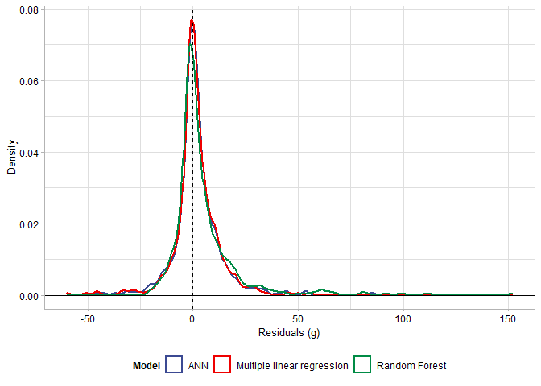

# Multiple approaches to predict flake mass

-   Guillermo Bustos-Pérez <sup>(1,2)</sup>  
-   Javier Baena Preysler <sup>(1)</sup>

<sup>1</sup> Departamento de Prehistoria y Arqueología, Universidad
Autónoma de Madrid, Madrid, Spain  
<sup>2</sup> Corresponding author at:
<guillermo.bustos@estudiante.uam.es> \| <guillermo.willbustos@gmail.com>

## Table of contents

-   01 Installing packages  
-   02 Loading and describing the data
    -   02.1 Loading and describing the data  
    -   02.2 Variable selection  
-   03 Model training and hyperparameter tunning:
    -   03.1 Multiple Linear Regression  
    -   03.2 Random Forest Regression  
    -   03.3 Artificial Neuronal Network (ANN)  
-   04 Results
    -   04.1 Model evaluation metrics and plots  
    -   04.2 Residuals analysis and distribution  
    -   04.3 Variable importance  
    -   04.4 Linear transformation of predictions

## 01 Installing packages

The following code provides the list of packages employed in the
analysis, checks if they are missing and installs the missing ones. This
is set to meet reproducibility standards for machine learning (Heil et
al., 2021).

``` r
list.of.packages <- c("tidyverse", "caret", "neuralnet", "lattice", "ranger")

new.packages <- list.of.packages[!(list.of.packages %in% 
                                     installed.packages()[,"Package"])]

if(length(new.packages)) install.packages(new.packages)
```

 

After this we can load the packages to perform model training and
analysis. Additionally in this markdown we are going to use package
knitr to show a nice output of tables.

``` r
list.of.packages <- c("tidyverse", "caret",  "ranger", "knitr", "knitr")

lapply(list.of.packages, library, character.only = TRUE)
```

    ## [[1]]
    ##  [1] "forcats"   "stringr"   "dplyr"     "purrr"     "readr"     "tidyr"    
    ##  [7] "tibble"    "ggplot2"   "tidyverse" "stats"     "graphics"  "grDevices"
    ## [13] "utils"     "datasets"  "methods"   "base"     
    ## 
    ## [[2]]
    ##  [1] "caret"     "lattice"   "forcats"   "stringr"   "dplyr"     "purrr"    
    ##  [7] "readr"     "tidyr"     "tibble"    "ggplot2"   "tidyverse" "stats"    
    ## [13] "graphics"  "grDevices" "utils"     "datasets"  "methods"   "base"     
    ## 
    ## [[3]]
    ##  [1] "ranger"    "caret"     "lattice"   "forcats"   "stringr"   "dplyr"    
    ##  [7] "purrr"     "readr"     "tidyr"     "tibble"    "ggplot2"   "tidyverse"
    ## [13] "stats"     "graphics"  "grDevices" "utils"     "datasets"  "methods"  
    ## [19] "base"     
    ## 
    ## [[4]]
    ##  [1] "knitr"     "ranger"    "caret"     "lattice"   "forcats"   "stringr"  
    ##  [7] "dplyr"     "purrr"     "readr"     "tidyr"     "tibble"    "ggplot2"  
    ## [13] "tidyverse" "stats"     "graphics"  "grDevices" "utils"     "datasets" 
    ## [19] "methods"   "base"     
    ## 
    ## [[5]]
    ##  [1] "knitr"     "ranger"    "caret"     "lattice"   "forcats"   "stringr"  
    ##  [7] "dplyr"     "purrr"     "readr"     "tidyr"     "tibble"    "ggplot2"  
    ## [13] "tidyverse" "stats"     "graphics"  "grDevices" "utils"     "datasets" 
    ## [19] "methods"   "base"

 

## 02 Loading and describing the data

Sample for analysis is composed of 500 experimentally knapped flakes
using hard hammer. Flakes belong to 30 knapping sequences where a wide
variety of knapping methods were employed —hierarchical (Levallois and
Hierarchical Discoid), bifacial (Discoid), and unipolar— to generate the
experimental sample, ensuring a wide range of morphologies. This is an
expansion of a previous dataset employed for similar purposes
(Bustos-Pérez and Baena, 2021) which allows to expand the range of
dimensions and mass of the assemblage.

``` r
# Load the data
Reg_Data <- read.csv("Data/Flake Mass v02 Eng.csv")
```

``` r
kable(Reg_Data[1:10,])
```

| Length | Width | MeanThick | Max_Thick | Weight | Surface.Plat | Platfom_Depth | Cortex | No_Scars | Termination_type | EPA | Log_Weight | Log_Max_Thick | Log_Plat | Log_Plat_De |
|-------:|------:|----------:|----------:|-------:|-------------:|--------------:|-------:|---------:|:-----------------|----:|-----------:|--------------:|---------:|------------:|
|   51.3 |  29.8 | 10.066667 |      13.1 |  17.83 |       83.585 |           7.3 |      5 |        4 | Feather          |  51 |  1.2511513 |     1.1172713 | 1.922128 |   0.8633229 |
|   49.1 |  30.0 |  8.566667 |       9.7 |  13.33 |       90.480 |           7.8 |      5 |        3 | Feather          |  70 |  1.1248301 |     0.9867717 | 1.956553 |   0.8920946 |
|   30.8 |  43.8 | 11.566667 |      16.8 |  20.33 |       40.500 |           3.6 |      3 |        2 | Feather          |  35 |  1.3081374 |     1.2253093 | 1.607455 |   0.5563025 |
|   30.2 |  19.6 |  5.500000 |       6.7 |   3.98 |       59.670 |           5.1 |      5 |        3 | Feather          |  66 |  0.5998831 |     0.8260748 | 1.775756 |   0.7075702 |
|   57.1 |  37.8 | 11.166667 |      13.3 |  22.18 |      109.800 |          12.0 |      4 |        3 | Feather          |  68 |  1.3459615 |     1.1238516 | 2.040602 |   1.0791812 |
|   37.5 |  34.2 |  5.466667 |       6.7 |   7.97 |       51.340 |           6.8 |      5 |        1 | Hinge            |  65 |  0.9014583 |     0.8260748 | 1.710456 |   0.8325089 |
|   65.6 |  41.9 | 10.400000 |      14.6 |  24.16 |       93.840 |          10.2 |      5 |        2 | Feather          |  67 |  1.3830969 |     1.1643529 | 1.972388 |   1.0086002 |
|   86.8 |  70.8 | 16.066667 |      19.2 |  96.20 |      210.625 |          12.5 |      5 |        3 | Step             |  66 |  1.9831751 |     1.2833012 | 2.323510 |   1.0969100 |
|   39.2 |  54.7 | 16.700000 |      27.3 |  31.70 |       17.460 |           3.6 |      5 |        2 | Feather          |  30 |  1.5010593 |     1.4361626 | 1.242044 |   0.5563025 |
|   49.2 |  60.6 | 11.233333 |      14.0 |  40.16 |      158.080 |          12.8 |      5 |        2 | Hinge            |  68 |  1.6037937 |     1.1461280 | 2.198877 |   1.1072100 |

``` r
#  Summary statistics of the experimental assemblage
Summary_Assem <- data.frame(
  rbind(data.frame(data.matrix(summary(Reg_Data$Length))) %>% t(),
        data.frame(data.matrix(summary(Reg_Data$Width))) %>% t(),
        data.frame(data.matrix(summary(Reg_Data$MeanThick))) %>% t(),
        data.frame(data.matrix(summary(Reg_Data$Surface.Plat))) %>% t(),
        data.frame(data.matrix(summary(Reg_Data$Weight))) %>% t()))
Measure <- c("Length", "Width", "Mean Thickness", "Platform Surface",
             "Weight")
Summary_Assem <- cbind(Measure, Summary_Assem)
rownames(Summary_Assem) <- 1:nrow(Summary_Assem)
```

``` r
kable(Summary_Assem)
```

| Measure          |      Min. |  X1st.Qu. |    Median |      Mean |  X3rd.Qu. |   Max. |
|:-----------------|----------:|----------:|----------:|----------:|----------:|-------:|
| Length           | 16.500000 | 36.300000 | 45.900000 | 48.253200 |  59.60000 | 100.90 |
| Width            | 14.900000 | 31.175000 | 39.000000 | 40.559200 |  46.82500 |  85.50 |
| Mean Thickness   |  1.800000 |  6.058333 |  8.516667 |  9.249567 |  11.28333 |  26.50 |
| Platform Surface |  2.591814 | 31.350000 | 62.933736 | 93.254685 | 116.11875 | 620.00 |
| Weight           |  1.140000 |  5.870000 | 12.965000 | 21.390400 |  26.95750 | 200.73 |

``` r
kable(data.frame(table(Reg_Data$Termination_type)))
```

| Var1     | Freq |
|:---------|-----:|
| Feather  |  449 |
| Hinge    |   42 |
| Inflexed |    2 |
| Plunging |    2 |
| Step     |    5 |

 

A fast to explore lithic assemblage composition is through a Bagolini
scatter plot (Bagolini, 1968). Comparison of the experimental dataset
with the one of the previous study (Bustos-Pérez and Baena, 2021) shows
an increase on the size and average mass of experimentally knapped
flakes. While in the previous study 50% of the flakes had mass values
between 4.15g and 14.02g (Bustos-Pérez and Baena, 2021), in the present
study 50% of the flakes weight between 5.87g and 26.96g. This indicates
that the expansion of the dataset has been done by the inclusion of
heavier and bigger flakes.

``` r
Reg_Data %>% 
  ggplot(aes(Width, Length)) +
  geom_segment(x = 40, y = 0, xend = 0, yend = 40, color = "gray48") +
  geom_segment(x = 60, y = 0, xend = 0, yend = 60, color = "gray48") +
  geom_segment(x = 80, y = 0, xend = 0, yend = 80, color = "gray48") +
  
  geom_segment(x = 0, y = 0, xend = 105, yend = 105, color = "gray48") +
  
  geom_segment(x = 0, y = 0, xend = (105/6), yend = 105, color = "gray48") +
  geom_segment(x = 0, y = 0, xend = (105/3), yend = 105, color = "gray48") +
  geom_segment(x = 0, y = 0, xend = (105/2), yend = 105, color = "gray48") +
  geom_segment(x = 0, y = 0, xend = (105/1.5), yend = 105, color = "gray48") +
  geom_segment(x = 0, y = 0, xend = (105/0.75), yend = 105, color = "gray48") +
  geom_segment(x = 0, y = 0, xend = (105/0.5), yend = 105, color = "gray48") +
  geom_segment(x = 0, y = 0, xend = 105, yend = (105/2), color = "gray48") +
  
  annotate("text", x = 0, y = 104, adj = 0, 
           label = "Very thin blade", size = 2.5) +
  annotate("text", x = 20, y = 104, adj = 0, 
           label = "Thin blade", size = 2.5) +
  annotate("text", x = 40, y = 104, adj = 0, 
           label = "Blade", size = 2.5) +
  annotate("text", x = 53, y = 104, adj = 0, 
           label = "Elongated flake", size = 2.5) +
  annotate("text", x = 85, y = 104, adj = 0, 
           label = "Flake", size = 2.5) +
  annotate("text", x = 103, y = 92.5, adj = 0, 
           label = "Wide\nflake", size = 2.5) +
  annotate("text", x = 103, y = 65, adj = 0, 
           label = "Very\nwide\nflake", size = 2.5) +
  annotate("text", x = 103, y = 25, adj = 0, 
           label = "Wider\nflake", size = 2.5) +
  
  annotate("text", x = 20, y = 1, adj = 0, 
           label = "Micro", size = 2.5) +
  annotate("text", x = 47, y = 1, adj = 0, 
           label = "Small", size = 2.5) +
  annotate("text", x = 65, y = 1, adj = 0, 
           label = "Normal", size = 2.5) +
  annotate("text", x = 85, y = 1, adj = 0, 
           label = "Big", size = 2.5) +
  
  geom_point(aes(color = Termination_type), size = 2, alpha = 0.75) +
  scale_x_continuous(breaks = seq(0, 105, 5), lim = c(0, 105)) +
  scale_y_continuous(breaks = seq(0, 105, 5), lim = c(0, 105)) +
  ylab("Length (mm)") +
  xlab("Width (mm)") +
  theme_light() +
  ggsci::scale_color_aaas() +
  labs(color = "Termination type") +
  guides(color = guide_legend(nrow = 1, title.position = "top")) +
  theme(axis.title = element_text(size = 9, color = "black", face = "bold"),
        axis.text = element_text(size = 7.5, color = "black"),
        legend.position = "bottom") +
  coord_fixed() 
```


 

Additionally, exploratory visual analysis of flake mass through
histogram shows a highly skewed distribution with flakes weighting
between 10 g and 20 g the most frequent.

``` r
# Histogram of flake weight
Reg_Data %>% ggplot(aes(Weight)) +
  geom_histogram(binwidth = 10,
                 color = "black", fill = "gray") +
  theme_light() +
  ylab("Count") +
  xlab("Weight (g)") +
  scale_x_continuous(breaks = seq(0, 200, 20)) +
  theme(
    axis.text = element_text(color = "black", size = 9),
    axis.title = element_text(color = "black", size = 10))
```


 

## 03 Model training

### 03.1 Multiple Linear regression

Multiple linear regression extends the simple linear regression to
accommodate multiple predictors

``` r
### Set Train control ####
train.control <- trainControl(method = "repeatedcv", 
                              number = 10, repeats = 50,
                              savePredictions = TRUE)

# Train the model
frmla <- Log_Weight ~ MeanThick + Cortex + No_Scars + EPA + Log_Max_Thick + Log_Plat + Log_Plat_De

set.seed(123)
lm.model <- train(frmla, 
               data = Reg_Data, 
               method = "lm",
               trControl = train.control)
```

``` r
summary(lm.model)
```

    ## 
    ## Call:
    ## lm(formula = .outcome ~ ., data = dat)
    ## 
    ## Residuals:
    ##      Min       1Q   Median       3Q      Max 
    ## -0.69473 -0.13616  0.01939  0.13186  0.47859 
    ## 
    ## Coefficients:
    ##                 Estimate Std. Error t value Pr(>|t|)    
    ## (Intercept)   -0.4427689  0.1301456  -3.402 0.000723 ***
    ## MeanThick      0.0337557  0.0064369   5.244 2.34e-07 ***
    ## Cortex        -0.0814959  0.0093836  -8.685  < 2e-16 ***
    ## No_Scars       0.0731414  0.0101348   7.217 2.03e-12 ***
    ## EPA            0.0017785  0.0009083   1.958 0.050805 .  
    ## Log_Max_Thick  0.9273949  0.1430721   6.482 2.20e-10 ***
    ## Log_Plat       0.3358338  0.0469619   7.151 3.13e-12 ***
    ## Log_Plat_De   -0.3522401  0.0898045  -3.922 0.000100 ***
    ## ---
    ## Signif. codes:  0 '***' 0.001 '**' 0.01 '*' 0.05 '.' 0.1 ' ' 1
    ## 
    ## Residual standard error: 0.2083 on 492 degrees of freedom
    ## Multiple R-squared:  0.779,  Adjusted R-squared:  0.7759 
    ## F-statistic: 247.8 on 7 and 492 DF,  p-value: < 2.2e-16

 

### 03.2 Random Forest Regression

Random Forests build multiple decision trees from the training data
(Breiman, 2001). Using different data adds diversity to the models.
Predictiobs are obtained through the average of examples that reach a
leaf. Finally, the results are averaged along all the grown trees.

Cartesian grid search is performed on the following hyperparameters:
number of trees to grow for each model (ranging from 500 to 700 by 25);
number of variables to possibly split at each node (ranging from 1 to
5); and minimal node size (ranging from 1 to 5).

Please note that while **mtry** (random number of variables to consider
in each split) and **min.node.size** can be integrated into a cartesian
grid search, the number of trees to grow cannot. Thus, it is necessary
to include the training of the models in a loop were the number of trees
changes in a sequence. At the end of each loop the best combination of
mtry and min.node.size for the given number of trees is extracted (along
with the results).

``` r
#### Hyperparameter tuning for random forest ####
# range of hyperparameters
mtry <- seq(1, 5, 1)
min.node.size <- seq(1, 5, 1)
splitrule = "variance"

# Grid of possible combinations
hyper_grid <- expand.grid(
  mtry = mtry,
  min.node.size = min.node.size ,
  splitrule = "variance")

# Loop over different number of trees
best_tune <- data.frame(
  mtry = numeric(0),
  min_node.size = numeric(0),
  Num_Trees = numeric(0),
  r_squared = numeric(0))

my_seq <- seq(500, 700, 25)

set.seed(123)
for (x in my_seq){
  
  RF_weight <- train(frmla, 
                       Reg_Data,
                       method = "ranger",
                       trControl = train.control,
                       num.trees = x,
                       tuneGrid = hyper_grid 
  )
  
  Bst_R <- data.frame(
    mtry = RF_weight$bestTune[[1]],
    min_node.size = RF_weight$bestTune[[3]],
    Num_Trees = x,
    r_squared = RF_weight$finalModel[[10]])
  
  best_tune <- rbind(best_tune, Bst_R)
  
  Bst_R <- c()
  
}
```

 

The previous code is computationally expensive, but it ensures finding
the best combination of hyperparameters. The following table presents
the results of hyperparameter grid search.

``` r
kable(best_tune)
```

| mtry | min_node.size | Num_Trees | r_squared |
|-----:|--------------:|----------:|----------:|
|    2 |             5 |       500 | 0.7312673 |
|    2 |             5 |       525 | 0.7271587 |
|    2 |             5 |       550 | 0.7256057 |
|    2 |             5 |       575 | 0.7305429 |
|    2 |             4 |       600 | 0.7281003 |
|    2 |             4 |       625 | 0.7312961 |
|    2 |             5 |       650 | 0.7277806 |
|    2 |             5 |       675 | 0.7279673 |
|    2 |             4 |       700 | 0.7296423 |

On the table we can see that **mtry** is constant at a value of 2 for
all combinations of number of trees and minimum node size. Additionally
values of minimum node size range either from 4 or 5. This simplifies
the visualization of hyperparameters.

``` r
#### Hyperparameters of Random forest ####
data.frame(best_tune) %>% 
  ggplot(aes(factor(Num_Trees), min_node.size, fill = r_squared)) + 
  geom_tile(alpha = 0.75) +
  xlab("Number of trees") +
  ylab("Min node size") +
  scale_y_continuous(breaks = seq(4, 5, 1), lim = c(3.5, 5.5)) +
  geom_text(aes(label = round(r_squared, 4)), size = 3) +
  ggsci::scale_fill_gsea(reverse = TRUE) +
  theme_classic() +
  theme(legend.position = "none",
        axis.text = element_text(color = "black", size = 8))
```


 

The following code returns the best combination of hyperparameters.

``` r
best_tune_2 <- best_tune[which.max(best_tune$r_squared),]
best_tune_2
```

    ##   mtry min_node.size Num_Trees r_squared
    ## 6    2             4       625 0.7312961

 

Finally, the Random forest with optimal combination of hyperparameters
can be trained.

``` r
#### Final random forest model ####
newr_grid <- expand.grid(mtry = best_tune_2$mtry,
                          min.node.size = best_tune_2$min_node.size,
                          splitrule = "variance"
)

RF_weight <- train(frmla, 
                   Reg_Data,
                   method = "ranger",
                   trControl = train.control,
                   tuneGrid = newr_grid, 
                   num.trees = best_tune$Num_Trees,
                   importance = "impurity_corrected")
```

 

### 03.3 Artificial Neuronal Network (ANN)

Artificial Neuronal Networks (ANN) model the relationship between input
data and the output signal through a series of hidden layers each
composed by a number of nodes (Lantz, 2015). The present work uses the R
package “neuralnet” (Günther and Fritsch, 2010) to train ANN with
backpropagation (Rumelhart et al., 1986). For the present work ANN
topology is limited to having only one or two hidden layers. Number of
nodes of hidden layer 1 ranges between 1 and 4 while number of nodes of
hidden layer 2 ranges from 0 (no second hidden layer) to 4. All possible
combination are tested.

``` r
#### Look for best ANN architecture ####
 set.seed(123)
 train.control <- trainControl(method = "repeatedcv", 
                               number = 10, repeats = 50,
                               verboseIter = TRUE)

  tune.grid.neuralnet <- expand.grid(
   .layer1 = c(1:4),
   .layer2 = c(0:4),
   .layer3 = 0
 )

 nnet_model <- train(
   Log_Weight ~ MeanThick + Log_Max_Thick + EPA + Log_Plat + Log_Plat_De + Cortex + No_Scars,
   Reg_Data,
   method = 'neuralnet',
   trControl = train.control,
   tuneGrid = tune.grid.neuralnet,
   preProcess = c("center", "scale"),
   learningrate = 0.01,  
   threshold = 0.01,
   stepmax = (10^100),
   linear.output = TRUE
 )
```

 

Cartesian grid search of ANN topology indicates that increasing the
number of nodes in the first hidden layer decreases linear correlation
with the outcome. On general Cartesian grid search of ANN topology
indicates that increasing the number of layers and nodes results in
lower values of *r*<sup>2</sup>. Thus, the most simple ANN architecture
(one hidden layer with one node) provides the highest correlation
coefficient (r2 = 0.78). The second best topology (two hidden layers
with one node at each layer) provides a marginally lower value (0.0005
lower).

``` r
data.frame(nnet_model$results) %>% 
  ggplot(aes(layer1, layer2, fill = Rsquared)) + 
  geom_tile(alpha = 0.75) +
  geom_text(aes(label = round(Rsquared, 4)), size = 3) +
  ggsci::scale_fill_gsea(reverse = TRUE) +
  xlab("Number of nodes in layer 1") +
  ylab("Number of nodes in layer 2") +
  theme_classic() +
  coord_fixed() +
  theme(legend.position = "none",
        axis.text = element_text(color = "black", size = 8))
```


 

## 04 Results

### 04.1 Model evaluation metrics

The following table presents the precision metrics for each model. On
general ANN and multiple linear regression perform similarly with
similar values of r2 (0.78), RMSE (0.21) and MAE (0.17), although ANN
performs slightly better. On the other hand Random Forest regression
performs slightly worst with a lower value of *r*<sup>2</sup> (0.72) and
higher values of RMSE (0.24) and MAE (0.19).

``` r
Temp <- data.frame(rbind(
  round(MLR_model$results[2:4],2),
  round(nnet_model_f$results[4:6],2),
  round(RF_model$results[4:6],2)))

Temp <- cbind(data.frame(model = c("MLR", "ANN", "RF")), Temp)

kable(Temp)
```

| model | RMSE | Rsquared |  MAE |
|:------|-----:|---------:|-----:|
| MLR   | 0.21 |     0.78 | 0.17 |
| ANN   | 0.21 |     0.78 | 0.17 |
| RF    | 0.24 |     0.72 | 0.19 |

 

Visualization of regression plots for each model provides additional
information of the performance of each model. The poor performance of
Random Forest (lowest value of *r*<sup>2</sup>) is reflected in a
limited range of prediction. The prediction range of the Random Forest
is limited between a minimum value of 0.55 and a maximum value of 1.76
for log10 of flake mass. As a result of this, data is not evenly
distributed among the regression line. In the lowest values of
prediction most points fall below the regression line while most data
points falling above for the highest values of the regression line. ANN
and multiple linear regression plots present similar patterns of
distribution with data evenly distributed among the regression line.
Flakes with a log10 value of flake mass above 2 are lightly more evenly
distributed for the multiple linear regression than for the ANN.

``` r
#### Linear model ####
MLR_results <- as.data.frame(MLR_model$pred) %>% 
  group_by(rowIndex) %>% 
  summarise(Pred = mean(pred),
            Obs = mean(obs)) %>% 
  mutate(Residual = Obs - Pred)

#### ANN model ####
nnet_results <- as.data.frame(nnet_model_f$pred) %>% 
  group_by(rowIndex) %>% 
  summarise(Pred = mean(pred),
            Obs = mean(obs)) %>% 
  mutate(Residual = Obs - Pred)

#### RF Model ####
RF_results <- as.data.frame(RF_model$pred) %>% 
  group_by(rowIndex) %>% 
  summarise(Pred = mean(pred),
            Obs = mean(obs)) %>% 
  mutate(Residual = Obs - Pred)

#### Put models together #####
Temp <- rbind(MLR_results, nnet_results, RF_results)
Temp$Model <- "Multiple linear regression"
Temp$Model[501:1000] <- "ANN"
Temp$Model[1001:1500] <- "Random Forest"

#### Correlation plot ####
Temp %>% 
  ggplot(aes(Pred, Obs)) +
  geom_point(alpha = 0.5, size = 1.5) +
  geom_line(aes(y = Pred), size = 1, col = "blue") +
  
  scale_x_continuous(breaks = seq(0, 2.55, 0.25), lim = c(-0.1, 2.35)) +
  scale_y_continuous(breaks = seq(0, 2.55, 0.25), lim = c(-0.1, 2.35)) +
  
  xlab("Predicted") +
  ylab("Observed") +

  facet_wrap(~ Model, ncol = 3) + 
  coord_fixed() +
  theme_light() +
  theme(strip.text = element_text(color = "black", face = "bold", size = 9),
        strip.background = element_rect(fill = "white", colour = "black", size = 1),
        axis.text = element_text(size = 7.5, color = "black"))
```


 

### 04.2 Residuals analysis and distribution

Visual analysis of the scatter plot for observed and residual values
allows to observe model performance for different ranges of log10 of
flake mass values. Residuals of the Random Forest present a systematic
bias for the upper and lowest values of observed weight. In the case of
flakes with a log10 value of 0.50 there is a systematic overestimation
of the size. In the case of flakes with a log10 value of 1.75 there is a
systematic underestimation of values. ANN and multiple linear regression
present very similar plots for observed values and residuals. In both
cases residual values indicate a systematic overestimation of a log10
flake mass when the actual value is below 0.25.  
Between values of 0.25 and 2 both models present a very similar
performance with residual values falling evenly among the 0 value. ANN
seems to present a slightly systematic underestimation of flakes with a
log10 of flake mass above a value of 2. Multiple linear regression does
seem to perform better for flakes with a log10 flake mass value above 2
with residual values falling evenly or very close to the 0 value line.

``` r
## Plots of observed values and residuals
Temp %>% 
  ggplot(aes(Obs, Residual)) +
  geom_point(alpha = 0.5, size = 1.5) +
  
  xlab("Observed") +
  ylab("Residual") +
  
  scale_x_continuous(breaks = seq(0, 2.55, 0.25), lim = c(min(Temp$Obs), max(Temp$Obs))) +
  scale_y_continuous(breaks = seq(-0.75, 0.75, 0.25), lim = c(-0.85, 0.85)) +
  geom_hline(yintercept = 0, linetype = "dashed") +
  
  facet_wrap(~ Model, ncol = 3) + 
  coord_fixed() +
  theme_light() +
  theme(strip.text = element_text(color = "black", face = "bold", size = 9),
        strip.background = element_rect(fill = "white", colour = "black", size = 1),
        axis.text = element_text(size = 7.5, color = "black"))
```


 

Correlation between observed values and residuals allows to evaluate if
residuals increase along with increasing values of log10 of weight. ANN
and multiple linear regression models present the same value of
*r*<sup>2</sup> for correlation of observed values and residuals
(*r*<sup>2</sup> = 0.22; p \< 0.01) while Random Forest presents a
higher value of correlation (*r*<sup>2</sup> = 0.5; p \< 0.01).

``` r
# Residuals and multiple linear regression
summary(lm(Residual ~ Obs, MLR_results))
```

    ## 
    ## Call:
    ## lm(formula = Residual ~ Obs, data = MLR_results)
    ## 
    ## Residuals:
    ##      Min       1Q   Median       3Q      Max 
    ## -0.54486 -0.11287  0.00723  0.12352  0.53357 
    ## 
    ## Coefficients:
    ##             Estimate Std. Error t value Pr(>|t|)    
    ## (Intercept) -0.24837    0.02260  -10.99   <2e-16 ***
    ## Obs          0.22306    0.01889   11.81   <2e-16 ***
    ## ---
    ## Signif. codes:  0 '***' 0.001 '**' 0.01 '*' 0.05 '.' 0.1 ' ' 1
    ## 
    ## Residual standard error: 0.1857 on 498 degrees of freedom
    ## Multiple R-squared:  0.2188, Adjusted R-squared:  0.2172 
    ## F-statistic: 139.4 on 1 and 498 DF,  p-value: < 2.2e-16

``` r
# Residuals and ANN
summary(lm(Residual ~ Obs, nnet_results))
```

    ## 
    ## Call:
    ## lm(formula = Residual ~ Obs, data = nnet_results)
    ## 
    ## Residuals:
    ##      Min       1Q   Median       3Q      Max 
    ## -0.55719 -0.10717 -0.00036  0.13051  0.51214 
    ## 
    ## Coefficients:
    ##             Estimate Std. Error t value Pr(>|t|)    
    ## (Intercept) -0.24798    0.02258  -10.98   <2e-16 ***
    ## Obs          0.22286    0.01887   11.81   <2e-16 ***
    ## ---
    ## Signif. codes:  0 '***' 0.001 '**' 0.01 '*' 0.05 '.' 0.1 ' ' 1
    ## 
    ## Residual standard error: 0.1855 on 498 degrees of freedom
    ## Multiple R-squared:  0.2188, Adjusted R-squared:  0.2172 
    ## F-statistic: 139.5 on 1 and 498 DF,  p-value: < 2.2e-16

``` r
# Residuals and RF model
summary(lm(Residual ~ Obs, RF_results))
```

    ## 
    ## Call:
    ## lm(formula = Residual ~ Obs, data = RF_results)
    ## 
    ## Residuals:
    ##      Min       1Q   Median       3Q      Max 
    ## -0.49052 -0.11216  0.00151  0.10916  0.47628 
    ## 
    ## Coefficients:
    ##             Estimate Std. Error t value Pr(>|t|)    
    ## (Intercept) -0.42164    0.02052  -20.55   <2e-16 ***
    ## Obs          0.38224    0.01715   22.29   <2e-16 ***
    ## ---
    ## Signif. codes:  0 '***' 0.001 '**' 0.01 '*' 0.05 '.' 0.1 ' ' 1
    ## 
    ## Residual standard error: 0.1686 on 498 degrees of freedom
    ## Multiple R-squared:  0.4994, Adjusted R-squared:  0.4984 
    ## F-statistic: 496.8 on 1 and 498 DF,  p-value: < 2.2e-16

 

Descriptive statistics of residuals and density plots allow to evaluate
dispersion range of residuals. All models present average and median
residual values close to 0 with density curves peaking near this value
which is indicative of a good model performance. 50% of residual values
from ANN model fall between values of -0.133 and 0.143 making for a
distance of 0.276. 50% of residual values from multiple linear
regression model fall between values of -0.137 and 0.134 making for a
distance of 0.271. 50% of residual values from multiple Random Forest
model fall between values of -0.138 and 0.177 making for a distance of
0.315. This indicates that multiple linear regression model concentrates
50% of residuals values in a slightly shorter range. This range is 0.005
shorter than the one from ANN model. The Random forest presents the
highest dispersion range for 50% of residual values.

``` r
# Density plot of residuals
Temp %>% ggplot(aes(Residual, color = Model)) +
  geom_density(size = 1) +
  ggsci::scale_color_aaas() +
  scale_x_continuous(breaks = seq(-1, 1, 0.25), lim = c(-1,1)) +
  geom_vline(xintercept = 0, linetype = "dashed") +
  geom_hline(yintercept = 0) +
  ylab("Density") +
  theme_light() +
  theme(legend.position = "bottom",
        legend.title = element_text(face = "bold"),
        axis.text = element_text(color = "black", size = 9),
        axis.title = element_text(color = "black", size = 10))
```


90% of residual values from ANN model fall between values of -0.379 and
0.33 making for a distance of 0.709. 90% of residual values from
multiple linear regression model fall between values of -0.371 and 0.333
making for a distance of 0.704. 90% of residual values from Random
Forest model fall between values of -0.412 and 0.355 making for a
distance of 0.767. Again, multiple linear regression concentrates 90% of
residuals in the shortest range. ANN presents a slightly wider range
(difference of 0.005) and Random Forest presents the widest range of the
three models.

``` r
kable(
  Temp %>% group_by(Model) %>% 
  summarise(
    Min = min(Residual),
    `5 Percentil` = quantile(Residual, 0.05),
    `1Quantile` = quantile(Residual, 0.25),
    Mean = mean(Residual),
    Median = quantile(Residual, 0.5),
    `3Quantile` = quantile(Residual, 0.75),
    `95 Percentil` = quantile(Residual, 0.95),
    Max = max(Residual)
  ))
```

| Model                      |        Min | 5 Percentil |  1Quantile |       Mean |    Median | 3Quantile | 95 Percentil |       Max |
|:---------------------------|-----------:|------------:|-----------:|-----------:|----------:|----------:|-------------:|----------:|
| ANN                        | -0.6952028 |  -0.3790468 | -0.1331217 |  0.0000595 | 0.0240733 | 0.1428723 |    0.3295823 | 0.4993439 |
| Multiple linear regression | -0.7046012 |  -0.3711780 | -0.1368752 | -0.0001095 | 0.0204098 | 0.1341937 |    0.3332873 | 0.4823185 |
| Random Forest              | -0.8456258 |  -0.4117285 | -0.1383524 |  0.0037893 | 0.0133008 | 0.1773731 |    0.3550391 | 0.6154902 |

### 04.2 Variable importance

The following presents variable relative importance scaled from 0 to 100
for each model. ANN considers of key importance variables of thickness
(mean thickness of the flake and log10 of flake thickness) along with
log10 of platform size. Relative amount of cortex is also considered to
have relative importance. Multiple linear regression considers relative
amount of cortex, number of scars and log10 of platform size as the most
important variables. Log10 of maximum thickness is also considered as an
important variable. Random Forest only considers mean thickness and
log10 of maximum thickness as important variables.

Only ANN model provides an importance value above 0 for EPA, although it
is considered as the least important variable for that model. On general
log10 of platform size is considered as an important variable being the
third most important variable for multiple linear regression and Random
Forest; and the second most important variable for ANN. Log10 of
platform depth is usually considered a minor important variable by all
models with scores of importance below the 50 value threshold.

``` r
#### Variable importance ####
# Make Data frame of importance of MLR
mr_imp <- varImp(MLR_model, scale = TRUE)
mr_imp <- as.data.frame(mr_imp$importance)
mr_imp$Variable = rownames(mr_imp)
mr_imp$Model = "Multiple Linear Regression"

# Make Data frame of importance of ANN
temp <- NeuralNetTools::garson(nnet_model_f)

ANN_imp <- data.frame(temp$data) %>% mutate(
  Overall = (rel_imp*100)/0.24145208) %>% 
  select(-c(rel_imp)) %>% 
  rename(Variable = x_names) %>% 
  mutate(Model = "ANN") %>% 
  select(Overall, Variable, Model)

# Make Data frame of RF importance
RF_imp <- varImp(RF_model, scale = TRUE)
RF_imp <- as.data.frame(RF_imp$importance)
RF_imp$Variable = rownames(RF_imp)
RF_imp$Model = "Random Forest"

#### Variable importance according to model 
Var_Imp <- rbind(mr_imp, ANN_imp, RF_imp)
rm(mr_imp, ANN_imp, RF_imp)

# reset variable labels
table(Var_Imp$Variable)
```

    ## 
    ##        Cortex           EPA Log_Max_Thick      Log_Plat   Log_Plat_De 
    ##             3             3             3             3             3 
    ##     MeanThick      No_Scars 
    ##             3             3

``` r
Var_Imp$Variable <- factor(Var_Imp$Variable,
                           levels = c("MeanThick", "Log_Max_Thick",
                                      "Log_Plat", "Log_Plat_De",
                                      "EPA", "Cortex", "No_Scars"),
                           labels = c("Mean\nThickness", "Log of\nMax. Thick.",
                                      "Log of Pla.", "Log of\nPlat. Depth",
                                    "EPA", "Cortex",
                                    "No Scars"))

# and plot
Var_Imp %>% ggplot(aes(Variable, Overall, fill = Overall)) +
  geom_col() +
  geom_text(data = Var_Imp[Var_Imp$Overall > 0,],
            aes(label = round(Overall, 2)), vjust= "top", size = 2.5) +
  ggsci::scale_fill_gsea(reverse = TRUE) +
  theme_classic() +
  facet_wrap(~ Model, ncol = 1) +
  ylab("Relative importance") +
  xlab(NULL) +
  theme(legend.position = "none",
        axis.text = element_text(color = "black", size = 7),
        strip.text = element_text(color = "black", face = "bold", size = 8),
        strip.background = element_rect(fill = "white", colour = "black", size=1),
        axis.title.y = element_text(color = "black", size = 8))
```


 

### 04.4 Linear transformation of predictions

The following table presents the performance metrics of each model after
transforming true and predicted values back to the linear scale. ANN and
multiple linear regression reinforce their correlation while Random
Forest decreases it’s *r*<sup>2</sup> value. Multiple linear regression
provides the highest *r*<sup>2</sup> value (*r*<sup>2</sup> = 0.813)
followed by ANN (*r*<sup>2</sup> = 0.801), indicating that multiple
linear regression generalizes better to the linear scale. All models
present lower RMSE values than the standard deviation value of weight of
the experimental assemblage (24.83) which is indicative of a good
general performance.

``` r
# Transform into linear scale
Temp <- Temp %>% 
  mutate(Observed = 10^Obs,
         Predicted = 10^Pred,
         Line_Res = Observed - Predicted)
```

``` r
ANN <- Temp %>% filter(Model == "ANN")
MLR <- Temp %>% filter(Model == "Multiple linear regression")
RF <- Temp %>% filter(Model == "Random Forest")

# Performance metrics
kable(data.frame(
  "Metric" = 
    c("r2", "RMSE", "MAE"),
  
  "ANN" = 
    c(round(R2(ANN$Observed, ANN$Predicted),3),
  round(RMSE(ANN$Observed, ANN$Predicted),3),
  round(MAE(ANN$Observed, ANN$Predicted), 3)),
  
  "Mult. Linear Reg." = 
    c(round(R2(MLR$Observed, MLR$Predicted),3),
    round(RMSE(MLR$Observed, MLR$Predicted),3),
    round(MAE(MLR$Observed, MLR$Predicted), 3)),
  
  "Random Forest" = 
    c(round(R2(RF$Observed, RF$Predicted),3),
    round(RMSE(RF$Observed, RF$Predicted),3),
    round(MAE(RF$Observed, RF$Predicted), 3))
))
```

| Metric |    ANN | Mult..Linear.Reg. | Random.Forest |
|:-------|-------:|------------------:|--------------:|
| r2     |  0.801 |             0.814 |         0.660 |
| RMSE   | 11.344 |            10.853 |        16.996 |
| MAE    |  6.942 |             6.793 |         8.700 |

 

Visualization of regression plots also supports the better
generalization of multiple linear regression to the linear scale. Random
Forest limits its maximum prediction to 57.2 g resulting in a poor
generalization to the linear scale. Due to this, residuals from the
Random Forest indicate important underestimations of flake weight with
an average underestimation of 4.6 g. 50% of the residuals of the Random
Forest range between overestimations of 2.64 g and underestimations of
7.06 g. 90% of the residuals from the random forest range between
overestimations of 10.35 g and underestimations of 29.74 g.

``` r
## Regression plot on linear scale
Temp %>% ggplot(aes(Predicted, Observed)) +
  geom_point(alpha = 0.5, size = 1.5) +
  geom_line(aes(y = Predicted), size = 1, col = "blue") +
  
  scale_x_continuous(breaks = seq(0, 205, 20), lim = c(0, 205)) +
  scale_y_continuous(breaks = seq(0, 205, 20), lim = c(0, 205)) +
  
  facet_wrap(~ Model) +
  coord_fixed() +
  theme_light() +
  theme(strip.text = element_text(color = "black", face = "bold", size = 9),
        strip.background = element_rect(fill = "white", colour = "black", size = 1),
        axis.text = element_text(size = 7.5, color = "black"))
```


 

Visual representation of residuals of the Random Forest through density
plot shows that despite peaking on the 0 value it presents a long tale
of positive residuals as a result of underestimations of predictions.
ANN generalizes better to the linear scale with a higher range of
predictions which reach a maximum value of 123 g. Density plot of
residuals from the ANN present a concentrated peak on the 0 value with a
mean value of 1.82 g. Despite this ANN residuals still present a
slightly long tale of positive values for residuals as a result of some
underestimations. 50% of residuals from ANN range between
overestimations of 2.52 g and underestimations of 5.55 g. 90% of the
residuals from ANN range between overestimations of 13.18 g and
underestimations of 18.79 g.

``` r
#  Density plot of residuals in the linear scale
Temp %>% ggplot(aes(Line_Res, color = Model)) +
  geom_density(size = 0.75) +
  ggsci::scale_color_aaas() +
  geom_vline(xintercept = 0, linetype = "dashed") +
  geom_hline(yintercept = 0) +
  ylab("Density") +
  xlab("Residuals (g)") +
  theme_light() +
  theme(legend.position = "bottom",
        legend.title = element_text(face = "bold",size = 9),
        axis.text = element_text(color = "black", size = 9),
        axis.title = element_text(color = "black", size = 10),
        legend.text = element_text(size = 9))
```


As previously mentioned Multiple Linear Regression generalizes better to
the linear scale with a maximum predicted value of 170 g. Residuals
present an average 1.4 g value, with the density plot peaking near the 0
value and similar tales to the positive and negative values (Figure 12).
50% of residuals from Multiple Linear Regression range between
overestimations of 2.42 g and underestimations of 5.73 g. 90% of
residuals from Multiple Linear Regression range between overestimations
of 13.18 g and underestimations of 18.79 g. Thus, Multiple Linear
regression presents the concentration of 90% of residuals in the
shortest range.

``` r
# Descriptive statistics of residuals in the linear scale

kable(Temp %>% group_by(Model) %>% 
  summarise(
    Min = min(Line_Res),
    `5 Percentil` = quantile(Line_Res, 0.05),
    `1Quantile` = quantile(Line_Res, 0.25),
    Mean = mean(Line_Res),
    Median = quantile(Line_Res, 0.5),
    `3Quantile` = quantile(Line_Res, 0.75),
    `95 Percentil` = quantile(Line_Res, 0.95),
    Max = max(Line_Res)
  ))
```

| Model                      |       Min | 5 Percentil | 1Quantile |     Mean |    Median | 3Quantile | 95 Percentil |       Max |
|:---------------------------|----------:|------------:|----------:|---------:|----------:|----------:|-------------:|----------:|
| ANN                        | -47.08316 |   -13.79028 | -2.516174 | 1.816030 | 0.4762883 |  5.552758 |     19.80933 |  84.98876 |
| Multiple linear regression | -60.22261 |   -13.18240 | -2.422225 | 1.400462 | 0.3307878 |  5.724842 |     18.79086 |  55.58517 |
| Random Forest              | -20.06615 |   -10.35089 | -2.641137 | 4.611775 | 0.3338027 |  7.059517 |     29.74203 | 152.07560 |
